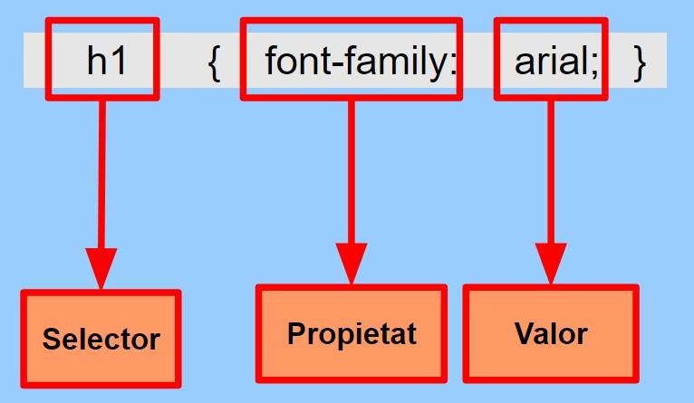

---
# Informació general del document
title: Regles CSS
subtitle: Llenguatges de marques i sistemes de gestió de la informació (LMSGI)
lang: ca
page-background: img/bg.png

# Portada
titlepage: true
titlepage-rule-height: 0
# titlepage-rule-color: AA0000
# titlepage-text-color: AA0000
titlepage-background: img/portada.png
# logo: img/logotext.png

# Taula de continguts
toc: true
toc-own-page: true
toc-title: Continguts

# Capçaleres i peus
header-left: Llenguatges de Marques
header-right: Curs 2024-2025
footer-left: IES Jaume II El Just
footer-right: \thepage/\pageref{LastPage}

# Imatges
float-placement-figure: H
caption-justification: centering

# Llistats de codi
listings-no-page-break: false
listings-disable-line-numbers: false

header-includes:
     - \usepackage{lastpage}
---

# Regles CSS

Les **regles CSS** defineixen de quina forma es representaran les diferents etiquetes HTML de la pàgina.

{ width=350px }

Si volem especificar **més d’una propietat** en una regla CSS:

* Es posen una darrere l’altra dins de les claus.
* Separades amb un punt i coma ( **;** )
* Es recomana acabar amb ; totes les regles, encara que a la última no siga necessari fa falta.
* També és recomanable fer ús d'una línia per regla, per tal de facilitar la legibilitat.

Veiem un exemple:

```css
h1 {
 font-size: 10pt;
 text-decoration: underline;
 color: black;
 font-family:arial;
 background-color:#00FF00;
}
```


## Aplicació de regles en cascada

L'acrònim CSS prové de *Cascading Style Sheets*, o *fulls d'estil en **Cascada***. Anem a veure exactament quin és aquest significat de *cascada*.

Com hem vist, és possible tenir varies definicions d’estil (externes, internes i integrades en l'etiqueta). En cas que hi haja un conflicte entre els estils definits s’aplica la següent prioritat:

**De menor a major prioritat**:

* *4t lloc (menys prioritat):* Estils predeterminats del navegador.
* *3r lloc*: Fulls d’estil externs, en un arxiu CSS separat.
* *2n lloc*. Fulls d’estil interns, amb l’etiqueta `<style>` en el`<head>`.
* *1r lloc (major prioritat)*. Estils integrats en etiquetes HTML amb l’atribut `style`.

Veiem-ho al següent exemple: *De quin color es veurà l'encapçalament h1?*

=== "HTML"
    ```html
    <html>
        <head>
            <style>
            h1 {
                color: blue;
            }
            </style>
        </head>
        <body>
            <h1 style="color:red">Títol</h1>
        </body>
    </html>
    ```
=== "Resultat"
    <div style="all: initial;">
        <h1 style="color:red">Títol</h1>
    </div>


## Selectors repetits

Si repetim una etiqueta en el mateix nivell i s’hi repeteix alguna propietat, l'últim valor és el vàlid.

```css
h1 {
    font-family:arial;
    color: blue;
} 

h1 { 
    color:red;
  }
```

El contingut de les etiquetes **h1** es pintarà amb la tipografía *Arial* definida en el primer bloc, però amb color roig, ja que és el valor assignat per al color en l'últim bloc.

## Herència

Els estils CSS s’hereten d’un element a un altre. Quan parlem d'herència en programació, de manera genèrica fem referència a que determinat objectes o elements *prenen* les mateixes propietats o característiques que aquells dels que provenen.

Veiem-ho amb un exemple:

```css
body { 
    font-family:arial;
    color:#FF0000;
    background-color:#00FF00;
    }

h2 { 
    font-style: italic; 
    }
```

En aquest exemple, definim l’estil del `<body>` i, en conseqüència tots els elements que apareixeran dins d'ell. Així doncs, els encapçalaments `<h2>`, que es defineixen en itàlica, es veuran en itàlica, però a més amb els estils heretats del body (tipografia Arial, i en color roig i fons verd).

!!! note "Colors en notació hexadecimal"

    En aquest exemple, en lloc d'especificar els colors pel seu nom (`red`, `green`), estem fent ús de la notació hexadecimal.

    Aquesta notació per als colors en CSS utilitza una combinació de 6 dígits després del símbol #. Cada parell de dígits representa la intensitat del Roig (R), verd (G) i blau (B) en format hexadecimal, amb valors que van des de 00 fins a FF. Per exemple, #FF0000 és roig pur, #00FF00 és verd, i #0000FF és blau.

    Amb aquest format, podem definir qualsevol color combinant els tres valors.


# Comentaris

CSS permet incloure comentaris entre les seves regles.

Els navegadors ignoraran aquests comentaris. S’indiquen mitjançant els caràcters `/*` i `*/`. Per exemple:

```css

/* Definció d'estils genèrics pe al body */
body { 
    font-family:arial;
    color:#FF0000;
    background-color:#00FF00;
    }

/* Definició d'estils per a les capçaleres */
h2 { 
    font-style: italic; 
    }

```

!!! warning "Compte!"
    El comentaris, tot i que no es mostren, s’envien al navegador juntament amb la resta d’estils, per tant no poden incloure dades confidencials.
