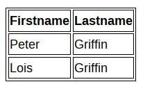
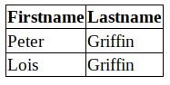

---
# Informació general del document
title: Taules
subtitle: Llenguatges de marques i sistemes de gestió de la informació (LMSGI)
lang: ca
page-background: img/bg.png

# Portada
titlepage: true
titlepage-rule-height: 0
# titlepage-rule-color: AA0000
# titlepage-text-color: AA0000
titlepage-background: img/portada.png
# logo: img/logotext.png

# Taula de continguts
toc: true
toc-own-page: true
toc-title: Continguts

# Capçaleres i peus
header-left: Llenguatges de Marques
header-right: Curs 2024-2025
footer-left: IES Jaume II El Just
footer-right: \thepage/\pageref{LastPage}

# Imatges
float-placement-figure: H
caption-justification: centering

# Llistats de codi
listings-no-page-break: false
listings-disable-line-numbers: false

header-includes:
     - \usepackage{lastpage}
---

# Taules

La visualització de les taules pot millorar molt amb CSS.

Per a modificar les vores de les taules i de les cel·les, usem la propietat **border**: 

```css
table, th, td {
    border: 1px solid;
}
```

{ width=400px }

Si no volem vores dobles utilitzem la propietat **border-collapse: collapse**: 

```css
table, th, td {
    border: 1px solid; 
    border-collapse: collapse;
}
```

{ width=400px }


Més propietats utilitzades per a formatar les taules:

* **width i height**: amb width:100% aplicat a la taula podem fer que aquesta ocupe tot l’ample de la pàgina. Podem aplicar un height major que la resta a les cel·les th per a que siguen més altes.
* **margin:auto**: aplicat a la taula fa que aquesta es centre horitzontalment.
* **background-color**: canvia el color de les cel·les.
* **text-align** i **vertical-align**: per a alinear horitzontal i verticalment el contingut de les cel·les.
* **padding**: per a separar el contingut de les vores.

```css
table, th, td {
     border: 1px solid;
     border-collapse: collapse;
}

table {
     margin: auto; width: 50%;
}

th {
     background-color: #ffffa0; height: 40px; vertical-align: bottom;
}

td {

     height: 20px; text-align: right; padding: 5px;

}

```

{ width=500px }

[Més exemples de taules a W3Schools](https://www.w3schools.com/css/css_table.asp)


