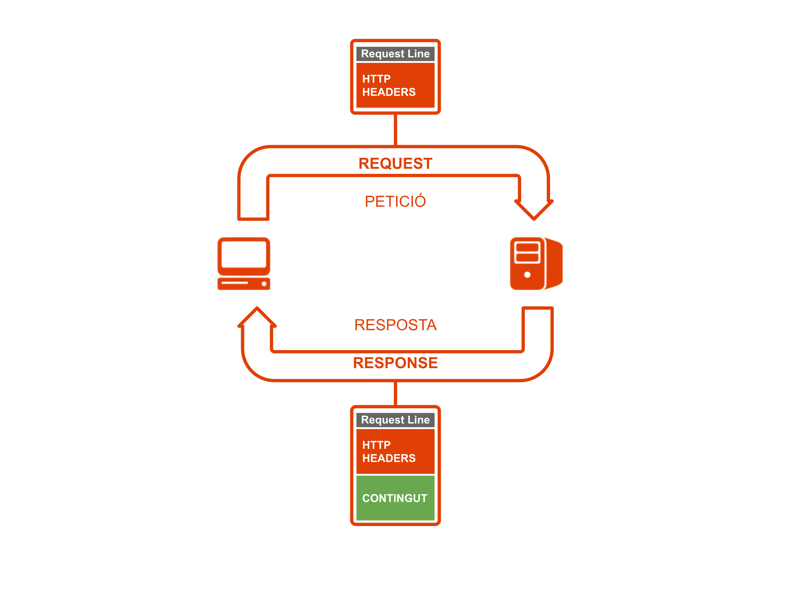

---
# Informació general del document
title: 1. Introducció a HTML
subtitle: Llenguatges de marques i sistemes de gestió de la informació (LMSGI)
authors: 
    - José A. Múrcia Andrés
lang: ca
page-background: img/bg.png

# Portada
titlepage: true
titlepage-rule-height: 0
# titlepage-rule-color: AA0000
# titlepage-text-color: AA0000
titlepage-background: img/portada.png
# logo: img/logotext.png

# Taula de continguts
toc: true
toc-own-page: true
toc-title: Continguts

# Capçaleres i peus
header-left: Llenguatges de Marques
header-right: Curs 2024-2025
footer-left: IES Jaume II El Just
footer-right: \thepage/\pageref{LastPage}

# Imatges
float-placement-figure: H
caption-justification: centering

# Llistats de codi
listings-no-page-break: false
listings-disable-line-numbers: false

header-includes:
     - \usepackage{lastpage}
---

# HTML. Introducció i Evolució

Quan parlem **d’hipertext**, parlem de la tècnica que ens permet enllaçar un document amb altres documents mitjançant paraules marcades. Amb eixe objectiu naix en 1989 l’**HyperText Markup Language** de la ma de **Tim Bernes Lee, científic** del **CERN** que va utilitzar el llenguatge **SGML** per a definir un nou llenguatge de marques.

Tim Bernes Lee també estableix les bases del **protocol HTTP d’Internet**, que regula la **transferència dels documents HTML** i els recursos associats. L’èxit d'HTML és l’èxit d’Internet, tal i com el coneixem avui en dia, ja que dona lloc als documents que coneguem popularment com a pàgines web. 

En un primer moment **els primers intèrprets** de text **reconeixien HTML** per a **pintar o marcar el text en negreta o cursiva**.  Aquets primers intèrprets tenien funcions molt limitades i és en eixe moment quan **apareixen els primers navegadors amb capacitat d’interpretar l'HTML** d’una manera **més visual**, incorporant entre altres la **possibilitat de canviar el tipus de lletra i colors, incorporar també imatges**, sons, etcètera. 

{width=500px}

Des del 1989 ençà HTML ha anat millorant i incorporant nous **avanços significatius** que es descriuen a continuació:

* Incorporació de **noves etiquetes** que permeten a HTML incloure taules, capes, marcs, imatges, etcètera.  
* Incorporació de **llenguatges d’script** (JavaScript per exemple) que doten a HTML de funcionalitat extra i pàgines web dinàmiques.  
* Incorporació de **llenguatges d’estil** (CSS) per a donar format als documents d’una manera senzilla i de fàcil manteniment.  
* S’afegeixen **utilitats al JavaScript** mitjançant XML (AJAX) per a donar major interacció i dinamisme.
* Es permet la **inclusió d’elements avançats** (Flash i applets de Java)
* Es permet **elements semàntics** per a donar significat al contingut.  
* S’afegeixen cada vegada més **plugins als navegadors** que son capaços de mostrar imatges, so, vídeo i altres **elements multimèdia** a les pròpies pàgines.

Arribats a este punt, podem afirmar que **HTML és el llenguatge fonamental de les pàgines web**, però ara **Internet és la web**, ja que baix la web s’executa pràcticament la totalitat d’Internet, convertint-se en la base sobre la que trobem tecnologies molt diverses.

# Funcionament de les aplicacions web

## HTML, CSS i JavaScript

Una aplicació web és una aplicació que s’executa en un navegador d’internet i te com a base el llenguatge HTML. Aquestes aplicacions utilitzen actualment:

* **HTML** per a donar-li **estructura i significat** als continguts de l’aplicació. Per exemple permet indicar quins elements són paràgrafs, taules, imatges, etcètera.   
* Llenguatge **CSS** per a donar **format i maquetació** als continguts, com ara color, mida de la font, etcètera.  
* Llenguatge **JavaScript** per a dissenyar llocs interactius, és a dir, per a permetre capturar les **accions de l’usuari** i que la pàgina reaccione a aquetes accions. Un exemple és la validació de formularis.

{ width=400px }

## Protocol HTTP

Per a la **transmissió de fitxers o pàgines web** s’utilitza el protocol **HyperText Transfer Protocol (HTTP)**, el qual forma part de la pila de protocols TCP/IP. Aquest protocol està basat en la **comunicació petició-resposta**, de manera què, un **client (navegador)** realitza una petició d’un recurs indicant l’adreça en Internet.  La petició arriba a un **servidor HTTP o Web** el qual respon transmetent al client el recurs sol·licitat o bé indicant un missatge d’error si el recurs no està disponible. 

Quan un navegador rep com a resposta un codi d’error, mostra la pàgina d’error que porta incorporada el mateix navegador, tal i com s’observa a continuació per a l’antic Explorer i per a l’actual Chrome.

{ width=400px }

{ width=400px }

**El client i el servidor s’intercanvien paquets d’informació** que contenen una **capçalera** on es troba la **informació de control**, i un **cos** que, en el cas d’enviar una pàgina web, és on es troba el **codi HTML**.

{ width=400px }

A continuació es mostra un exemple de la informació que transporta un paquet HTTP per a la petició d’un client.

{ width=400px }

## Front-End i Back-End

El funcionament d’una **aplicació web** amb cert nivell de complexitat, requereix **executar** certes **accions en el del servidor** com ara **interpretar el codi** del servidor, amb PHP o ASP.NET, demanar **recursos** a altres servidors, com **bases de dades**, **imatges o streaming**,  i **emmagatzemar dades de sessió** de l’usuari. Aquestes accions són les que anomenem **Back-End**, i no són accessibles per a l’usuari.

Una vegada estes accions són executades, **el navegador rep el seu codi i ha de ser capaç d’interpretar-les** (HTML, CSS i JavaScript). Esta segona part és el que anomenem **Front-End**.

{ width=400px }

# Normalització i estàndards. Versions d’HTML

## Guerra de navegadors

Un **navegador** (**browser** en anglès) és un programa amb la **capacitat de traduir i interpretar HTML** per a produir una eixida gràfica. El primer navegador conegut fou Mosaic a principis dels 90. El més popular a finals dels 90 fou **Netscape Navigator** qui competia amb Internet Explorer de Microsoft, navegador nadiu de Windows. D’esta competència, **anomenada guerra de navegadors, sorgeix el problema de la falta d’estandardització**, ja que el codi HTML que entenia un navegador no era el mateix que entenia un altre, i per això calia dissenyar dos versions de la mateixa pàgina. Actualment la competència entre navegadors és bastant desigual tal i com s’observa en les dades de visites a la web [www.w3shools.com](http://www.w3shools.com) en 2023.

| 2023 | Chrome | Edge | Firefox | Safari | Opera |
| ----- | :---: | :---: | :---: | :---: | :---: |
| **August** | 80.1 % | 9.8 % | 4.6 % | 3.0 % | 1.8 % |
| **July** | 79.9 % | 10.0 % | 4.8 % | 3.0 % | 1.8 % |
| **June** | 79.8 % | 9.4 % | 4.3 % | 3.5 % | 2.1 % |
| **May** | 79.4 % | 9.3 % | 4.5 % | 3.7 % | 2.3 % |
| **April** | 79.5 % | 9.0 % | 4.6 % | 3.8 % | 2.2 % |
| **March** | 79.6 % | 8.8 % | 4.7 % | 3.7 % | 2.3 % |
| **February** | 79.7 % | 8.6 % | 4.8 % | 3.9 % | 2.2 % |
| **January** | 79.7 % | 8.2 % | 5.0 % | 3.9 % | 2.3 % |

## Estandardització

Al problema de la falta d’estandardització i incompatibilitat dels diferents navegadors vingué de la ma del mateix Tim Bernes Lee, que va fundar la **World Wide Web Consortium (W3C)**, organisme encarregat de crear un estàndard del llenguatge HTML per a què els desenvolupadors dels navegadors el seguisquen.

Així, gràcies a la W3C s’han creat les diferents versions d’HTML: **HTML2, HTML3, HTML4 I HTML5**, passant per **XHTML**, que és un llenguatge HTML que utilitza les normes de XML. La W3C s’encarrega també d’estandarditzar tecnologies i llenguatges relacionats amb HTML com ara CSS, JavaScript, SVG o el mateix XML.

No obstant, si bé la majoria de navegadors segueixen les directrius de la W3C no ho fan al 100%, i **encara perduren alguns problemes de compatibilitat** entre navegadors.

!!! note "Provant el teu navegador" 

    Existeixen divertes pàgines on poder provar fins quin punt és compatible el nostre navegador amb els estàndards:

    * Tests Acid: [http://acid3.acidtests.org/](http://acid3.acidtests.org/)
    * HTML5 Test: [https://html5test.com/](https://html5test.com/)

## Versions d’HTML

Actualment continuen en vigor el següents estàndards:

* **HTML 4.01**

Es tracta d’un estàndard creat en 1999 i que encara te plena vigència. La manera de referenciar-lo en el nostre document és la següent.

```html
<!DOCTYPE HTML PUBLIC   “-//W3C//DTD HTML 4.01 Transitional//EN" “http://www.w3.org/TR/html4/loose.dtd">
```

* **XHTML**

XHTML estava cridat per a ser el substitut d’HTML, ja que fins aquell moment XML s’havia erigit com a llenguatge de marques definitiu. **Les pàgines escrites en XHTML han de complir obligatòriament les regles del llenguatge XML** ben format. La capçalera per a utilitzar este llenguatge en el nostre document és la següent:

```html
<!DOCTYPE html PUBLIC  “-//W3C//DTD XHTML 1.0 Strict//EN"  “http://www.w3.org/TR/xhtml1/DTD/xhtml1-transitional.dtd"> <html xmlns=http://www.w3.org/1999/xhtml xml:lang="es">
```

{ width=400px }

* **HTML5**

Actualment es considerat com la versió definitiva d’HTML i contràriament al que es puga pensar, fou creat per la **WHATWG** (**Web Hypertext Application Technology Working Group**) i no per la W3C.

```html
`<!DOCTYPE html> <html lang="es">
```

Actualment la W3C ja ha substituït a la **WHATWG** com a organisme responsable de l’estàndard **HTML5**. Com a estàndard compleix una filosofia **d’estàndard viu**, ja que va canviant en funció de les millores tecnològiques.

## Validació de codi HTML.

**Els navegadors no són estrictes a l’hora d’interpretar HTML**, ja que tracten d’ignorar els errors per mostrar una versió òptima d’allò que desenvolupem. No obstant això, **com a creadors de pàgines web tractarem de complir amb les normes del llenguatge**, impedint que el navegador puga equivocar-se i interpretar les nostres errades. Per a això tenim a la nostra disposició el validador de la **W3C ([http://validator.w3.org](http://validator.w3.org))** que permet validar les versions d’HTML. 

Els errors greus es mostren en roig. Podem trobar també alertes (warnings) que són errades lleus, però que hi ha que tenir en compte.

Per altra part la majoria de IDE’s actuals disposen d’un validador incorporat o bé d’una extensió que ens permet validar el nostre codi.
