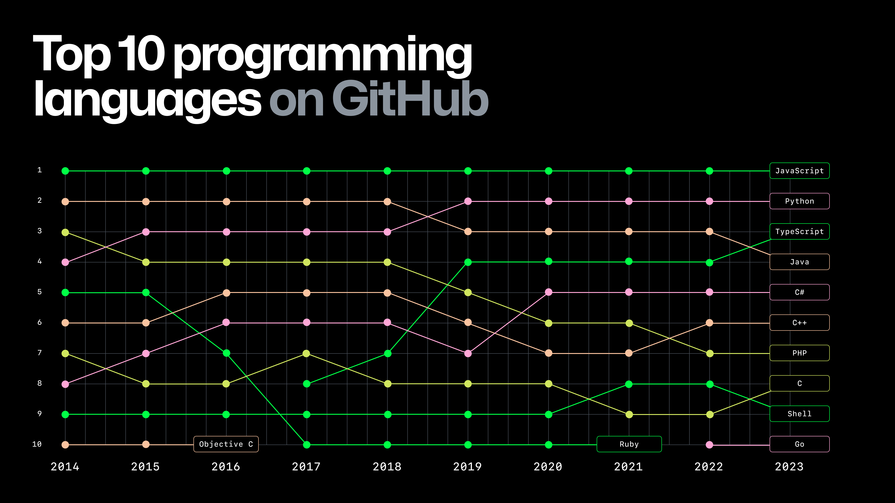

---
# Informació general del document
title: 1. Introducció a Javascript
subtitle: Llenguatges de marques i sistemes de gestió de la informació (LMSGI)
authors: 
    - José A. Múrcia Andrés
lang: ca
page-background: img/bg.png

# Portada
titlepage: true
titlepage-rule-height: 0
# titlepage-rule-color: AA0000
# titlepage-text-color: AA0000
titlepage-background: img/portada.png
# logo: img/logotext.png

# Taula de continguts
toc: true
toc-own-page: true
toc-title: Continguts

# Capçaleres i peus
header-left: Llenguatges de Marques
header-right: Curs 2024-2025
footer-left: IES Jaume II El Just
footer-right: \thepage/\pageref{LastPage}

# Imatges
float-placement-figure: H
caption-justification: centering

# Llistats de codi
listings-no-page-break: false
listings-disable-line-numbers: false

header-includes:
     - \usepackage{lastpage}
---

## Introducció

Node.js és un entorn d'execució (runtime) construït sobre el motor JavaScript V8 de Google Chrome, que ens permet utilitzar aquest llenguatge per desenvolupar qualsevol tipus d'aplicació, constituint-se com un entorn full-stack (*frontend* i *backend*) complet. A més, com que és un llenguatge lligat inicialment al món web, tenim la possibilitat de crear aplicacions d'escriptori o mòbils emprant tecnologies com HTML5 i CSS.

A l'espai Octoverse (https://octoverse.github.com/) creat per Github, es presenta un informe anual de les tendències en desenvolupament de programari lliure, basat en milions de projectes allotjats en aquest portal. En aquest informe, podem veure com JavaScript és, de lluny, el llenguatge més utilitzat en projectes de programari lliure, seguit de Python en segon lloc i Java en tercer.

{ width=400px }

!!! note "Documentació oficial"

    Lloc web oficial amb la documentació de Node.js: [https://nodejs.org/en/docs/](https://nodejs.org/en/docs/)

## Evolució de JavaScript

La primera versió de JavaScript va ser dissenyada el 1995 per Netscape, amb la intenció inicial de donar als navegadors la capacitat de validar formularis sense enviar les dades al servidor, la qual cosa era avantatjós en un moment en què la velocitat de les comunicacions era molt limitada. Aquesta primera versió, inicialment anomenada LiveScript, va passar a dir-se JavaScript per raons de màrqueting (Java estava de moda en aquella època).

L'any 1997 es va estandarditzar el llenguatge, creant-se la norma ECMA-262 (European Computer Manufacturers Association), coneguda com a ECMAScript. La ISO va adoptar l'ECMA-262 donant lloc a l'estàndard ISO/IEC-16262.

Des d'aleshores, el llenguatge ha anat evolucionant i guanyant capacitat, sent la versió ES6 (ECMAScript 2015) la que va introduir més canvis, amb la introducció d'àmbits per a les variables, *string templates*, funcions fletxa, desestructuració, classes i promeses.

## Característiques principals de Node.js

Entre les característiques de Node.js, podem destacar:

* Ofereix un paradigma de **programació basada en esdeveniments**, a través d'una **API asíncrona** que no bloqueja el programa principal mentre espera una resposta, sinó que continua l'execució principal fins a rebre la resposta.
* L'execució del codi és molt ràpida.
* Es basa en un **model monofilament molt escalable**: Només hi ha un fil d'execució atenent peticions, però gràcies a l'API asíncrona i orientada a esdeveniments, es poden atendre múltiples peticions amb aquest fil, consumint molts menys recursos que un sistema multithread.
* Com que l'execució no es realitza dins del navegador, s'elimina la necessitat de desenvolupar codi compatible amb cada navegador.

## On podem trobar Node.js?

Node.js està en més llocs dels que ens podem imaginar. Veiem una llista d'aplicacions on s'utilitza Node.js, tant des del costat del servidor com en aplicacions d'escriptori i mòbils. A continuació alguns exemples:

* Entorns de servidor (*backend*): Netflix, PayPal, LinkedIn, eBay, NASA, Mozilla, Uber, Yahoo, Groupon (https://www.hackaboss.com/blog/5-mejores-ejemplos-de-aplicaciones-node-js-para-empresas).
* Aplicacions d'escriptori:
    * Aplicacions d'escriptori basades en Electron (https://electronjs.org/apps): Skype, WhatsApp, Slack, Atom, Visual Studio Code, Github Desktop.
    * Aplicacions basades en nwjs (https://github.com/nwjs/nw.js/wiki/list-of-apps-and-companies-using-nw.js): Haroopad, Reditr, TweetDeck, Kindle Cloud Reader.
* Aplicacions mòbils amb Ionic/Capacitor: MarketWatch, Sanvello, Calla (https://mdevelopers.com/blog/14-best-ionic-apps-of-2022).

# Primers passos amb Node.js

## Instal·lació

En Ubuntu, Node.js ja ve instal·lat de sèrie en la versió 10.19.0~dfsg-3ubuntu1 (Ubuntu 20.04 LTS) a data de desembre de 2022.

Si desitgem la darrera versió, podem descarregar el paquet des del propi lloc web de Node.js, on es troben les darreres versions oficials (actualment, les versions LTS i Current). La diferència entre les dues és que la LTS es considera estable i té suport a llarg termini, mentre que la Current incorpora les últimes novetats, a canvi de perdre un poc d'estabilitat (podríem dir que és una beta de la propera versió LTS).

Si optem per descarregar aquesta versió, veurem que no està en format de paquet, sinó que és un fitxer comprimit, per la qual cosa caldrà descomprimir-lo i copiar cada cosa al seu lloc. D'altra banda, al repositori NodeSource de Github hi ha uns scripts per facilitar-nos la instal·lació des del gestor de paquets del sistema: https://nodejs.org/es/download/package-manager.

Per al treball que farem, ens serà suficient amb la versió que porta Ubuntu, així no tindrem problemes amb dependències en distribuir les nostres aplicacions.

Aquest paquet ofereix tant el `node` (o el seu àlies `nodejs`) com el gestor de paquets de Node.js, anomenat `npm` (*Node Package Manager*).

## Hola Node

Node.js es pot llançar des de la terminal amb l'ordre `node` o el seu àlies `nodejs`.

Per comprovar la versió de Node que tenim, farem servir `node -v` o `node --version`:

```console
$ node -v
v18.19.1
```

Node.js admet dues formes de treball: mitjançant la consola interactiva i l'execució directa de scripts.

### La consola interactiva

Node.js disposa d'una consola interactiva a la qual podem accedir amb `node` i llançar directament ordres:

```shell
$ node
> console.log("Hola Node");
Hola Node
undefined
```

Quan llancem Node, el *prompt* del sistema canvia al símbol `>`, indicant que estem dins de la consola de Node. Si alguna vegada hem treballat amb la consola web del navegador, el funcionament és exactament el mateix.

Si ens fixem, hem escrit només una instrucció `console.log`, que seria l'equivalent en Java a `System.out.println`. Podem veure com no ha fet falta definir cap classe principal ni cap mètode `main`. JavaScript, tot i que suporta la programació orientada a objectes, no obliga a que tot estiga dins d'una classe.

Per eixir del mode interactiu, utilitzarem la combinació de tecles `Ctrl+D`.

### Execució d'scripts

La manera habitual de treballar amb Node.js serà llançant l'ordre `node` sobre un script. Veiem un senzill exemple. Tenim el següent script, denominat hola.js.

```javascript
if (process.argv.length == 3)
 console.log("Hola " + process.argv[2]);
else
 console.log("Hola Node.js");
```

Per executar-lo, utilitzarem `node` juntament amb el nom del fitxer:

```console
$ node hola.js Jose
Hola Jose
$ node hola.js 
Hola Node.js
```

Es tracta d'un *Hola Món* personalitzat que, segons els paràmetres que li proporcionem, escriurà una cosa o una altra. També podem observar, com ja s'ha comentat abans, que no cal incloure el codi dins de cap classe o funció especial. A més, veiem que podem accedir als paràmetres passats per la línia d'ordres a través de l'objecte `process.argv`.
