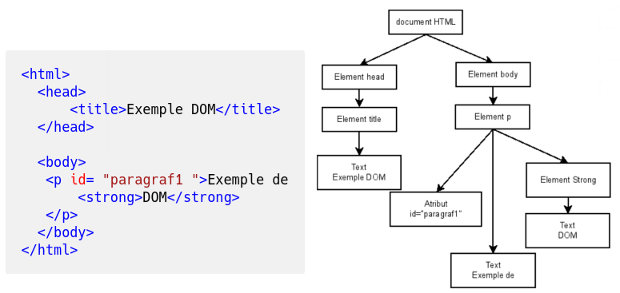
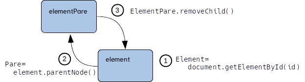

# El DOM (Document Object Model)

## Què és el DOM?
  
El DOM és una representació estructural del contingut dels documents HTML, XHTML i XML, que proporciona una interfície de programació (API) per accedir directament als seus elements, consultar-los i modificar-los. Aquest estàndard, definit originalment per l'W3C (World Wide Web Consortium, https://www.w3.org), és ara mantingut per la **WHATWG** (* Web Hypertext Application Technology Working Group*, https://dom.spec.whatwg.org/) com un estàndard viu (conegut com **DOM Live Standard**), que evoluciona contínuament per adaptar-se a les necessitats modernes.

El DOM és multiplataforma i independent del llenguatge de programació utilitzat, tot i que JavaScript és el més habitual.

> Les primeres especificacions del DOM (DOM1, DOM2 i DOM3) van ser desenvolupades pel W3C entre 1998 i 2004. En 2005 es va crear el WHATWG, amb la col·laboració de diverses empreses i comunitats com Mozilla, Apple i Opera, i es va anar produint una transcició fins que en 2015 es consolida com cun estàndard viu, formalitzat en 2019 amb la signatura del *Memorandum of Understanding (MoU)* entre el W3C i el WHATWG.

### L'arbre DOM

Els documents HTML tenen una estructura jeràrquica que es pot representar com un arbre. Quan el navegador carrega un document, crea automàticament aquest arbre DOM, que ofereix una manera sistemàtica d'accedir a qualsevol element o atribut.

Tot i que el DOM defineix múltiples tipus de nodes, els més comuns són:

- **document**: el node arrel que representa tot el document.
- **element**: els elements HTML, formats per l'etiqueta, els atributs i el contingut.
- **attr**: representa atributs de les etiquetes/elements HTML.
- **text**: conté el text dins d’una etiqueta.
- **comment**: representa els comentaris de la pàgina.

***Exemple***



L'estructura del DOM en qualsevol pàgina web pot vore's a través de l'inspector d'elements.

El procés de generació de l'arbre DOM és automàtic, i segueix sempre les mateixes regles:

* Les etiquetes HTML es transformen en dos nodes: 
    * un amb la pròpia etiqueta (element), i  
    * un, fill d'aquest, que conté el contingut textual (text)
* Si una etiqueta es troba dins d'altra, aquesta genera un element fill dins de l'anterior, amb les mateixes regles que aquest.

## Accés als elements del DOM

L'API del DOM proporciona diverses maneres d'accedir als elements. Tot i que encara són útils, alguns mètodes clàssics han estat parcialment substituïts per alternatives modernes més eficients i flexibles.

**Mètodes clàssics**

- `getElementsByTagName(etiqueta)`: retorna una col·lecció d'elements amb una etiqueta específica.
- `getElementsByName(nom)`: busca elements amb un atribut `name` específic.
- `getElementById(id)`: retorna el node únic amb l'identificador especificat.

**Mètodes moderns**

Es recomana utilitzar els mètodes següents per la seva simplicitat i compatibilitat amb **selectors CSS**:

- `querySelector(selector)`: retorna el primer element que coincideix amb el selector especificat.
- `querySelectorAll(selector)`: retorna tots els elements coincidents com una `NodeList`.

***Exemple:***
```js
// Mètode clàssic
var elementsClassics = document.getElementsByTagName('div');

// Mètode modern
var elementModern = document.querySelector('div');
var elementsModerns = document.querySelectorAll('div');
```

### Processament dels NodeList

Les llistes `NodeList` suporten mètodes com `forEach`, però no són un array. Si necessitem funcionalitats d’array, podem convertir-les amb:

```js
Array.from(document.querySelectorAll('div')).forEach(el => console.log(el));
```

!!! note "Funcions fletxa =>"
     Una funció fletxa és una abreviació d'una funció anònima. És a dir, l'expressió:

     ```js
     el => console.log(el)
     ```

     Seria equivalent a:

     ```js
     function(el) { 
         console.log(el);
     }
     ```

!!! note "**Recorrent els resultats d’una `NodeList`**"

    Quan treballem amb una `NodeList` retornada per `querySelectorAll`, podem recórrer els seus elements de diverses maneres:

    #### 1. **Amb el mètode `forEach` (més recomanable):**

    El mètode `forEach` està disponible directament a `NodeList` i és molt pràctic:

    ```js
    document.querySelectorAll('div').forEach(function(el) {
        console.log(el);
    });
    ```

    Amb una funció fletxa, encara més compacte:

    ```js
    document.querySelectorAll('div').forEach(el => console.log(el));
    ```

    #### 2. **Amb un bucle `for` clàssic:**

    La `NodeList` pot recórrer-se com un array utilitzant un bucle `for` clàssic:

    ```js
    var elements = document.querySelectorAll('div');
    for (var i = 0; i < elements.length; i++) {
        console.log(elements[i]);
    }
    ```

    #### 3. **Amb un bucle `for...of`:**

    Les `NodeList` són iterables, així que també podem utilitzar el bucle `for...of`:

    ```js
    for (const el of document.querySelectorAll('div')) {
        console.log(el);
    }
    ```

    #### 4. **Convertint la `NodeList` en un array:**

    Si necessitem utilitzar mètodes avançats d’array, podem convertir la `NodeList` a un array amb `Array.from` o l’operador d'extenxió (`...`):

    ```js
    Array.from(document.querySelectorAll('div')).forEach(el => console.log(el));

    // Alternativa amb l'operador d'extensió:
    [...document.querySelectorAll('div')].forEach(el => console.log(el));
    ```

    #### 5. **Amb un bucle `for...in` (desaconsellat):**

    Encara que tècnicament es pot utilitzar `for...in`, aquest bucle no és recomanable perquè itera sobre totes les propietats enumerables de l’objecte, no només sobre els elements:

    ```js
    var elements = document.querySelectorAll('div');
    for (var i in elements) {
        console.log(elements[i]); // Això pot incloure propietats innecessàries
    }
    ```

## Creació i modificació del DOM

El DOM és dinàmic i pot modificar-se per afegir, eliminar o alterar elements.

### Creació d'elements

Per tal de crear elements HTML amb JavaScript natiu:

1. Creem un node de tipus `element` que represetna l'element en sí (`createElement`).
2. Afegeix contingut al node (amb `createTextNode` o amb `innerHTML`).
3. Inserim el node al document (amb `appendChild` o `insertAdjacentElement`).

Veiem-ho amb un exemple per afegir un paràgraf al final del document:

```js
var nouParagraf = document.createElement('p'); // Pas 1
nouParagraf.textContent = 'Hola món!';         // Pas 2
document.body.appendChild(nouParagraf);        // Pas 3
```

Actualment, disposem d'una alternativa més moderna, que és fer ús de `insertAdjacentHTML`:

```js
document.body.insertAdjacentHTML('beforeend', '<p>Hola món!</p>');
```

Aquest mètode `insertAdjacentHTML` ens permet inserir un fragment de codi HTML com a part del DOM, sense necessitat de crear manualment nodes amb `createElement` o afegir-los amb `appendChild`. És útil quan volem inserir elements de manera eficient, ja que no cal modificar el DOM diverses vegades.

En general la sintaxi de `insertAdjacentHTML` és:

```js
element.insertAdjacentHTML(position, html);
```

On:

* `position`: Indica on volem inserir el codi HTML en relació amb l'element seleccionat (element). Els valors possibles són:
  * `beforebegin`: Abans del node seleccionat.
  * `afterbegin`: Just dins del node seleccionat, abans del primer fill.
  * `beforeend`: Just dins del node seleccionat, després de l’últim fill.
  * `afterend`: Després del node seleccionat.
* `html`: És una cadena (string) amb el codi HTML que volem inserir.

!!! caution "Compte amb les cometes!"
     Quan afegiu directament codi HTML en una cadena, aneu en compte amb respectar com fem ús de les cometes. Per exemple, si volem afegir un paràgraf amb l'`id="p1"` podriem fer:

     ```
     document.body.insertAdjacentHTML('beforeend', "<p id='p1'>Hola</p>");
     ```

     O bé:

     ```
     document.body.insertAdjacentHTML('beforeend', '<p id="p1">Hola</p>');
     ```

     Però **NO**:

     ```
     document.body.insertAdjacentHTML('beforeend', "<p id="p4">Hola 4</p>");
     ```


### Supressió d'elements

Per tal d'eliminar un node, el primer que fem és localitzar-lo (amb `getElementById` o `querySelector`), i fer ús de `remove`o `removeChild`
Utilitza `remove` o `removeChild`:

```js
// Amb getElementById
document.getElementById('idElement').remove();

// Amb querySelector i un selector CSS
document.querySelector('#idElement').remove();
```

Aquest mètode `remove` va ser introduit per l'especificació del **DOM Live Standard** al voltant de 2014-2015. En les especificacions anteriors del DOM, calia accedir al node pare i eliminar el fill, de la següent manera:

```js
const element = document.getElementById('elementId');
element.parentNode.removeChild(element);
```

Gràficament, fariem el següent:



### Afegint atributs i classes als nodes

Si del que desitgem és afegir nous atributs al node seleccionat, podem fer ús del mètode `setAttribute` de la següent manera:

```js
document.querySelector('body').setAttribute('data-example', 'valor');
```

Amb això, hem seleccionat l'etiqueta *body*, i li hem afegit l'atribut `data-example`, amb el `valor` indicat.

Si volem afegir-li, llevar-li o alternar una classe CSS ho farem a través de la propietat `classList` de l'element, de la següent manera:

Per a classes:
```js

// Afegir una classe a la llista de classes
element.classList.add('classe');

// Eliminar una classe de la llista
element.classList.remove('classe');

// Alterna la classe (si no està l'afig, i si està la lleva)
element.classList.toggle('classe');
```

### Manipulació directa d’estils

Per tal de modificar els estils d'un element, podem fer-ho directament amb la propietat `style`:

```js
document.getElementById('menu').style.backgroundColor = '#000';
```

Tot i que per gestionar estils més complexos, és més pràctic fer ús de fulls d'estil amb `classList`, en lloc de modificar estils directament.


## Funcionalitats avançades del DOM

### MutationObserver

El **MutationObserver** és una API moderna que permet observar i respondre a canvis en el DOM. És més eficient i recomanable que utilitzar esdeveniments com `DOMSubtreeModified`, que són més antics i tenen problemes de rendiment.

Un **MutationObserver** monitoritza canvis en un element específic i pot observar:

* Quan s'afigen o eliminen elements fills,
* Quan hi ha canvis als atributs,
* Quan es modifica el contingut del text

Per fer ús d'un MutationObserver, seguirem la següent sintaxi:

```js
const observer = new MutationObserver(callback);
observer.observe(targetNode, options);
```

On:

* **`callback`**: És una funció que s'executarà cada vegada que hi haja un canvi al DOM.
* **`targetNode`**: És l'element que volem observar.
* **`options`**: És un objecte que que defineix els tipus de canvis a observar.

Veiem-ho de forma pràctica amb el següent exemplem, que monitoritzarà els canvis dins d'un div (tingueu en compte que aci mesclem Javscript i HTML per exemplificar aquesta funcionalitat, però no és una pràctica recomanable)


```html
<div id="contenidor">
    <p>Contingut inicial</p>
</div>
<script>
    const targetNode = document.getElementById('contenidor');

    // Callback per gestionar canvis: Observeu que estem donant nom a una funció anònima
    // i que aquesta s'expressa en forma de funció fletxa.
    // A més, aquesta funció anònima rep dos arguments: mutationlist i observer.
    const callback = (mutationsList, observer) => {
        // el mètode forEach permet recórrer una llista l'elements, 
        // i aplicar una funció sobre ells, mitjançant una funció fletxa
        mutationsList.forEach(mutation => {
            console.log(`Tipus de canvi: ${mutation.type}`);
            if (mutation.type === 'childList') {
                console.log('Canvi en elements fills:', mutation.addedNodes);
            }
            if (mutation.type === 'attributes') {
                console.log(`Atribut canviat: ${mutation.attributeName}`);
            }
        });
    };

    // Crear l'observador
    const observer = new MutationObserver(callback);

    // Configurar què observar
    observer.observe(targetNode, {
        childList: true, // Observar canvis en els fills
        attributes: true, // Observar canvis en atributs
        subtree: true // Incloure fills del subtree
    });

    // Afegim canvis per provar-ho
    // Per a això fem ús de setTimeOut, que estableix un temporitzador
    // el qual al cap de 2 segons llançarà determinada funció
    setTimeout(() => {
        const nouParagraf = document.createElement('p');
        nouParagraf.textContent = 'Nou contingut afegit!';
        targetNode.appendChild(nouParagraf);
    }, 2000);

    // I ara altre temporitzador que es dispararà als 4 segons
    setTimeout(() => {
        targetNode.setAttribute('data-test', 'valor');
    }, 4000);
</script>
```

Si volem aturar d'observar canvis en el DOM, fem ús de `disconnect()`:

```js
observer.disconnect();
```

Aquest mecanisme pot ser útil per detectar elements que es creen de manera dinàmica, per exemple en aplicacions de tipus SPA (Single Page Application), o per monitoritzar canvis al DOM per sincronitzar l'estat de l'aplicació.

### Shadow DOM

El **Shadow DOM** és una funcionalitat del DOM que permet crear una còpia encapsulada i independent del DOM dins d’un element amfitrió. Aquest sistema ofereix **encapsulació d'estils i funcionalitats**, el què significa que els estils i scripts dins del Shadow DOM no afecten el DOM global, ni viceversa. A més, facilita la reutilització de components.

Com veurem més endavant, el *Shadow DOM* és una de les peces clau que momponen els *Web Components*.

Un concepte clau a l'hora de treballar amb el *Shadow DOM* és el *Shadow Root* o l'*arrel Shadow*, que és el que ens permet convertir un element comú en un element amfitrió que conté el *Shadow DOM*. Dins de l'arrel Shadow podem definir tant elements HTML com estils CSS com interactivitat encapsulada.

Veiem un exemple pràctic amb això:

```js
// Creem un element div que farà d'amfitrió (host)
const host = document.createElement('div');

// Creem un arrel Shadow dins del host amb attachShadow
// Amb el paràmetre mode indiquem si permetem l'accés al 
// Shadow DOM (mode:open) o no (mode:closed), sent 
// només gestionable pel navegador 
const shadowRoot = host.attachShadow({ mode: 'open' }); 

// Ara afegim HTML i CSS al Shadow DOM, utilitzant innerHTML
// Aquests estils CSS encapsulats només afecten el contingut 
// del Shadow DOM, no altres elements del DOM global.

shadowRoot.innerHTML = `
   <style>
       /* Estils encapsulats, que només afecten al Shadow DOM */
       p { color: red; font-weight: bold; }
   </style>
   <p>Aquest paràgraf està dins del Shadow DOM</p>`;
   
// Afegim l'element amfitrió del Shadow Root al DOM global.
// El contingut d'aquest serà visible, però completament 
// independent del DOM extern
document.body.appendChild(host); 

        
// Afegim un paràgraf amb l'estil predeterminat
document.body.insertAdjacentHTML('beforeend', '<p>Paràgraf amb estil normal</p>');
```

El resultat serà que el paràgraf que apareix dins el Shadow DOM serà roig i en negreta, i els que hi són fora, tindran l'estil predeterminat.

!!! note "Modes d'encapsulació `open` vs `closed`"

     Quan creem l'arrel Shadow amb `attachShadow`, podem triar entre dos modes:

     * **`open`:**  
       - L'arrel Shadow és accessible via `element.shadowRoot` des de JavaScript.
       - Útil per depuració o quan necessitem accedir al contingut encapsulat.

        ```js
        const shadowRoot = host.attachShadow({ mode: 'open' });
        console.log(host.shadowRoot); // Mostra el ShadowRoot
        ```

     * **`closed`:**  
       - El Shadow DOM no és accessible via `shadowRoot`.
       - Millor per a components que requereixen més encapsulació i seguretat.

     ```js
     const shadowRoot = host.attachShadow({ mode: 'closed' });
     console.log(host.shadowRoot); // Mostra null
     ```

#### Exemple amb funcionalitat i interacció

El següent exemple conté un *div* amb l'`id` *contenidor*, dins el qual anem a afegir un *Shadow DOM* que conté un botó. 

Dins aquest Shadow DOM encapsularem els estils per al botó, per a que no interferisquen amb altres botons al DOM global. A més, afegirem un esdeveniment de click sobre el botó, fent ús d'`addEventListener` dins del Shadow DOM.

```html
<div id="contenidor"></div>
<script>
    const host = document.getElementById('contenidor'); // Seleccionem el contenidor
    const shadowRoot = host.attachShadow({ mode: 'open' }); // Creem l'arrel Shadow

    shadowRoot.innerHTML = `
        <style>
            button {
                background-color: blue;
                color: white;
                border: none;
                padding: 10px;
                cursor: pointer;
            }
        </style>
        <button>Fes clic</button>
    `;

    // Afegim funcionalitat al botó dins del Shadow DOM
    shadowRoot.querySelector('button').addEventListener('click', () => {
        alert('Botó dins del Shadow DOM!');
    });
</script>
```

Observeu que aci hem afegit un nou tipus d'esdeveniment, el *clic* sobre un element, en aquet cas, un botó, i veiem també com mostrar missatges d'alerta des de Javascript.

Per altra banda, observeu que aci, estem accedint al botó amb `querySelector`, a partir de la referència que tenim al `shadowRoot`.

!!! question "Repte!"
     Canvia l'accés al botó, i en lloc de `shadowRoot.querySelector`, accedeix a aquest des de l'amfitrió. És a dir, des de `host.shadowRoot.querySelector`.

     Fet això, prova a canviar el mode `open` a `closed`, i comprova'n el funcionament, accedint des del `shadowRoot` i des del `host.shadowRoot`. Veus alguna diferència?

!!! note "Sobre l'encapsulació amb Shadow DOM"
     En començar el document, hem parlat d'un dels principis clàssics en programació web: Separar l'estructura (HTML) de la seua representació (CSS) i comportament (Javascript).

     Si t'adones, amb el ShadowDOM estem fent tot el contrari, i en un mateix component estem mesclant estructura, representació i comportament.

     Això respon a una evolució del paradigma, centrat en l'encapsulació a nivell de component, no a nivell de pàgina.

     Aquesta encapsulació ens proporciona modularitat i reutilització, ja que cada component encapsula tot el que necessita per a la seua funcionalitat, i l'estrucutra, representació i comportament estan dissenyays per treballar junts dins el context del component, evitant conflictes globals i garantint que els components siguen autònoms i reutilitzables.

     Aquest enfocament és útil en aplicacions modernes, on els components són unitats autònomes que es poden reutilitzar i combinar.