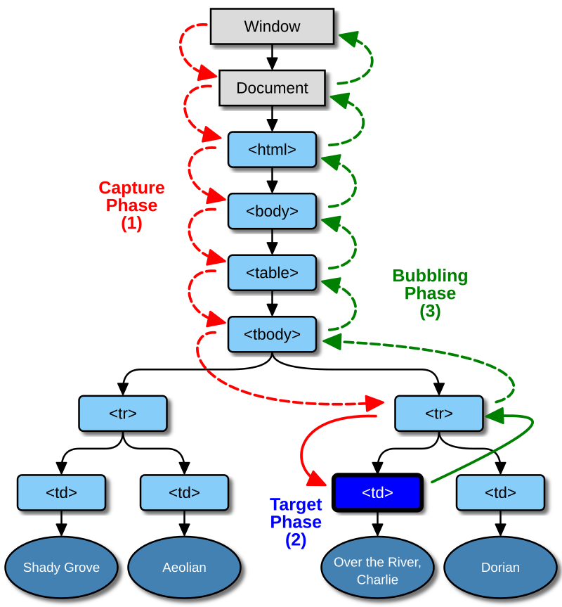

# Events en JavaScript

En la programació tradicional, el flux d'execució està ben definit de la primera instrucció a l'última, a través de seqüències d'instruccions i sentències de control de flux.

La programació web està **dirigida a esdeveniments**, associant funcions o mètodes com a resposta a determinades accions de l'usuari o successos del sistema. Quan es produeix un esdeveniment, s'executa la funció associada, anomenada *gestor d'esdeveniments* o *event handler*.

Els navegadors moderns suporten un model d'esdeveniments basat en els principis definits en el **DOM de nivell 2**, que ha estat ampliat i millorat pel **DOM Living Standard**. Aquest estàndard viu, mantingut per WHATWG, introdueix funcionalitats modernes i alternatives a esdeveniments obsolets, com l'ús de `MutationObserver` per monitoritzar canvis al DOM. 

## Tipus d'esdeveniments

Els esdeveniments es poden classificar en diversos grups segons el seu origen:

* **Esdeveniments de ratolí**: Generats per accions com clics, moviments o interaccions amb el ratolí.
* **Esdeveniments de teclat**: Generats quan l'usuari interactua amb el teclat.
* **Esdeveniments HTML**: Relacionats amb la càrrega de la pàgina o canvis en elements HTML.
* **Esdeveniments del DOM**: Relacionats amb canvis a l'estructura del DOM.

Veiem a les següents taules alguns dels principals esdeveniments de cada tipus:

**Esdeveniments de ratolí**

| Esdeveniment  | Descripció                         |
|---------------|-------------------------------------|
| `click`       | Fer clic amb el ratolí             |
| `dblclick`    | Doble clic                         |
| `mousedown`   | Premer un botó del ratolí          |
| `mouseup`     | Soltar un botó del ratolí          |
| `mousemove`   | Moure el ratolí                   |
| `mouseover`   | Passar el ratolí per sobre d’un element |
| `mouseout`    | Treure el ratolí d’un element      |

**Esdeveniments de teclat**

| Esdeveniment  | Descripció                         |
|---------------|-------------------------------------|
| `keydown`     | Premer una tecla                   |
| `keyup`       | Soltar una tecla                   |

És possible que en alguna documentació també es mencione l'esdeveniment `keypress`. Aquest està obsolet i ja no es recomana. En lloc d'això, la recomanació és utilitzar **`keydown`** o **`keyup`**.

**Esdeveniments HTML**

| Esdeveniment  | Descripció                         |
|---------------|-------------------------------------|
| `load`        | Quan la pàgina s’ha carregat completament |
| `change`      | Quan un element de formulari canvia |
| `focus`       | Quan un element obté el focus       |
| `blur`        | Quan un element perd el focus       |
| `resize`      | Quan es redimensiona la finestra    |
| `scroll`      | Quan l'usuari fa scroll a un element|

!!! note "Esdeveniments del DOM"
     Actualment, els esdeveniments sobre el DOM es gestionen directament amb `MutationObserver`, en lloc de fer ús de diversos esdeveniments per detectar els diversos canvis al DOM. Esdeveniments antics com **`DOMSubtreeModified`**, **`DOMNodeInserted`**, i altres estan **obsolets**.

     Recordem com podem fer ús del `MutationObserver`
     ```js
     const observer = new MutationObserver((mutations) => {
         mutations.forEach((mutation) => {
             console.log(`Canvi detectat: ${mutation.type}`);
         });
     });

     observer.observe(document.body, {
         childList: true, 
         subtree: true 
     });
     ```

## Gestors d'esdeveniments (Event Handlers)

### Models antics (`onclick`, etc.)

Els mètodes com `onclick`, `onload`, etc., s’utilitzaven històricament per associar esdeveniments directament als elements HTML. Això està **desaconsellat** perquè barreja comportament i estructura.

```html
<button onclick="alert('Clic!')">Fes clic</button>
```

!!! danger "Compte!"
     Aquesta tècnica només es menciona per motius històrics i no hauria d’utilitzar-se en projectes moderns.

### DOM nivell 2: `addEventListener`

El mètode **`addEventListener`** permet associar múltiples gestors d'esdeveniments a un mateix element i suporta les fases de *captura* i *bubbling*.

La sintaxi d'aquest mètode és:

```js
element.addEventListener(
    'tipus', 
    funció, 
    { 
        capture: false, 
        once: false, 
        passive: true 
    });
```
On: 

- **`tipus`**: És el nom de l'esdeveniment (p. ex., `click`).
- **`funció`**: és la funció que s'executa quan es produeix l'esdeveniment (i pot expressar-se com a funció anònima o funció fletxa, o ser una referència a una funció amb nom)
- **Opcions avançades:**:
  - `capture`: Determina si l’esdeveniment s’executa en la fase de captura (`true`) o bubbling (`false`).
  - `once`: Si és `true`, l'esdeveniment només es dispara una vegada.
  - `passive`: Si és `true`, indica que el gestor no cancel·larà el comportament predeterminat (això és útil per optimitzar quan es fa scroll scroll).

## Flux d'esdeveniments

El **flux d'esdeveniments** o *event flow* és el mecanisme que defineix l'ordre en què els esdeveniments es propaguen pel **DOM** quan es produeixen. Quan l'usuari interactua amb un element (per exemple, fent clic), l'esdeveniment es propaga seguint un flux definit que inclou les següents fases:

1. **Fase de Captura (Capture Phase):** L'esdeveniment viatja des de l'arrel del DOM (`document`) fins a l'element objectiu (*target*), passant per cada element intermedi.
2. **Fase de Target (Target Phase):** L'esdeveniment arriba a l'element objectiu i es dispara directament sobre ell.
3. **Fase de Bubbling (Bubble Phase):** L'esdeveniment es propaga de manera inversa, des de l'element objectiu fins a l'arrel del DOM, passant de nou pels elements intermedis.

Aquest flux permet que múltiples elements puguen reaccionar a un mateix esdeveniment en diferents punts del procés.

Fixem-nos en el següent document:

```html
<!DOCTYPE html>
<html lang="en">

<head>
    <meta charset="UTF-8">
    <meta name="viewport" content="width=device-width, initial-scale=1.0">
    <title>Document</title>
</head>

<body>

    <div id="div1">
        <p id="p1">Paràgraf de prova
            <strong id="s1">Feu clic ací</strong>
        </p>
    </div>

    <script>
        document.body.addEventListener('click', () => console.log('Capturing en <body>'), true);
        document.body.addEventListener('click', () => console.log('Bubbling en <body>'), false);

        document.getElementById('div1').addEventListener('click', () => console.log('Capturing en #div1'), true);
        document.getElementById('div1').addEventListener('click', () => console.log('Bubbling en #div1'), false);

        document.getElementById('p1').addEventListener('click', () => console.log('Capturing en #p1'), true);
        document.getElementById('p1').addEventListener('click', () => console.log('Bubbling en #p1'), false);

        document.getElementById('s1').addEventListener('click', () => console.log('Capturing en #s1'), true);
        document.getElementById('s1').addEventListener('click', () => console.log('Bubbling en #s1'), false);
    </script>

</body>

</html>
```

??? question "Analitza els esdeveniments que estem capturant en el codi anterior. Copia'l en un document HTML i observa a la consola de les eines de desenvolupament què passa quan fas clic en el text."

     Cadaelement del DOM (des de `<body>` fins a l'element més profund) té dos gestors associats:
      - Un per a la fase de **captura** (`true`).
      - Un altre per a la fase de **bubbling** (`false`).

     Si executem el codi podem veure com es produeix aquesta captura d'esdeveniments, en l'ordre que hem indicat al principi de l'apartat, és a dir, primer es realitzen els events de Capture des de l'arrel fins l'element més profund, i després el bubbling, en ordre invers.


        ```
        Capturing en <body>
        Capturing en #div1
        Capturing en #p1
        Capturing en #s1
        Bubbling en #s1
        Bubbling en #p1
        Bubbling en #div1
        Bubbling en <body>
        ```

Gràficament, podem veure aquest flux d'esdeveniments de la següent manera:

{ width=500px }

### Control de la propagació d'esdeveniments

Javascript ens proporciona diversos mètodes per controlar la propagació d'esdeveniments, com `stopPropagation`, `stopImmediatelyPropagation` o `preventDefault`.

#### 1. Aturar la propagació amb `stopPropagation`

Si utilitzem **`event.stopPropagation()`**, aturem la propagació de l'esdeveniment cap a altres elements, però només afecta una de les fases (captura o bubbling). Per exemple, si a l'script anterior modifiquem la línia:

```js
document.getElementById('s1').addEventListener('click', () => console.log('Capturing en #s1')}, true);
```

per:

```js
document.getElementById('s1').addEventListener('click', () => {
    event.stopPropagation();
            console.log('Capturing en #s1');
            
        }, true);
```

Veurem com la propagació d'esdeveniments s'atura quan s'arriba a l'element `#s1`, i no es disparen els gestors de **bubbling** dels elements més externs.

#### 2. Aturar la propagació immediatament amb `stopImmediatePropagation`

Amb `event.stopImmediatePropagation()`, no només aturem la propagació cap a altres elements, sinó que també bloquegem altres gestors d'esdeveniments en el mateix element.

Veiem-ho amb un exemple. Al codi anterior, afegim, sense eliminar res, un altre gestor sobre `#s1`:

```js
document.getElementById('s1').addEventListener('click', () => {
    console.log('Segon gestor. Capturing en #s1.');
}, true);
```

Si recarreguem el document i fem clic en el paràgraf, obtindrem:

```
Capturing en <body>
Capturing en #div1
Capturing en #p1
Capturing en #s1
Segon gestor. Capturing en #s1.
```

Ara bé, si al primer gestor, en lloc d'`event.stopPropagation();` utilitzem `event.stopImmediatePropagation();`, podrem veure com aquest segon gestor ja no es dispara.

#### 3. Cancel·lar el comportament predeterminat amb `preventDefault`

Alguns esdeveniments, com `click` en un enllaç o `submit` en un formulari, tenen un comportament predeterminat que podem evitar amb **`event.preventDefault()`**.

Per exemple, si tenim el següent enllaç:

```html
<a href="https://portal.edu.gva.es/iesjaumeeljust/" id="link1">Anar a la web del centre</a>
```

Podem evitar que aquest enllaç siga accessible podríem incorporar el següent codi:

```js
document.getElementById('link1').addEventListener('click', (event) => {
    event.preventDefault(); // Evitem que el navegador redirigisca
    console.log('Enllaç clicat, però no redirigit.');
});
```

!!! note "DOM XSS"
    Aquesta funció podria utilitzar-se per realitzar un atac DOM XSS (Cross Site Scripting basat en el DOM), si un usuari malintencionat aconsegueix modificar el Javascrip en el navegador de l'usuari.

    Per exemple, si tenim el codi:

    ```html
    <a href="https://www.google.com" id="link1">Vés al buscador de Google</a>
    ```

    I s'aconsegueix injectar el següent javascript:

    ```js
    document.getElementById("link1").addEventListener("click", (event) => {
            event.preventDefault();
            window.location.href = "https://bing.com";
        });
    ```

    Tot i que fins i tot en el codi de la pàgina l'enllaç siga correcte, quan fem clic serem redirigits a altre buscador.


## L'objecte Event

Quan creem una funció per gestionar un esdeveniment sobre un element, sovint necessitem informació sobre el propi esdeveniment, com la tecla que s'ha premut en un esdeveniment de teclat, la posició del ratolí on s'ha fet clic, o una referència a l'objecte on s'ha produït l'esdeveniment.

L'objecte `event`, creat automàticament pel navegador, encapsula aquesta informació i **la proporciona com a argument de la funció gestora**. Aquest objecte `event` inclou propietats i mètodes estàndard que permeten interactuar amb l'esdeveniment.

En exemples anteriors, ja hem vist com treballar amb aquest objecte, per exemple quan hem fet ús del `preventDefault()`, `stopPropagation()` i `stopImmediatelyPropagation()`.

Veiem algunes de les principals propietas d'aquest objecte:

| Propietat          | Descripció  |
|--------------------|-----------------------------------------------------------------|
| **`type`**      | Tipus d'esdeveniment (p. ex., `'click'`, `'keydown'`, `'mouseover'`). |
| **`target`**        | Element HTML que ha generat l'esdeveniment. |
| **`currentTarget`** | Element on s'està executant el gestor d'esdeveniments.  |
| **`bubbles`**       | Indica si l'esdeveniment pot propagar-se en la fase de bubbling. |
| **`cancelable`**    | Determina si l'esdeveniment es pot cancel·lar amb `preventDefault()`.  |
| **`timeStamp`**     | Temps en mil·lisegons des que la pàgina es va carregar fins l'esdeveniment.|
| **`isTrusted`**     | Cert si l'esdeveniment ha estat generat pel navegador (i no per script). |

Per exemple, podem afegir el següent codi als exemples que estavem veient:

```js
document.querySelector('#s1').addEventListener('click', (event) => {
    console.log('Tipus d’esdeveniment:', event.type);         // "click"
    console.log('Element objectiu:', event.target);          // El botó clicat
    console.log('Esdeveniment propagable:', event.bubbles);  // true
});
```

Veiem ara altres propietats relatives a tipus d'esdeveniment produit.

* **Propietats per a esdeveniments del ratolí**

| Propietat     | Descripció                                                                                      |
|---------------|------------------------------------------------------------------------------------------------|
| **`clientX`** | Coordenada X del cursor respecte a la finestra visible.                                         |
| **`clientY`** | Coordenada Y del cursor respecte a la finestra visible.                                         |
| **`pageX`**   | Coordenada X del cursor respecte al document complet (inclòs l'scroll).                        |
| **`pageY`**   | Coordenada Y del cursor respecte al document complet (inclòs l'scroll).                        |
| **`button`**  | Indica el botó premut del ratolí (`0`: esquerre, `1`: central, `2`: dret).                      |

Veiem-ho amb un exemple aplicat a tot el document:

```js
document.addEventListener('click', (event) => {
    console.log('Posició X:', event.clientX);
    console.log('Posició Y:', event.clientY);
    console.log('Botó clicat:', event.button); // 0 (esquerre), 1 (central), 2 (dret)
});
```

!!! note "Altres esdeveniments de ratolí"
     A l'exemple anterior, només es detectaran els clicks del botó esquerre. Si volem gestionar els altres botons, caldrà fer ús d'esdeveniments del ratolí més específics com `mousedown` i `mouseup`. 

* **Propietats per a esdeveniments de teclat**

| Propietat  | Descripció       |
|------------|----------------------------------------------------------------|
| **`key`**  | Representa la tecla premuda (p. ex., `'Enter'`, `'a'`). |
| **`code`** | Codi físic de la tecla (p. ex., `'KeyA'`, `'Enter'`). Independent del layout del teclat. |
| **`altKey`**, **`ctrlKey`**, **`shiftKey`**, **`metaKey`** | tenen el valor cert si aquestes tecles modificadores estaven premudes durant l'esdeveniment.|


**Exemple:**

```js
document.addEventListener('keydown', (event) => {
    console.log('Tecla premuda:', event.key);  // "Enter"
    console.log('Codi de tecla:', event.code); // "KeyA"
    console.log('ALT premut:', event.altKey); // false
});
```

### Gestió d'esdeveniments, objectes i `this`

Quan gestionem esdeveniments dins de **classes** o **objectes**, és important entendre el comportament de **`this`**. El valor de **`this`** depèn del context on es crida una funció. Això pot causar problemes quan treballem amb esdeveniments, perquè **`this`** dins d’un gestor d’esdeveniments es refereix a l'element HTML que l’ha generat, no a l’objecte o classe.

#### **El paper de `this` dins d'una classe**

1. **Dins d'una classe**, **`this`** fa referència a l'objecte instanciat de la classe:
   ```js
   class App {
       constructor(nom="Sense Nom") {
           this.nom = nom;
       }

       mostraNom() {
           console.log(this.nom);
       }
   }

   const app = new App();
   app.mostraNom(); // Mostra "Sense Nom"

   const app2=new App("La meua App")
   app.mostraNom(); // Mostra "La meua App"
   ```

2. **Dins d'un gestor d’esdeveniments**, però, **`this`** canvia i apunta a l’element HTML que ha generat l’esdeveniment:

   ```js
   class App {
       constructor(nom="Sense Nom") {
           this.nom = nom;
       }

       init() {
           document.querySelector('#botó').addEventListener('click', function () {
               console.log(this.nom); // undefined
           });
       }
   }

   const app = new App();
   app.init();
   ```

   - En aquest exemple, **`this.nom`** és **`undefined`** perquè **`this`** apunta a l'element HTML (`#botó`), no a l'objecte `App`.


#### **Solucions modernes al problema de `this`**

* **1. Utilitzar funcions fletxa**

Les funcions fletxa **no tenen el seu propi context de `this`**. En lloc d’això, hereten el valor de **`this`** del context on s’han definit. Això les fa ideals per a gestionar aquest problema.

**Exemple:**
```js
class App {
    constructor(nom="Sense Nom") {
           this.nom = nom;
       }

    init() {
        document.querySelector('#botó').addEventListener('click', (event) => {
            console.log(this.nom); // "Sense nom" o el nom amb què s'haja instanciat
        });
    }
}

const app = new App();
app.init();
```

Ací, la funció fletxa fa que **`this`** seguisca referint-se a l’objecte `App`, fins i tot dins del gestor d’esdeveniments.


* **2. Utilitzar el mètode `bind()`**

El mètode **`bind()`** permet fixar el valor de **`this`** en una funció, assegurant que no canvie dins del gestor d’esdeveniments.

**Exemple:**
```js
class App {
    constructor(nom="Sense Nom") {
           this.nom = nom;
       }

    init() {
        document.querySelector('#botó').addEventListener(
            'click',
            function () {
                console.log(this.nom);
            }.bind(this) // Fixem `this` a l'objecte App
        );
    }
}

const app = new App();
app.init();
```

**`bind(this)`** assegura que **`this`** sempre apunta a l'objecte `App`, independentment d’on s’execute la funció.

* **3. Utilitzar una variable intermèdia (`self` o `that` generalment)**

Aquesta tècnica és més antiga i consisteix a emmagatzemar el valor de **`this`** en una variable intermèdia (`self`, `that`, etc.) abans de definir el gestor d’esdeveniments.

**Exemple:**
```js
class App {
    constructor(nom="Sense Nom") {
           this.nom = nom;
       }

    init() {
        const self = this; // Guardem el valor de `this` en `self`
        document.querySelector('#botó').addEventListener('click', function () {
            console.log(self.nom);
        });
    }
}

const app = new App();
app.init();
```

Tot i que funcional, aquesta tècnica és menys recomanada en entorns moderns perquè les funcions fletxa són més netes i intuïtives.


### Creació d'esdeveniments personalitzats

Javascript ens permet crear events de forma personalitzada fent ús del constructor d'events personalitzats `CustomEvent`, així com llançar qualsevol tipus d'event amb el mètode `dispatchEvent` aplicat a qualsevol element HTML.

Per tal de crear un event personalitzat farem:

```js
const event = new CustomEvent('el_meu_event');
```

I si a més, volem **afegir informació a l'event**, podem fer ús de `CustomEvent` i la propietat `detail`de la següent forma:

```js
const event = new CustomEvent('el_meu_event', { detail: { hora: new Date() } });
```

Aquest event el podem capturar com qualsevol altre, i associar-li un escoltador d'events amb una funció gestora de l'event:

```js
document.body.addEventListener('el_meu_event', (ev) => {
    console.log('Event personalitzat:', ev.detail);
});
```

I si el que volem és **disparar l'event**, farem ús del mètode `dispatchEvent` dels elements HTML:

```js
document.body.dispatchEvent(event);
```

