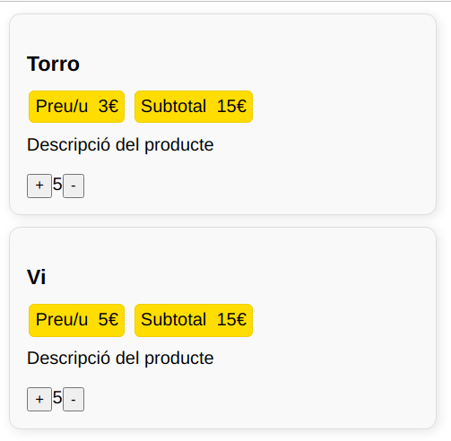

## Components reactius

Com hem vist a l'exercici de l'apartat anterior, un Web Component no es torna a renderitzar quan canviem els seus atributs.

Si volem modificar els atributs (l'estat del component) i que automàticament canvie el seu contingut i es renderitze de nou, hem d'implementar algun mecanisme que oferisca aquesta *reactivitat*.

Un component serà doncs *reactiu* quan es renderitza automàticament després de produir-se canvis en el seu estat.

Per fer això hi ha diverses formes, però la més habitual és fer ús del mètode del cicle de vida `attributeChangedCallback()` i de `observedAttributes()` dels Custom Elements.

El codi complet serà el següent:

```js
class MissatgeBenvinguda extends HTMLElement {
    constructor() {
        super();
        this.attachShadow({ mode: 'open' });
    }

    static get observedAttributes() {
        return ['nom']; // Escoltem canvis en aquest atribut
    }

    attributeChangedCallback(name, oldValue, newValue) {
        if (name === 'nom') {
            this.render();
        }
    }

    connectedCallback() {
        this.render();
    }

    render() {
        const nom = this.getAttribute('nom') || 'Usuari';
        this.shadowRoot.innerHTML = `<h2>Hola, ${nom}!</h2>`;
    }
}

customElements.define('missatge-benvinguda', MissatgeBenvinguda);
```

Veiem el funcionament pas a pas seguint el cicle de vida del component.

* **Pas 1.** Afegim el component al document.
     * Es crea el component (s'invoca al constructor),
     * El navegador invoca el mètode getter estàtic `observedAttributes()`, el qual li retorna una llista amb les propietats o atributs que ha d'observar. En aquest cas, ens interessa que observe el nom. **Aquest és un mètode propi dels Custom Elements, i és invocat automàticament pel navegador en aquest punt**.
    * El navegador invoca el mètode `connectedCallback()`. Abans renderirzàvem aci el contingut, però ara hem definit altre mètode `render()` que realitza aquesta funció de renderitzat del component, i la invoquem des d'aci (`this.render`). Aquesta és una forma de *refactorització* del codi, ja que extraiem part del codi en altre mètode per fer-lo reutilitzable.
* **Pas 2.**. Quan es modifica alguna propietat del document.
     * Si modifiquem alguna de les propietats al component, el navegedor consulta la *llista d'observables* que li hem proporcionat.
     * Si la propietat que hem modificat està en la llista d'atributs observats, invoca el mètode `attributeChangedCallback`, proporcionant-li el nom de l'atribut que ha canviat, el valor anterior i el valor nou.
     * Dins aquesta funció, es comprova quin és l'atribut modificat, i s'invoca de nou al mètode `render()` per tal que torne a dibuixa el component.


??? question "Activitat"
    Modifica el web Component de les targetes per a que siga reactiu, i tinga el següent aspecte:

    

    El Web Component rebrà com a paràmetres el nom del producte, el preu i la descripció. Inicialment la quantitat serà 0, i es podrà modificar amb els botons de + i -.

    Ela atributs als que haurà d'estar pendent el navegador seran la quantitat i el subtotal, ja que el nom del producte, el preu i la descripció, en principi no variaran.

