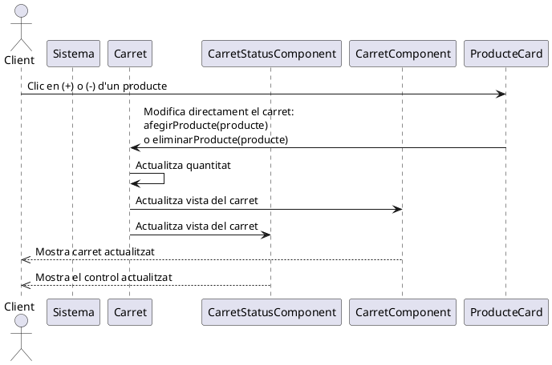

# Desenvolupament de l'Sprint 3: Gestió del carret

## Introducció

En aquest tercer sprint hem implementat la funcionalitat de **carret de la compra**, permetent als usuaris afegir i eliminar productes per a realitzar un encàrrec. Aquest sistema també inclou una àrea d'informació a la part superior de la interfície on es mostra la quantitat de productes al carret i el preu total.

Aquest desenvolupament es correspon a la [descripció funcional i els diagrames UML definits en la fase de disseny d'aquest sprint](https://joamuran.net/curs24_25/edd/u5/Sprint3/). 

## Objectius i funcionalitats desenvolupades

En aquest sprint s'han implementat les funcionalitats de:

* Afegir productes al carret des de la llista vista corresponent (pizzes o entrants), corresponent al requisit funcional RF03.
* Eliminar productes del carret, ja siga reduint unitats o eliminant-los completament, corresponent al requisit funcional RF04.
* Consultar el contingut del carret, corresponent al RF05.

Per altra banda, les postcondicions per actualitzar la informació (quantitat de productes i preu total) sobre el carret cada vegada que s'eliminen o s'afisquen elements a aquest impliquen implementar mecanismes per mantenir l'estat del carret a nivell global, i mecanismes per fer reactius els canvis en aquest. Veurem més endavant com fer aquesta implementació mitjançant els [events personalitzat que vam veure anteriorment](https://joamuran.net/curs24_25/lmi/u3_js_dom/3.events/#creacio-desdeveniments-personalitzats).

## Implementació

### **Estructura de carpetes del projecte**

L'estructura de carpetes després de la implementació d'aquest sprint és la següent:

```text
.
├── img
│   └── ,,,
├── index.html
└── js
    ├── components                      // Aci aniran els components gràfics del sistema
    │   ├── CardComponent.js
    │   ├── CarretComponent.js          // Mostra el contingut del carret
    │   ├── CarretStatusComponent.js    // Mostra l'estat del carret a la pestanya
    │   ├── CounterComponent.js
    │   ├── entrantCard.js
    │   ├── LlistaAlergens.js
    │   └── pizzaCard.js
    ├── libcomponents                   // Llibreria de components
    │   ├── base_component.js
    │   ├── scaffold_component.js
    │   └── tab_component.js
    ├── main.js
    ├── models                          // Aci tenim els models del domini
    │   ├── entrant.js
    │   ├── pizza.js
    │   └── producte.js
    ├── services                        // Ací la capa d'accés als serveis
    │   └── pizzeriaService.js
    └── state                           // Gestiona l'estat global de l'aplicació
        └── Carret.js
```

### Gestió del carret

La nova classe `Carret` s'encarrega del carret i el seu estat.

Abans de veure la implementació, anem a fer ús d'un diagrama de seqüència, on especificarem amb més detall com es gestiona aquest carret. Aci cal preguntar-nos ara... quan l'usuari fa clic en el botó "+" per afegir un nou producte, què es el que passa exactament? Veiem-ho:



Quan l'usuaria prem els botons de "+" o "-", s'afig o s'elimina un producte del carret, però aquest ha d'informar d'alguna manera als components gràfics que mostren aquesta informació. Per a això existeixen diferents mecanismes o patrons. Anem a optar per una opció senzilla, i és que quan es modifique l'estat del carret, llançarem un event personalitzat al sistema. D'aquesta manera, cada element d'interfície que s'haja de modificar quan canvie l'estat, haurà d'escoltar aquests events, de manera que s'actualitzen als valors corresponents quan es produisquen els events.

Veiem com s'implementa cada part. En primer loc, la classe carret es defineix com una classe que deriva d'`EventTarget`. D'aquesta manera tindrà disponible el mètode `dispatchEvent` per disparar esdeveniments.

```js
class Carret extends EventTarget{...}
```

En el constructor d'aquesta classe, definirem una llista l'elements, en la qual guardarem tuples o parells d'elements de la forma `{producte, quantitat}`:

```js
constructor() {
    super(); // Invoquem el constructor de la classe pare
    this.elements = []; // Guarda { producte, quantitat }
}
```

Veiem ara el mètode `afegirProducte`, el qual rep un producte com a argument. Aquest mètode recorre la llist ade producte, de maner que si trovba un producte amb el mateix id que el produce que li proporcionen, incrementa la quantitat d'aquest. Pel contrari, si no troaba cap element, l'afig (amb `push`) a la llista, amb una quantitat de 1.

```js
afegirProducte(producte) {
    // flag que indica si l'elementa afegir es troba a la llista
    let trobat = false;

    // Recorrem la llista de productes
    for (let i = 0; i < this.elements.length; i++) {
        // Si l'id del producte que anem a afegir és l'element de la llista
        // incrementem la quantitat
        if (this.elements[i].producte.id === producte.id) {
            this.elements[i].quantitat++;
            trobat = true;    // Actualitzem el flag
            // I eixim del buce
            break;
        }
    }

    // Si no s'ha trobat el producte, l'afegim
    if (!trobat) {
        this.elements.push({ producte, quantitat: 1 });
    }
    this.notificaCanvis()
}
```

Observeu que al final s'invoca un mètode que `notificaCanvis` de la pròpìa classe. Veurem després què fa aquest mètode.

De la mateixa manera, el mètode `eliminarProducte` rep un producte i el busca a la llista de productes. Si el troba, decrementa la quantitat en una unitat. En cas que s'arribe a 0 unitats del producte, aquest s'ha d'elimina de la llista. Per eliminar un element d'un vector, no és suficient amb posar a null el seu contingut. Anem a fer ús del mètode `splice`, que elimina, unq quantitat d'elements determinada en el vector a partir de la posició indicada, i després mou els elements a la dreta dels que s'han eliminat en el vector per tal que no queden posicions buiïdes.

Per exemple, si tenim el vector `v` següent:

```js
v = ["a", "b", "c", "d", "e", "f", "g", "h"]
pos:  0    1    2    3    4    5    6    7
```

I eliminem 2 elements a partir de la posició 3 (la `d` i la `e`)

```js
v.splice(3, 2)
```

El vector queda:

[ 'a', 'b', 'c', 'f', 'g', 'h' ]

```js
eliminarProducte(producte) {
    // Busquem el producte i reduim la quantitat.        
    for (let i = 0; i < this.elements.length; i++) {
        // Si trobem el producte...
        if (this.elements[i].producte.id === producte.id) {
            // Si la quantitat és major que 1, la reduim
            if (this.elements[i].quantitat > 1) {
               this.elements[i].quantitat--;
            } else {
                // En cas contrari, eliminem l'element de la llista
                // Per a això fem ús del mètode splice
                    // que elimina l'element del vector i mou la resta perquè no queden espais en blanc
                this.elements.splice(i, 1); // Eliminem si arriba a 0
            }
            break;
        }
    }
    this.notificaCanvis()
}

```

Com veiem al final també té el mètode `notificaCanvis`.

Abans d'abordar aquest mètode, veiem els mètodes per calcular la quantitat i el preu total:

```js
calcularQuantitatTotal() {
    let total = 0;
    for (let i = 0; i < this.elements.length; i++) {
        total += this.elements[i].quantitat;
    }
    return total;
}

calcularPreuTotal() {
    let total = 0;
    for (let i = 0; i < this.elements.length; i++) {
        total += this.elements[i].producte.preu * this.elements[i].quantitat;
    }
    return total;
}
```

Veiem, ara sí el mecanisme de notificació de canvis. Com hem vist, tant el mètode `afegirProducte` com `eliminarProducte`, fan ús del mètode notificarCanvis. Veiem-ne el codi:

```js
notificaCanvis() {
    // Mètode que emet un event personalitzat amb l'estat del carret
    console.log("[Info] Notificant canvis...");
    //  Emetem l'event carretActualitzat
    this.dispatchEvent(new CustomEvent("carretActualitzat", {
        bubbles: true,  // Indiquem que l'event pot "pujar" com una bombolla cap a elements del DOM que estiguen per damunt
        composed: true  // Permet "eixit"  del Shadow DOM
    }));
}
```

Com veiem, per tal d'emetre un event personalitzat, en primer lloc el creem, inicialitzant-lo amb un String i determinades opcions:

```js
new CustomEvent("carretActualitzat", {
        bubbles: true,  // Indiquem que l'event pot "pujar" com una bombolla cap a elements del DOM que estiguen per damunt
        composed: true  // Permet "eixit"  del Shadow DOM
    }));
```

Coom veiem, hem incorporat les opcions `bubbles: true` i `composed: true`, de manera que l'event puga *eixir* del Shadow DOM i propagar-se als elements ascendents.

Ara, per llançar l'event, només hem d'invocar al mètode `this.dispatchEvent(event)`.

### Fent la interfície reactiva

Amb el mecanisme anterior, qualsevol element de la interfície pot actualitzar-se automàticament escoltant l'esdeveniment *carretActualitzat*.

Els components que tindran aquest comportament seran:

* **CarretComponent**, que mostra tot el contingut del carret en la pestanya corresponent,
* **CarretStatusComponent**, que és el component que se sitúa en la capçalera de la pestanya que conté el carret, i 
* **CounterComponent**, que mostra la quantitat de cada producte en les vistes de Pizzes i Entrants.

#### Creació del carret

El carret amb la comanda es genera en el mateix `main`, amb:

```js
let carret=new Carret();
```

Aquest objecte *carret* és proporcionat als diferents elements de la interfície, com les *Cards* per a pizzes o entrants:

```js
 pizzaElement.carret=carret;
 pizzaElement.producte=p;
...
entrantElement.carret=carret;
entrantElement.producte=p;
```

Així com al propi elemnt `carretComponent` i `carretStatusComponent`:

```js
const carretComponent = document.querySelector("carret-component");        
carretComponent.setCarret(carret);
...
const carretStatusComponent = document.querySelector("carret-status-component");        
carretStatusComponent.setCarret(carret);
```

!!!note "element.carret=carret o element.setCarret(carret)"
    Observeu que disposem de dues formes de proporcionar el carret als components. Directament, com fem amb les targets (`element.carret=carret`), o bé amb un mètode específica pe a això (`element.setCarret(carret)`).

#### Afegint elements al carret

Tant les *Cards* de pizza com d'entrant integren el component amb el comptador. Quan es faça clic en els botons "+" o "-" de cada comptador s'haurà d'incrementar o decrementar la quantitat de producte en el carret. Per fer això possible fem ús de callbacks, de la següent manera:

* En primer lloc, localitzem el component amb el comptador, i li proporcionem el *carret*, i el *producte* que s'havia proporcionat en crear la targeta:

```js
const counter = this.shadowRoot.querySelector("counter-component");
counter.setProducte(this.producte, this.carret);
```

* En segon lloc, per a aquet component, establim dos funcions de callback:

```js
counter.setCallbacks(
    () => { this.carret.afegirProducte(this.producte); this.carret.toString(); },
    () => { this.carret.eliminarProducte(this.producte); this.carret.toString(); }
);
```

El mètode `setCallbacks` del *CounterComponent* farà el següent:

```js
setCallbacks(incrementCallback, decrementCallback) {
     // Mètode per proporcionar els callbacks
     this.incrementCallback = incrementCallback;
     this.decrementCallback = decrementCallback;
}
```

I quan es faça clic en els botons de "+" o "-" s'invocaran aquests mètodes:

```js
// Assignem esdeveniments als botons
this.shadowRoot.getElementById('increment').addEventListener('click', () => {
    if (this.incrementCallback) this.incrementCallback();
});

this.shadowRoot.getElementById('decrement').addEventListener('click', () => {
    if (this.incrementCallback)  this.decrementCallback();
});
```

Amb aquest mecanisme de callbacks aconseguim que quan s'increment o decrement la quantitat d'un producte des de les targetes, es modifique realment en el carret.

Peò això no aconsegueix encara aquesta reactivitat. Si només ho deixarem així, els elements s'afegirien al carret, però no s'actualitzaria el valor d'aquest comptador. Per implementar aquesta reactivitat, hem de capturar l'event d'actualització del carret, que s'haurà disparat en actualitzar aquest.

Per a això, en el mateix mètode `setProducte`, establim l'escoltador d'esdeveniments:

```js
setProducte(producte, carret) {
    this.producte = producte;
    this.carret = carret;

    // Escoltem els canvis del carret
    this.carret.addEventListener("carretActualitzat", () => this.update());

    // Actualitzem la quantitat inicial
    this.update();
}
```

El mètode `this.update()` el que fa és actualitzar el valor del comptador, a la quantitat de productes que hi ha al carret com els de la targeta on s'està clicant:

```js
    // Aquest mètode actualitza el valo del comptador 
    update() {
        if (!this.carret || !this.producte) return;

        // Busquem el producte dins del carret
        let elementCarret = null;

        for (let item of this.carret.elements) {
            if (item.producte.id === this.producte.id) {
                elementCarret = item;
                break;
            }
        }
        // Si l'elementCarret no és nul, posem posem la quantitat, 
        // i si no, posem 0
        this.count = elementCarret ? elementCarret.quantitat : 0;

        // Actualitzem el comptador
        this.shadowRoot.querySelector(".counter-value").textContent = this.count;
    }
```

### El component CarretStatusComponent

Aquest component mostra l'estat del carret en el títol de la pestanya per consultar el carret. 

Com els elements anteriors, destaquem el mètode `setCarret`, que és qui rep el carret i prepara l'escoltador d'events:

```js
setCarret(carret) {
    this.carret = carret;
    this.update();
    // Escoltem l'event carretActualitzat en el carret
    this.carret.addEventListener("carretActualitzat", () => this.update());
}
```

I el mètode update, que quan rep aquest event, actualitza el component:

```js
update() {
    if (!this.carret) return;
    const quantitat = this.carret.calcularQuantitatTotal();
    const total = this.carret.calcularPreuTotal().toFixed(2);
    this.shadowRoot.querySelector(".status").textContent = `${quantitat} productes - ${total}€`;
}
```

Això últim modifica el contingut `<span class="status">0 productes - 0.00€</span>` amb la quantitat de productes i el preu.


### El component CarretComponent

I el component `CarretComponent` té un funcionament semblant a l'anterior, amb un mètode `setCarret`, que prepara el component amb el carret, i el mètode `update` que redibuixa el component quan es detecta una actualització:

```js

    setCarret(carret) {
        if (!carret) return;
        this.carret = carret;
        this.update();
        // Escoltem l'event carretActualitzat en el carret
        this.carret.addEventListener("carretActualitzat", () => this.update());
    }

    
    update() {
        console.log("Event capturat, actualitzant");
        if (!this.carret) return;
        const llista = this.shadowRoot.querySelector("#llista-productes");
        llista.innerHTML = "";

        this.carret.elements.forEach(({ producte, quantitat }) => {
            const div = document.createElement("div");
            div.classList.add("producte");
            div.innerHTML = `
                <span>${producte.nom} x ${quantitat} - ${(producte.preu * quantitat).toFixed(2)}€</span>
                <button class="borrar">-</button>
            `;

            div.querySelector(".borrar").addEventListener("click", () => {
                this.carret.eliminarProducte(producte);
                this.update();
            });

            llista.appendChild(div);
        });

        this.shadowRoot.querySelector("#total-preu").textContent = this.carret.calcularPreuTotal().toFixed(2);
    }
}
```

Aquest component ens mostra la llista de productes al carret, i ens dóna la possibilitat de reduir-ne la quantitat o eliminar-los de la llista, fent ús directament del mètode `eliminarProduce` del carret.

### Afegint els diferents components a l'aplicació

Per tal d'incorporar els nous components creats a l'aplicaió, hem afegir un nou botó que conté el `<carret-status-component>` a l'slot *tabs*, és a dir, al conjunt de pestanyes, i un *div*, amb el `<carret-component>` a l'slot *contents*, amb el contingut, de manera ordenada.

```html
    <scaffold-component>
        <h2 slot="header">Benvingut a la pizzeria</h2>

        <tab-component slot="content">
            <button slot="tabs" class="tab">Pizzes</button>
            <button slot="tabs" class="tab">Entrants</button>
            <button slot="tabs" class="tab"><carret-status-component></carret-status-component></button>

            <div slot="contents">
                <div id="llista-pizzes">
                    <!-- Les pizzes s'inseriran ací -->
                </div>
                <div id="llista-entrants">
                    <!-- Els entrants s'inseriran ací -->

                </div>
                <div id="carret-comanda">
                    <carret-component></carret-component>
                </div>
            </div>
        </tab-component>


    </scaffold-component>
    <script type="module" src="./js/main.js" defer></script>
</body>
```

