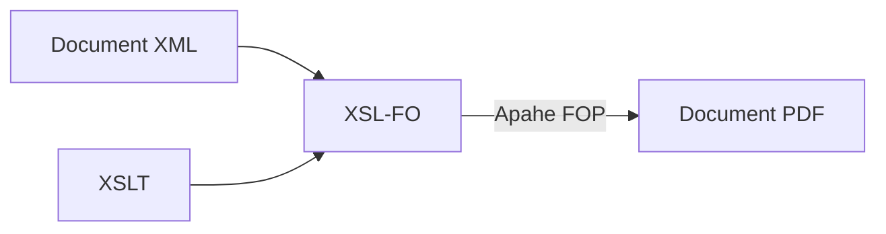

# Generació de Documents PDF

En aquest apartat, abordarem les tècniques per generar documents en **PDF** a partir de documents **XML**. Aquest tipus de generació de documents és àmpliament utilitzat en diversos àmbits, com ara **informes financers**, **factures** i altres documents legals o administratius que requereixen un format **estàndard** i **fiable**.

### Generació de Documents PDF amb XSL-FO (Formatting Objects)

**XSL-FO** és un llenguatge d'**estils** utilitzat per a la **presentació** i **formatació** de documents **XML** en un format imprimible, com **PDF**. La transformació d'un **XML** a **PDF** es realitza mitjançant un procés en dues etapes: primer, transformant el document XML a **XSL-FO** (un format intermig) mitjançant **XSLT**, i després utilitzant eines com **Apache FOP** (Formatting Objects Processor) per generar el PDF final.

Aixó el procés per fenerar un PDF és el següent:



1. El **document XML** conté la informació a representar (per exemple, una factura o un informe).
2. S'utilitza una fulla d'estils **XSLT** per transformar el document **XML** en **XSL-FO**.
3. És el format intermedi **XSL-FO** descriu la **presentació** del document (com taules, textos, imatges, etc.).
4. L'eina **Apache FOP** processa els fitxers **XSL-FO** i els converteix en **PDF** o altres formats d'eixida.

Veiem, per exemple, el següent XML amb la informació d'una factura:

```xml
<?xml version="1.0" encoding="UTF-8"?>
<factura>
    <id>001</id>
    <data>2025-03-30</data>
    <client>
        <nom>Joan Pérez</nom>
        <adreça>Carrer Major, 24</adreça>
    </client>
    <articles>
        <article>
            <nom>Pizza Margarita</nom>
            <preu>9.99</preu>
            <quantitat>1</quantitat>
            <total>9.99</total>
        </article>
        <article>
            <nom>Pizza Quattro Formaggi</nom>
            <preu>12.99</preu>
            <quantitat>2</quantitat>
            <total>25.98</total>
        </article>
    </articles>
    <total>35.97</total>
</factura>
```

I el següent full d'estils XSLT per transformar XML a XSL-FO:

```xml
<?xml version="1.0" encoding="UTF-8"?>
<xsl:stylesheet version="1.0" xmlns:xsl="http://www.w3.org/1999/XSL/Transform" xmlns:fo="http://www.w3.org/1999/XSL/Format">
    <xsl:output method="xml" indent="yes"/>

    <xsl:template match="/factura">
        <!-- Arrel del document XSL-FO -->
        <fo:root xmlns:fo="http://www.w3.org/1999/XSL/Format">
            <!-- Definir les plantilles de pàgina -->
            <fo:layout-master-set>
                <fo:simple-page-master master-name="simple" page-height="29.7cm" page-width="21cm">
                    <fo:region-body margin="2cm"/>
                </fo:simple-page-master>
            </fo:layout-master-set>

            <!-- Pàgina -->
            <fo:page-sequence master-reference="simple">
                <fo:flow flow-name="xsl-region-body">
                    <!-- Contingut de la factura -->
                    <fo:block font-size="16pt" font-weight="bold">Factura: <xsl:value-of select="id"/></fo:block>
                    <fo:block>Data: <xsl:value-of select="data"/></fo:block>
                    <fo:block>Client: <xsl:value-of select="client/nom"/></fo:block>
                    <fo:block>Adreça: <xsl:value-of select="client/adressa"/></fo:block>

                    <fo:block space-before="1cm" font-weight="bold">Articles:</fo:block>
                    <fo:table width="100%" border="1px solid black">
                        <fo:table-column column-width="30%"/>
                        <fo:table-column column-width="40%"/>
                        <fo:table-column column-width="30%"/>
                        <fo:table-body>
                            <xsl:for-each select="articles/article">
                                <fo:table-row>
                                    <fo:table-cell><fo:block><xsl:value-of select="nom"/></fo:block></fo:table-cell>
                                    <fo:table-cell><fo:block><xsl:value-of select="preu"/></fo:block></fo:table-cell>
                                    <fo:table-cell><fo:block><xsl:value-of select="total"/></fo:block></fo:table-cell>
                                </fo:table-row>
                            </xsl:for-each>
                        </fo:table-body>
                    </fo:table>

                    <fo:block space-before="1cm" font-weight="bold">Total: <xsl:value-of select="total"/></fo:block>
                </fo:flow>
            </fo:page-sequence>
        </fo:root>
    </xsl:template>
</xsl:stylesheet>
```

Ara fariem ús de l'eina `xsltproc` per tal d'aplicar la transformació:

```bash
$ xsltproc factura.xsl factura.xml > factura.fo
```

Amb això tenim el fitxer `factura.fo` ja en format `XSL-FO`.

#### L'eina Apache FOP

L'eina [Apache FOP](https://xmlgraphics.apache.org/fop/) ens permet transformar un fitxer en format XSL-FO a PDF.

Aquest eina s'instal·la en Ubuntu de manera senzilla a través del gestor de paques APT:

```bash
$ sudo apt install fop
```

Una vegada instal·lat, convertim documents amb:

```bash
fop factura.fo factura.pdf
```

Això generarà un document PDF anomenat **`factura.pdf`** amb el contingut basat en el document **XML**.

També podem fer ús de l'eina `fop` per fer tot el procés de la següent forma:

```bash
$ fop -xml factura.xml -xsl factura.xsl -pdf output.pdf
```

!!!info "Documentació: El format XSL-FO"
     Disposeu de més informació sobre el format XSL-FO en:

     * Documentació [¿Qué es XSL-FO?](https://marcosruiz.github.io/posts/xslfo/)
     * [Col·lecció d'exemples en XSL-FO](https://www.antennahouse.com/xsl-fo-samples)


<!--


### **3. Generació de PDF amb Formularis Dinàmics Usant XSL-FO i XSLT**

Si tens formularis basats en **XML** que es volen omplir dinàmicament i generar com a documents **PDF**, pots fer servir una combinació de **XSLT** i **XSL-FO** per a la seva generació.

#### **Exemple de formulari dinàmic**:

Imagina que tens un formulari d'usuari en **XML** com aquest:

```xml
<formulari>
    <camp nom="nom">Joan Pérez</camp>
    <camp nom="adreça">Carrer Gran, 24</camp>
    <camp nom="email">joan.perez@example.com</camp>
</formulari>
```

Amb **XSLT** i **XSL-FO**, pots generar un **PDF** amb aquests camps:

```xml
<?xml version="1.0" encoding="UTF-8"?>
<xsl:stylesheet version="1.0" xmlns:xsl="http://www.w3.org/1999/XSL/Transform" xmlns:fo="http://www.w3.org/1999/XSL/Format">
    <xsl:output method="xml" indent="yes"/>

    <xsl:template match="/formulari">
        <fo:layout-master-set>
            <fo:simple-page-master master-name="simple" page-height="29.7cm" page-width="21cm">
                <fo:region-body margin="2cm"/>
            </fo:simple-page-master>
        </fo:layout-master-set>
        
        <fo:page-sequence master-reference="simple">
            <fo:flow flow-name="xsl-region-body">
                <xsl:for-each select="camp">
                    <fo:block><xsl:value-of select="concat(@nom, ': ', .)"/></fo:block>
                </xsl:for-each>
            </fo:flow>
        </fo:page-sequence>
    </xsl:template>
</xsl:stylesheet>
```

Amb això, es generaria un formulari en **PDF** amb els camps de l'**XML** dinàmicament omplerts.


-->

