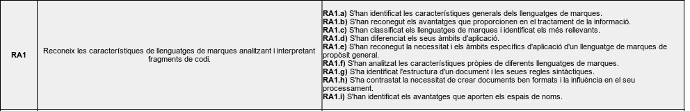
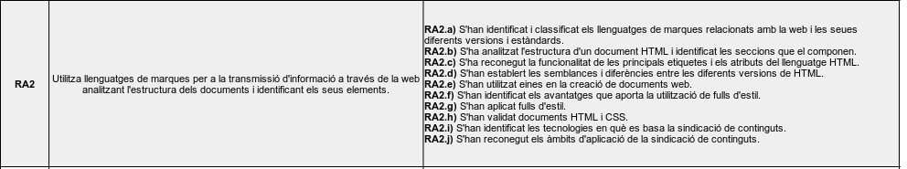
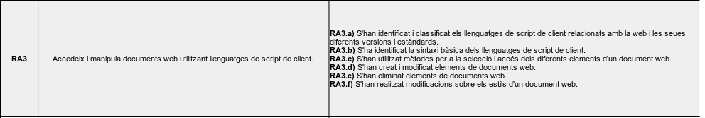
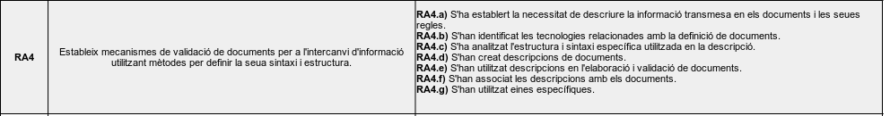
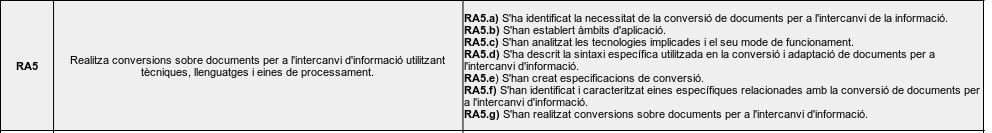
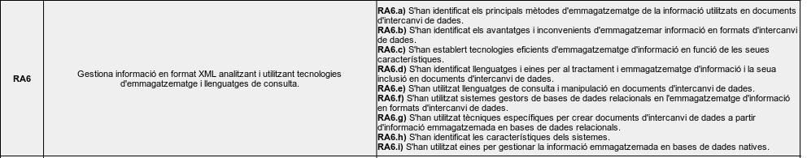

---
# Informació general del document
title: 2. Objectius
subtitle: Llenguatges de marques i sistemes de gestió de la informació (LMSGI)
authors: 
    - José A. Múrcia Andrés
lang: ca
page-background: img/bg.png

# Portada
titlepage: true
titlepage-rule-height: 0
# titlepage-rule-color: AA0000
# titlepage-text-color: AA0000
titlepage-background: img/portada.png
# logo: img/logotext.png

# Taula de continguts
toc: true
toc-own-page: true
toc-title: Continguts

# Capçaleres i peus
header-left: Guia Didàctica LM
header-right: Curs 2024-2025
footer-left: IES Jaume II El Just
footer-right: \thepage/\pageref{LastPage}

# Imatges
float-placement-figure: H
caption-justification: centering

# Llistats de codi
listings-no-page-break: false
listings-disable-line-numbers: false

header-includes:
     - \usepackage{lastpage}
---

# Objectius. Resultats d'aprenentatge

D'acord amb la normativa, els resultats d'aprenentatge del mòdul de *Entorns de Desenvolupament* són:

D'acord amb la normativa, els resultats d'aprenentatge del mòdul de *Llenguatges de marques i Sistemes de Gestió de la Informació* són:

| | |
|--|--|
| RA1 | Reconeix les característiques de llenguatges de marques analitzant i interpretant fragments de codi. |
| RA2	| Utilitza llenguatges de marques per a la transmissió d'informació a través de la web analitzant l'estructura dels documents i identificant els seus elements. |
| RA3 | Accedeix i manipula documents web utilitzant llenguatges de script de client. |
| RA4 | Estableix mecanismes de validació de documents per a l'intercanvi d'informació |utilitzant mètodes per definir la seua sintaxi i estructura. |
| RA5 | Realitza conversions sobre documents per a l'intercanvi d'informació utilitzant tècniques, llenguatges i eines de processament. |
| RA6 | Gestiona informació en format XML analitzant i utilitzant tecnologies d'emmagatzematge i llenguatges de consulta. |
| RA7 | Opera sistemes empresarials de gestió d'informació realitzant tasques d'importació, integració, assegurament i extracció de la informació. |

# Resultats d'aprenentatge i criteris d'avaluació

# M'ho pots explicar millor?

La formació professional (FP) està dissenyada per preparar-vos per al món laboral, aportant-vos coneixements teòrics, i sobretot pràctics.

Cada mòdul formatiu cobreix un aspecte específic relacionat amb la vostra futura professió, i es divideix en diversos ***Resultats d'aprenentatge***. És a dir... què heu de *saber fer* després de passar pel mòdul.

A més, cadascun d'aquesta *Resultats d'Aprenentatge* es divideixen en diferents ***Criteris d'Avaluació***, que és el que s'usa pe avaluar-vos. Aquests criteris ens ajuden a veure si heu assolit els objectius. 

*Per què és important conèixer els resultats d’aprenentatge i els criteris d’avaluació?*

* **Orientació**: Us ajuden a saber exactament què s’espera de vosaltres i què heu d’aprendre.
* **Autoavaluació**: Podeu utilitzar-los per avaluar el vostre propi progrés i veure en què necessiteu millorar.
* **Transparència**: Us donen una idea clara de com sereu avaluats, així no hi ha sorpreses al final del mòdul.

Com veieu, els *resultats d'aprenentatge* i els criteris d’avaluació són com un mapa que us guia durant el curs. I segons el qual, girarà tot el que es veu al mòdul.

!!! warning "I com influeix això en la qualificació?"

    * Els *Resultats d'aprenentatge* i els *Criteris d'Avaluació* ens serviran com a guia per avaluar els vostres coneixements i destresses.

    * Heu de tindre en compte, que per superar un mòdul, **heu de tindre tots els resultats d'aprenentatge superats**.
    
    * Cada resultat d'aprenentatge, influïrà en major o menor mesura en la qualificació final del mòdul.

    * Alguns d'estos CAs seran avaluats en la formació en empresa

!!! note ""

    Ara que ja sabeu què són els *resultats d'aprenentatge i els criteris d'Avaluació*, podeu tornar a fer una ullada ràpida als apartats anteriors, per tal d'entendre millor de què va el mòdul!

