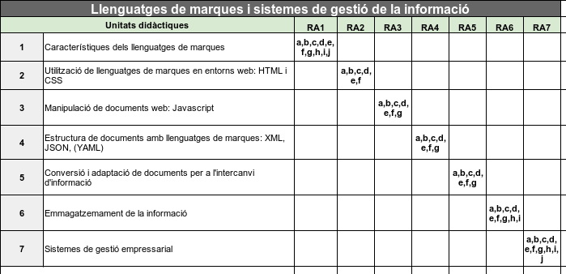

---
# Informació general del document
title: 3. Continguts
subtitle: Llenguatges de marques i sistemes de gestió de la informació (LMSGI) \newline Curs 2025-26
authors: 
    - José A. Múrcia Andrés
lang: ca
page-background: img/bg.png

# Portada
titlepage: true
titlepage-rule-height: 0
# titlepage-rule-color: AA0000
# titlepage-text-color: AA0000
titlepage-background: img/portada.png
# logo: img/logotext.png

# Taula de continguts
toc: true
toc-own-page: true
toc-title: Continguts

# Capçaleres i peus
header-left: Guia Didàctica LMI
header-right: Curs 2024-2025
footer-left: IES Jaume II El Just
footer-right: \thepage/\pageref{LastPage}

# Imatges
float-placement-figure: H
caption-justification: centering

# Llistats de codi
listings-no-page-break: false
listings-disable-line-numbers: false

header-includes:
     - \usepackage{lastpage}
---

# Continguts del mòdul. Unitats didàctiques

Els continguts del mòdul s'organitzen en les següents unitats didàctiques:

* **UD1**. Característiques dels llenguatges de marques
* **UD2**. Utilització de llenguatges de marques en entorns web: HTML i CSS
* **UD3**. Manipulació de documents web: Javascript
* **UD4**. Estructura de documents amb llenguatges de marques: XML, JSON, (YAML)
* **UD5**. Conversió i adaptació de documents per a l'intercanvi d'informació
* **UD6**. Emmagatzemament de la informació
* **UD7**. Sistemes de gestió empressarial

Cadascuna d'aquestes unitats està associada a un resultat d'aprenentatge:

{ width=500px }

## Continguts per unitat

Els continguts, segons el RD del títol, per cada unitat seran:

* **UD1**. Característiques dels llenguatges de marques
    * C1.1. Classificació.
    * C1.2. Característiques i àmbits d'aplicació.
    * C1.3. Estructura i sintaxi.
    * C1.4. Eines d'edició.
    * C1.5. Elaboració de documents ben formats.
    * C1.6. Utilització d'espais de noms.

* **UD2**. Utilització de llenguatges de marques en entorns web: HTML i CSS
    * C2.1. Estàndards web. Versions. Classificació.
    * C2.2. Estructura d'un document HTML.
    * C2.3. Identificació d'etiquetes i atributs de HTML.
    * C2.4. Eines de disseny web.
    * C2.5. Fulls d'estil (CSS).
    * C2.6. Validació de documents HTML i CSS.
    * C2.7. Llenguatges de marques per a la sindicació de continguts.

* **UD3**. Manipulació de documents web: Javascript
    * C3.1. Llenguatges de script de client. Característiques i sintaxi bàsica. Estàndards.
    * C3.2. Selecció i accés a elements.
    * C3.3. Creació i modificació d'elements.
    * C3.4. Eliminació d'elements.
    * C3.5. Manipulació d'estils.

* **UD4**. Estructura de documents amb llenguatges de marques: XML, JSON, (YAML)
    * C4.1. Tecnologies per a la definició de documents. Estructura i sintaxi.
    * C4.2. Creació de descripcions de documents.
    * C4.1. Tecnologies per a la definició de documents. Estructura i sintaxi.
    * C4.3. Associació de descripcions amb documents. Validació.
    * C4.4. Eines de creació i validació.

* **UD5**. Conversió i adaptació de documents per a l'intercanvi d'informació
    * C5.1. Tecnologies de transformació de documents. Estàndards. Àmbits d'aplicació.
    * C5.2. Descripció de l'estructura i de la sintaxi.
    * C5.3. Creació i utilització de plantilles. Eines i depuració.
    * C5.4. Conversió entre diferents formats de documents.

* **UD6**. Emmagatzemament de la informació
    * C6.1. Sistemes d'emmagatzematge d'informació. Característiques. Tecnologies.
    * C6.2. Llenguatges de consulta i manipulació en documents.
    * C6.3. Consulta i manipulació d'informació.
    * C6.4. Importació i exportació de bases de dades relacionals en diferents formats.
    * C6.5. Eines de tractament i emmagatzematge d'informació en sistemes natius.
    * C6.6. Emmagatzematge i manipulació d'informació en sistemes natius.

* **UD7**. Sistemes de gestió empressaria
    * C7.1. Aplicacions de gestió empresarial. Tipus. Característiques.
    * C7.2. Instal·lació.
    * C7.3. Administració i configuració.
    * C7.4. Integració de mòduls.
    * C7.5. Mecanismes d'accés segur a la informació. Rols i privilegis.
    * C7.6. Elaboració d'informes.
    * C7.7. Exportació d'informació.
    * C7.8. Elaboració de documentació.

!!! note "En ressum... què anem a vore en el mòdul?"

    Bàsicament, aquest mòdul tracta sobre el tractament de diferents tipus de documents, per tal de compartir informació entre aplicacions, i presentar informació als usuaris.

    Veurem diferents formats de representar aquests documents i com poder manipular-los i transformar-los en altres documents.

# Temporalització de continguts

La temporalització de continguts prevista serà la següent:

| 1r Trimestre                         | 2n Trimestre                      | 3r Trimestre                      |
| :----------------------------------: | :-------------------------------: |:-------------------------------: |
| `30 hores`                           | `30 hores`                        |  `30 hores`                        |
| UD1, UD2, UD3   |  UD4, UD5  |   UD6, UD7  | 
| _Avaluació: 3 - 5 h._                | _Avaluació: 3 - 5 h._             | _Avaluació: 3 - 5 h._             |

