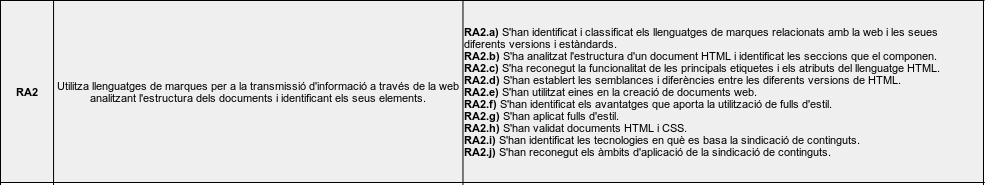
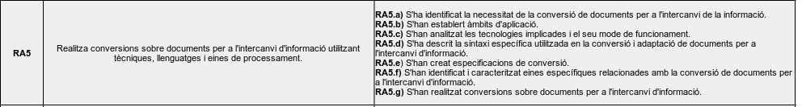
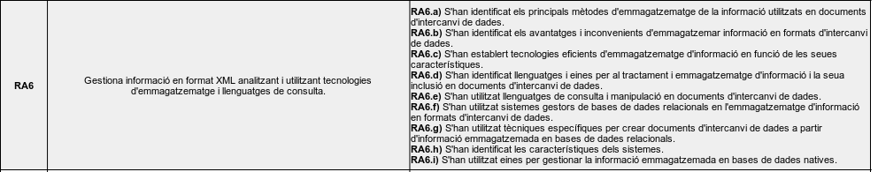

---
# Informació general del document
title: Guia Didàctica.\newline 
subtitle: Llenguatges de marques i sistemes de gestió de la informació (LMSGI) \newline Curs 2025-26
authors: 
    - José A. Múrcia Andrés
lang: ca
page-background: img/bg.png

# Portada
titlepage: true
titlepage-rule-height: 0
# titlepage-rule-color: AA0000
# titlepage-text-color: AA0000
titlepage-background: img/portada.png
# logo: img/logotext.png

# Taula de continguts
toc: true
toc-own-page: true
toc-title: Continguts

# Capçaleres i peus
header-left: Guia Didàctica LMSGI
header-right: Curs 2024-2025
footer-left: IES Jaume II El Just
footer-right: \thepage/\pageref{LastPage}

# Imatges
float-placement-figure: H
caption-justification: centering

# Llistats de codi
listings-no-page-break: false
listings-disable-line-numbers: false

header-includes:
     - \usepackage{lastpage}
---

# Presentació del mòdul

El mòdul de *Llenguatges de marques i Sistemes de Gestió de la Informació* pertany al 1r curs del CFGS de Desenvolupament d'Aplicacions Multiplataforma, i contribueix a adquirir diversesde les unitats de competència que s'hi estableixen al Catàleg Nacional de Qualificacions Professionals.

Segons el RD del títol, la formació en aquest mòdul contribueix a assolir els següents objectius del mòdul:

h) Desenvolupar aplicacions multiplataforma amb accés a bases de dades utilitzant llenguatges, biblioteques i eines adequades.
i) Gestionar la informació emmagatzemada en sistemes de fitxers, bases de dades i altres sistemes d’emmagatzematge.
p) Realitzar proves verificant el funcionament de les aplicacions i complint amb els requisits establerts.
r) Desplegar i distribuir aplicacions en diferents àmbits d’ús, assegurant-ne la seva funcionalitat. 

# Objectius. Resultats d'aprenentatge

D'acord amb la normativa, els resultats d'aprenentatge del mòdul de *Llenguatges de marques i Sistemes de Gestió de la Informació* són:

| RA1 | Reconeix les característiques de llenguatges de marques analitzant i interpretant fragments de codi. |
| RA2	| Utilitza llenguatges de marques per a la transmissió d'informació a través de la web analitzant l'estructura dels documents i identificant els seus elements. |
| RA3 | Accedeix i manipula documents web utilitzant llenguatges de script de client. |
| RA4 | Estableix mecanismes de validació de documents per a l'intercanvi d'informació |utilitzant mètodes per definir la seua sintaxi i estructura. |
| RA5 | Realitza conversions sobre documents per a l'intercanvi d'informació utilitzant tècniques, llenguatges i eines de processament. |
| RA6 | Gestiona informació en format XML analitzant i utilitzant tecnologies d'emmagatzematge i llenguatges de consulta. |
| RA7 | Opera sistemes empresarials de gestió d'informació realitzant tasques d'importació, integració, assegurament i extracció de la informació. |

# Resultats d'aprenentatge i criteris d'avaluació

# M'ho pots explicar millor?

La formació professional (FP) està dissenyada per preparar-vos per al món laboral, aportant-vos coneixements teòrics, i sobretot pràctics.

Cada mòdul formatiu cobreix un aspecte específic relacionat amb la vostra futura professió, i es divideix en diversos ***Resultats d'aprenentatge***. És a dir... què heu de *saber fer* després de passar pel mòdul.

A més, cadascun d'aquesta *Resultats d'Aprenentatge* es divideixen en diferents ***Criteris d'Avaluació***, que és el que s'usa pe avaluar-vos. Aquests criteris ens ajuden a veure si heu assolit els objectius. 

*Per què és important conèixer els resultats d’aprenentatge i els criteris d’avaluació?*

* **Orientació**: Us ajuden a saber exactament què s’espera de vosaltres i què heu d’aprendre.
* **Autoavaluació**: Podeu utilitzar-los per avaluar el vostre propi progrés i veure en què necessiteu millorar.
* **Transparència**: Us donen una idea clara de com sereu avaluats, així no hi ha sorpreses al final del mòdul.

Com veieu, els *resultats d'aprenentatge* i els criteris d’avaluació són com un mapa que us guia durant el curs. I segons el qual, girarà tot el que es veu al mòdul.

!!! warning "I com influeix això en la qualificació?"

    * Els *Resultats d'aprenentatge* i els *Criteris d'Avaluació* ens serviran com a guia per avaluar els vostres coneixements i destresses.

    * Heu de tindre en compte, que per superar un mòdul, **heu de tindre tots els resultats d'aprenentatge superats**.
    
    * Cada resultat d'aprenentatge, influïrà en major o menor mesura en la qualificació final del mòdul.

    * Alguns d'estos CAs seran avaluats en la formació en empresa

!!! note ""

    Ara que ja sabeu què són els *resultats d'aprenentatge i els criteris d'Avaluació*, podeu tornar a fer una ullada ràpida als apartats anteriors, per tal d'entendre millor de què va el mòdul!

# Continguts del mòdul. Unitats didàctiques

Els continguts del mòdul s'organitzen en les següents unitats didàctiques:

* **U1.** Característiques dels llenguatges de marques
* **U2.** Utilització de llenguatges de marques en entorns web: HTML i CSS
* **U3.** Manipulació de documents web: Javascript
* **U4.** Estructura de documents amb llenguatges de marques: XML, JSON, YAML
* **U5.** Conversió i adaptació de documents per a l'intercanvi d'informació
* **U6.** Emmagatzemament de la informació
* **U7.** Sistemes de gestió empressarial

Cadascuna d'aquestes unitats està associada a un resultat d'aprenentatge:

{ width=500px }

## Continguts per unitat

Els continguts, segons el RD del títol, per cada unitat seran:

* **U1.** Característiques dels llenguatges de marques
    * C1.1. Classificació.
    * C1.2. Característiques i àmbits d'aplicació.
    * C1.3. Estructura i sintaxi.
    * C1.4. Eines d'edició.
    * C1.5. Elaboració de documents ben formats.
    * C1.6. Utilització d'espais de noms.

* **U2.** Utilització de llenguatges de marques en entorns web: HTML i CSS

    * C2.1. Estàndards web. Versions. Classificació.
    * C2.2. Estructura d'un document HTML.
    * C2.3. Identificació d'etiquetes i atributs de HTML.
    * C2.4. Eines de disseny web. 
    * C2.5. Fulls d'estil (CSS).
    * C2.6. Validació de documents HTML i CSS.
    * C2.7. Llenguatges de marques per a la sindicació de continguts.

* **U3.** Manipulació de documents web: Javascript

    * C3.1. Llenguatges de script de client. Característiques i sintaxi bàsica. Estàndards. 
    * C3.2. Selecció i accés a elements. 
    * C3.3. Creació i modificació d'elements.
    * C3.4. Eliminació d'elements. 
    * C3.5. Manipulació d'estils.

* **U4.** Estructura de documents amb llenguatges de marques: XML, JSON, YAML

    * C4.1. Tecnologies per a la definició de documents. Estructura i sintaxi.
    * C4.2. Creació de descripcions de documents.
    * C4.3. Associació de descripcions amb documents. Validació.
    * C4.4. Eines de creació i validació.

* **U5.** Conversió i adaptació de documents per a l'intercanvi d'informació

    * C5.1. Tecnologies de transformació de documents. Estàndards. Àmbits d'aplicació.
    * C5.2. Descripció de l'estructura i de la sintaxi.
    * C5.3. Creació i utilització de plantilles. Eines i depuració.
    * C5.4. Conversió entre diferents formats de documents.

* **U6.** Emmagatzemament de la informació
 
    * C6.1. Sistemes d'emmagatzematge d'informació. Característiques. Tecnologies.
    * C6.2. Llenguatges de consulta i manipulació en documents.
    * C6.3. Consulta i manipulació d'informació.
    * C6.4. Importació i exportació de bases de dades relacionals en diferents formats.
    * C6.5. Eines de tractament i emmagatzematge d'informació en sistemes natius.
    * C6.6. Emmagatzematge i manipulació d'informació en sistemes natius.

* **U7.** Sistemes de gestió empressarial

    * C7.1. Aplicacions de gestió empresarial. Tipus. Característiques.
    * C7.2. Instal·lació.
    * C7.3. Administració i configuració.
    * C7.4. Integració de mòduls.
    * C7.5. Mecanismes d'accés segur a la informació. Rols i privilegis.
    * C7.6. Elaboració d'informes.
    * C7.7. Exportació d'informació.
    * C7.8. Elaboració de documentació.

!!! note "En ressum... de què va i què anem a vore en el mòdul?"

    Bàsicament, aquest mòdul tracta sobre el tractament de diferents tipus de documents, per tal de compartir informació entre aplicacions, i presentar informació als usuaris.

    Veurem diferents formats de representar aquests documents i com poder manipular-los i transformar-los en altres documents.

# Temporalització de continguts

La temporalització de continguts prevista serà la següent:

| 1r Trimestre                         | 2n Trimestre                      | 3r Trimestre                      |
| :----------------------------------: | :-------------------------------: |:-------------------------------: |
| `30 hores`                           | `30 hores`                        |  `30 hores`                        |
| UD1, UD2, UD3   |  UD4, UD5  |   UD6, UD7  | 
| _Avaluació: 3 - 5 h._                | _Avaluació: 3 - 5 h._             | _Avaluació: 3 - 5 h._             |

# Aspectes metodològics

## Material Didàctic

El material didàctic del mòdul pot ressumir-se en el següent:

* Apunts proporcionats pel professor, en format web.
* Textos d'ampliació i enllaços a articles i documentació oficial relacionats amb cada unitat.
* Pràctiques i exercicis resolts per reforçar el que s'ha exposat als apunts.
* Vídeos explicatius d'aquells aspectes que requerisquen d'una explicació més visual.

Tot aquest material s'oferirà a través de l'aula virtual durant el desenvolupament de cada unitat.

A més, dins l'aula virtual, disposarem d'un fòrum general per comentar aspectes globals del mòdul, i un fòrum per cada unitat didàctica, per tal deresoldre dubtes i tractar aspectes relacionats amb la unitat.

## Programari

El programari a utilitzar serà principalment lliure, i es donaran instruccions en cada unitat per a la seua descàrrega i instal·lació. A grans trets, el programari a utilitzar serà:

* **Kubuntu 24.04 o derivades.** Com a sistema operatiu de base a l'aula fem servir Kubuntu 24.04 LTS, tot i que per al modul, en principi qualsevol distribucio basada en Ubuntu 24.04 serà equivalent. No obstant això, l'alumne pot utilitzar qualsevol altre sistema operatiu, ja que tot el programari amb què treballarem és multiplataforma.
* **Visual Studio Code** com a editor de codi, que suporta diferents llenguatges, i és bastant ampliable amb extensions. Tot i que serà l'editor de referència, també s'utilitzaran IDEs com NetBeans i InteliJ.

A més, cada unitat podrà requerir d'algunes eines més específiques, com editors visuals d'XML o el navegador web.

### Eines web i col·laboratives

A banda del programari esmentat anteriorment, també s'utilitzaran el següent portals web i plataformes de treball col·laboratiu:

* **Portals Aules/Moodle**: Com a aula virtual, i que articularà el funcionament del mòdul. Serà aci on s'ubiquen els diferents recursos, fòrums, etc.
* **MS Teams**: Des del curs Des del 22/23, el nostre centre és *Centre Digital Col·laboratiu*, pel que cada alumne i professor disposa d'una identitat digital que li proporciona accés a tota la suite d'enies d'Office 365. Entre aquestes, la que utilitzarem de forma més freqüent serà *MS Teams*, a través de la qual s'organitzaran les diferents tutoríes col·lectives mitjançant videoconferència.
* **Github**: En alguns projectes en grup, serà de gran ajuda treballar amb sistemes de control de versions distribuits, com *Github* o *Gitlab*, de manera que puguen realitzar desenvolupaments de forma col·laborativa.

## Metodologia. Qè farem a classe?

La metodologia a utilitzar a l'aula pretén ser el més pràctica i realista possible, acostant la forma de treballar a l'aula a un entorn real de treball. Optarem per fer ús de metodologies actives, com l'aprenentatge basat en projectes o en reptes, on haureu de prendre un paper actiu. La ide aés potenciar l'aprenentatge per descobriment, significatiu, deductiu i el treball col·laboratiu i en equip.
 
Segons aquestes premisses, la metodología utilitzada al mòdul es regirà per les següents pautes:

* En iniciar cada unitat didàtica es realitzarà una presentació inicial d'aquesta, dels conceptes bàsics, i de què sereu capaços de fer en finalitzar-la.
* Disposareu de material per a la seua lectura comprensiva i estudi, així com de documentació addicional que es considere interessant,
* Disposareu d'exercicis i pràctiques guiades que acompanyen la teoría de la unitat i que ens ajudaran a entendre els conceptes de la unitat, fonamentant-se en coneixements previs, facilitant així l'aprenentatge per descobriment, significatiu i deductiu.
* Les session a l'aula tindran un caràcter fonamentalment pràctic, i s'aprofitaran exemples i casos pràctics per exposar els principals conceptes.
* Es fomentarà la realització de projectes i treballs en equip, simulant el treball real en una empresa, on cadascú tindrà un paper ben definit dins el grup. Per a això, es podran aplicar metodologíes àgils de desenvolupament, tipus *Scrum*, que implica una fase de planificació, el treball en parelles i la revisió periòdica mitjançant exposicions del treball realitzat en els equips.
* Es fomentarà la realització de projectes que relacionen continguts d'aquest amb altres mòduls, per tal que descobriu la relació i la importància de tots ells.
* Per a alguns continguts, es podran realitzar tallers d'aprofundoment o classes magistrals, on els conceptes a exposar siguen més densos i complexos, però sempre fonamentant-se en aspectes pràctics i sobre exemples reals.

# Avaluació

Donat que es tracta d'ensenyaments presencials, l'avaluació serà continuada, i consistirà en el seguiment del treball que aneu realitzant, i tindrà en compte la vostra evolució en l'assoliment dels diferents Resultats d'Aprenentatge a partir dels Criteris d'Avaluació d'aquests.

Els diferents intruments d'avaluació podran ser:

* Exercicis d'avaluació, tant escrites com pràctiques,
* Tests i questionaris,
* Treballs individuals i en equip,
* Projectes en equip.

Cadascuna d'aquestes proves estarà guiada pels criteris d'avaluació i contribuirà als resultats d'aprenentatge.

La qualificació final de cada avaluació s'obtindrà a partir del grau de consecució dels resultats d'aprenentatge assolits, en relació als resultats d'aprenentatge tractats durant el trimestre.

Per tal d'aprovar cada mòdul, caldrà haver assolit **tots els resultats d'aprenentatge** 
