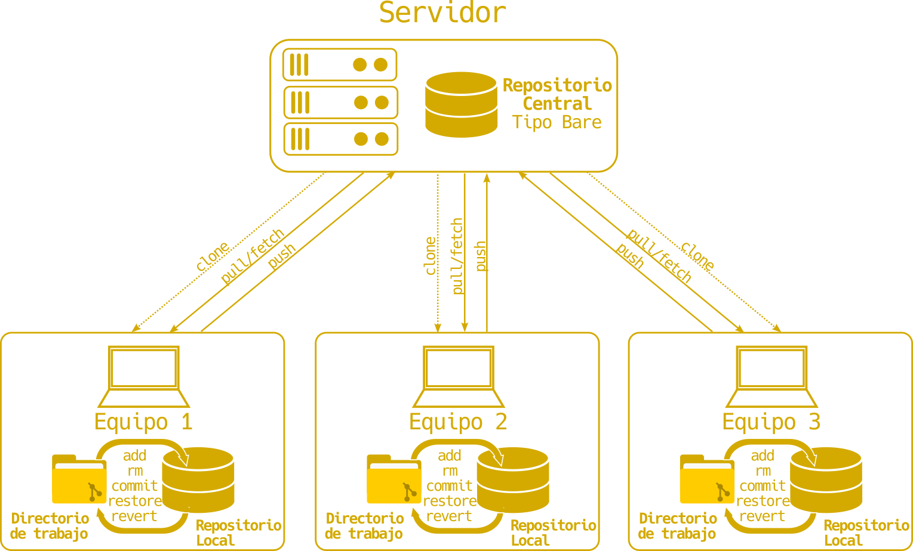
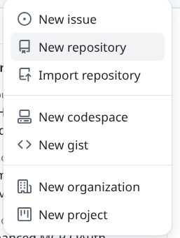
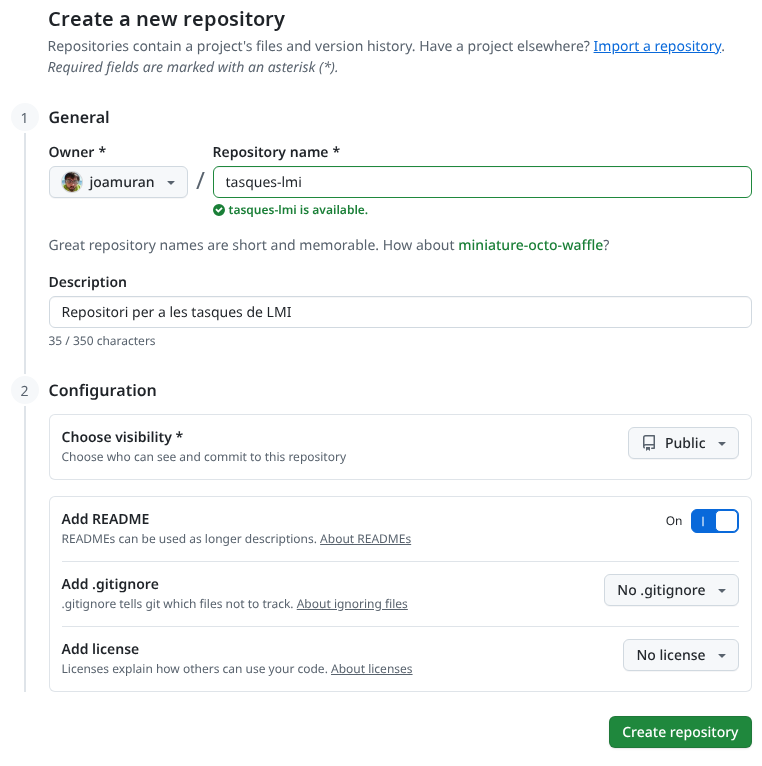
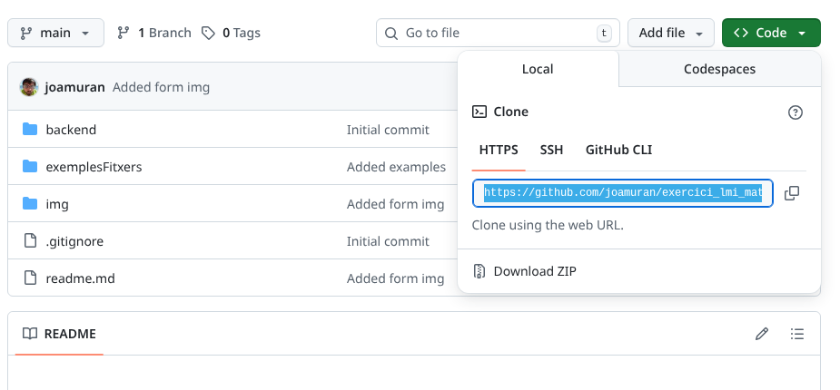

---
hide:
  - navigation
---

# Github bàsic

Veiem alguns conceptes bàsics:

!!! note ""
    Git és un sistema de control de versions distribuit: 
      - Cada equip té una còpia de tot el repositori
      - Pot haver un equip que adopte el rol de servidor, i mantinga diversos repositoris
      - Si hi ha un error al servidor, es pot regenerar a partir de qualsevol altre equip

!!! note ""
    Quan diversos desenvolupadors necessiten col·laborar, fem ús d'un repositori *descobert (bare)* que s'ubica en un servidor centralitzat.

    Els equips de treball, utilitzaran una còpia d'aquest repositori per treballar de forma local, i sincronitzaran el seu treball amb el repositori central.

    

!!! note "Github"
    Github és una plataforma de desenvolupament col·laboratiu, que entre altres coses ens ofereix la possibilitat d'allotjar projectes i gestionar-los mitjanánt Git.

## Treballant amb github

Una vegada tenim algunes nocions sobre github, anem a veure com treballat.

1. **Creació de repositoris**: Hi ha diverses formes de crear repositoris en Github, però potser, una de les més senzilles siga a través de la pròpia plataforma. Per això, una vegada registrats en [https://github.com/](https://github.com/), busquem el botó o l'opció per crear un repositori.
  
    
    
  
    Això ens portarà a la pàgina per emplenar la informació bàsica sobre el repositori:

    

    On emplenarem el nom del repositori, una descripció i algunes opcions més. És interessant que afegiu ja algun contingut a dins, com el fitxer **README**.

2. **Clonació del repositori**: Una vegada s'ha crear el repositori, podem clonar-lo des del nostre equip. Per a això, necessitem saber l'adreça del repositori. Busquem el botó verd on diu *Code*, fem clic al desplegable i ens copiem l'adreça que apareix:
  
    

    Amb aquesta adreça copiada, anem al directori del nostre equip on volem treballar amb el control de versions i el clonem amb:

    ```bash
    git clone adreça_que_hem_copiat
    ```

3. **Configuració de git**: Per tal de poder actualitzar el repositori des del  nostre equip, hem de tindre configurat l'usuari i el correu que hem registrat. Per configurar-ho farem:
  
    ```bash
    git config --global user.name "El teu nom"
    ```
    
    ```bash
    git config --global user.email "el@teu.correu"
    ```

3. **Flux habitual de treball**. Ara ja podem treballar amb github. Anem a veure el cas més senzill: tenim el repositori creat, i el tenim clonat a l'ordinador de casa i al centre, i volem que les modificacions que fem des d'un lloc se sincronitzen amb Github i s'actualitzen des de l'altre. Així, el flux serà (sempre treballant des de l'arrel del repositori a l'equip):
   
     * Actualitzem el repositori actual, amb els canvis que hi hagen al servidor:
  
        ```bash
        git pull
        ```

     * Treballem amb el codi, afegint les modificacions que necessitem.
     * Cada vegada que tinguem canvis significatius, fem un *commit* al repositori (local):
  
        ```bash
        git commit -a -m "Misstge descriptiu del commit"
        ```

        Amb això tenim el repositori **local** actualitzat, però els canvis no s'han pujat encara al servidor.

     * Actualitzant els canvis al servidor. Per pujar els commits que hem fet en local al servidor, hem de fer:
  
        ```bash
        git push
        ```

        Això ens demanarà usuari i el token de github (serà interessant tindre una còpia d'ell, ja que una vegada es genera, no te'l torna a mostrar). I si tot es correcte els canvis es pugen a github i podreu vore'ls des del portal de Github.

I una vegada fet això, el procés tornaria a ser el mateix per sincronitzar i treballar amb els repositoris locals.
      


