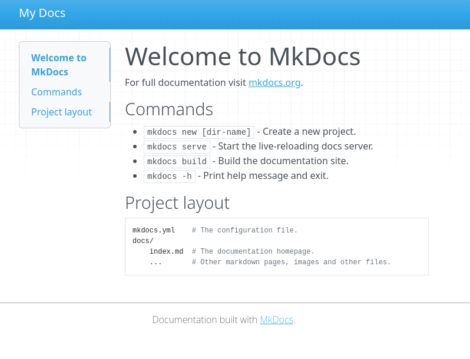
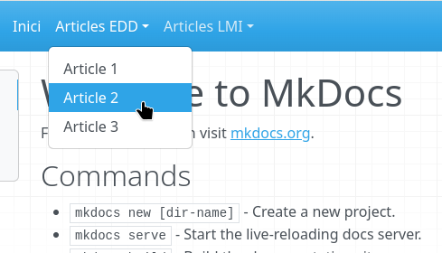

---
hide:
  - navigation
  - toc
---

<style>
  .centrat{
    background-color: var(--md-accent-fg-color);
    /*color: var(--mdSi-default-fg-color--lighter) !important;*/
    color: #ffffff !important;
    text-align: center !important;
    display: block !important;
    width: 200px !important;
    margin: 0 auto !important;
  }
  body{
    background-image: none !important;
  }

  .md-header{
    display: none;
  }
</style>


# Creació d'un lloc web estàtic amb MkDocs

## Introducció a MkDocs

MkDocs és un generador de llocs web estàtics dissenyat per crear documentació de projectes de manera senzilla i eficient. Utilitza el llenguatge de marcat lleuger Markdown per escriure el contingut i YAML per configurar el lloc. 

## Per a què s'utilitza?

MkDocs s'utilitza principalment per:

- Crear documentació tècnica per a projectes de programari, manuals o tutorials,
- Generar llocs web estàtics que poden ser allotjats fàcilment en serveis com GitHub Pages.
- Facilitar la col·laboració en projectes mitjançant una estructura de documentació clara i ben organitzada.

Al nostre cas, realitzarem un *blog* tècnic, on anirem documentant el que anem aprenent als mòduls d'Entorns de Desevolupament i Llenguatges de Marques, i que pot acabar convertint-se en els nostres propis apunts del mòdul.

# Al lio!

## Instal·lació 

En primer lloc, hem de realitzar la instal·lació d'MkDocs.

Els passos per realitzar la instal·lació s'han de realitzar des de la terminal (*Menu > Sistema > Konsole*).

!!! note "Usuaris de Windows"
    Si fem ús de Windows, caldrà que instal·leu python prèviament. Això ho farem descarregant-lo des de [https://www.python.org/](https://www.python.org/), i assegurant-nos durant la instal·lació que marquem l'opció *Add Python to PATH.*.

1. **Creació d'un entorn virtual de python**: El primer que hem de fer és crear un entorn virtual de Python. Això ens servirà per disposar d'un entorn propi per instal·lar components en python sense interferir en els components del sistema. Per a això llançarem la següent ordre (l'escriurem a la terminal i posarem *Intro*):

    ```bash
    sudo apt install python3-venv
    ```

    !!! note ""
        No es preocupeu si no enteneu massa el que estem fent ara. Amb `sudo` el que fem és llançar l'ordre com a administradors, i amb `apt install`, el que fem és utilitzar el gestor de paquets `apt` per instal·lar programari.
    

    !!! note "Accés com a sudo"
        En els ordinadors de l'aula, no podreu fer aquest pas com a alumnes. Aviseu el professor perquè realitze la instal·lació.
    
    Una vegada instal·lat el paquet `python3-venv`, que és el qui ens proporciona la capacitat de crear aquests entorns virtuals, anem a crear un entorn virtual per treballar amb *MkDocs*. 

    Per a això, ens situem primer a la carpeta on instal·larem l'entorn. Per exemple en `~/.local`:

    ```bash
    cd .local
    ```

    I llancem l'ordre:
    
    ```
    python3 -m venv mkdocsenv
    ```

    !!! note "Usuaris de Windows"
    
        Amb windows llançarem:

        ```
        python -m venv mkdocsenv
        ```

2. **Instal·lació dels paquets d'MkDocs amb `pip`.** Una vegada tenim creat l'entorn, l'hem d'activar, fent un `source` del fitxer d'activació:

  ```bash
  source mkdocsenv/bin/activate
  ```

!!! note "Usuaris de Windows" 

    En Windows, haureu d'activar-lo llançant directament l'script:

    ```
    mkdocsenv\Scripts\activate
    ```

  Veurem com el *prompt* ara canvia indicant que estem dins l'entorn.

!!! note "Important!"
    Recordeu que cada vegada que aneu a utilitzar mkdocs haureu d'activar aquest entorn!

Una vegada dins l'entorn, ja podem instal·lar mkdocs, com a llibreria de python, amb l'ordre:

```bash
pip install mkdocs
```

!!! note "Què és pip?"

    *Pip* (Package Installer for Pyton) és un sistema de gestió de programari propi de Python. Així com `apt` ens serveix per descarregar programari dels repositoris del sistema operatiu, `pip` ho fa des del repositori de programari Python.

Amb aquesta base, ja podrem fer ús d'mkdocs, i anar instal·lant altres components a mesura que els anem necessitant.


## Creació d'un Projecte

Per començar a treballar amb mkdocs, necessitarem abans que res un projecte. Per a això, farem ús de l'ordre `mkdocs new`, de la següent manera.

Ens situem en la carpeta on desitgem crear el projecte, i llancem, per exemple:

```bash
mkdocs new tasques_LMI_EDD
```

Això ens crearà una carpeta `tasques_LMI_EDD` o amb el nom que hem indicat. Per accedir a ella, fem:

```
cd tasques_LMI_EDD
```

## Estructura del contingut

L'ordre anterior ens haurà generat la següent estructura de carpetes:

```
tasques_LMI_EDD/
├── docs
│   └── index.md
└── mkdocs.yml
```

Com veieu, tenim una carpeta `docs`, que conté un document en Markdown anomenat `index.md`, que serà la pàgina principal dels continguts. Tenim també un document `mkdocs.yml`, que serà on afegirem les propietats del projecte i definirem la seua estructura. Si accedim al contingut d'aquest, veurem que de moment, només té la línia:

```yaml
site_name: My Docs
```

Que defineix amb l'etiqueta `site_name` el nom del lloc, i que podem canviar per posar el nom que desitgem.

## Visualització del lloc

Per tal de veure la documentació que estem generant, farem ús de l'ordre:

```
mkdocs serve
```

Que ens crearà un servidor web local on allotjarà la documentació que estem generant. Si tot va bé, ens traurà un resultat semblant a aquest:

```
INFO    -  Building documentation...
INFO    -  Cleaning site directory
INFO    -  Documentation built in 0.23 seconds
INFO    -  [06:27:36] Watching paths for changes: 'docs', 'mkdocs.yml'
INFO    -  [06:27:36] Serving on http://127.0.0.1:8000/
```

On ens diu que està servint la documentació en l'adreça http://127.0.0.1:8000/. Per accedir-hi, podem copiar i apegar l'adreça a la barra d'adreces del navegador o bé fer Ctrl+Clic amb el ratolí sobre l'adreça.

De moment, la única cosa que veurem és la pàgina d'índex que s'ha generat automàticament:



## Ara sí... mans a l'obra

Per tal d'anar generant continguts en aquest lloc, anirem creant diferents documents Markdown dins la carpeta `docs`. També és una bona idea organitzar aquests en subcarpetes, de manera que sapiguem on trobar els documents quan el lloc comence a créixer.

### Configuració del lloc web

Anem a configurar el lloc web a través del fitxer `mkdocs.yml`.

Obrirem amb VSCode la carpeta on tenim el projecte, i seleccionarem aquest fitxer.

Una primera configuració molt bàsica serà:


```yaml
site_name: 'Documentació de les tasques'
theme:
  name: 'mkdocs'
```

A més del `site_name` que ja coneixem, hem definit les propietats del tema d'aquest (`theme`). Entre d'altres coses, definirem el nom del tema, en aquest cas `mkdocs`, que és el tema per defecte (si no haverem posat res, utilitzaria aquest). Podem provar a canviar-lo per l'altre tema que ve preinstal·lat `readthedocs`.

!!! note "Compte amb les tabulacions!"

    Tingueu en compte que YAML no utilitza marques anidades per definir les diferents seccions i continguts del document, sinò que fa ús de tabulacions. En aquest cas, com que `name` està tabulat dins de `theme` significa que és una propieta d'aquest. Si volguérem afefir més propietats al tema, caldria que estigueren tabulats de la mateixa manera que `name`.

### Afegint documents i navegació

A mesura que anem afegint documents al lloc, ho farem, com hem comentat dins la carpeta `docs`, i en l'organització de carpetes que desitgem.

Per exemple, imagineu que tenim la següent organització de carpetes:

```
docs/
├── edd
│   ├── document_1.md
│   ├── document_2.md
│   └── document_3.md
├── index.md
└── lmi
    ├── document_1.md
    └── document_2.md
```

Com veieu, hem cret dos carpetes, una per als articles d'EDD i altra per als articles d'LMI. La primera conté tres documents, i la segona dos.

Per tal de plasmar això en la navegació del nostre lloc, caldria afegit una categoria `nav` a dins la configuració, de la següent manera:

```yaml
site_name: 'Documentació de les tasques'
theme:
  name: 'mkdocs'

nav:
  - Inici: index.md
  - Articles EDD:
    - Article 1: edd/document_1.md
    - Article 2: edd/document_2.md
    - Article 3: edd/document_3.md
  - Articles LMI:
    - Article 1: lmi/document_1.md
    - Article 2: lmi/document_2.md
```
Com veieu, dins de `nav`, afegim una *llista* de categories (Inici, Articles EDD i Articles LMI), i dins de cada categoria, els diferents articles. 

Això ens mostrarà el següent a la pàgina:



!!! note "Important!"

    Encara que en aquest cas l'estructura de navegació que hem creat coincideix amb l'organització de carpetes, no té per què ser així, i poden tindre organitzacions diferents.

Fixeu-vos també que per especificar una *llista* d'elements iguals dins d'una categoria fem d'utilitzar els guions `-`. En cas contrari, mkdocs ho interpretarà com etiquetes, i ens donarà error.

# Tasca a realitzar

Crea un lloc de documentació amb els diferents articles i exercicis que hem anat realitzant durant aquestes primeres unitats, tant en LMI com en EDD. En les següents unitats seguirem incorporant nous articles i treballant sobre aquest lloc.

Recorda que alguns dels exercici que hem fet han estat:

* En llenguatges de marques:
    - Identificar característiques (elements, etiquetes, propietats) dels llenguatges de marques en diferents documents (svg, html, xml...)
    - Identificació dels espais de noms en documents (AndroidManifest.xml). Aquest article es podria combinar amb l'anterior.


* En Entorns:
    - Buscar els llenguatges més utilitzats i indicar les seues característiques (a mode de ressum d'aquest article podríes incloure alguna taula amb Markdown)
    - Article sobre com plantejarieu el desenvolupament d'una app (llenguatges, tecnologies, etc.)
    - Exemples de traducció. Les ordres python3, cc, java i javac.
    - L'efecte Bola de neu
    - La web d'una empresa
    - Scrum: Comflicte d'interessos

Recordeu incorporar al codi Markdown:

  * Capçaleres,
  * Formats (negretes, subratllat),
  * Enllaços,
  * Imatges/captures de pantalla,
  * Fragments de codi font
  * Taules