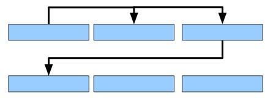
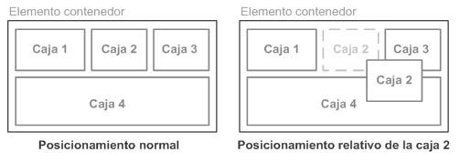
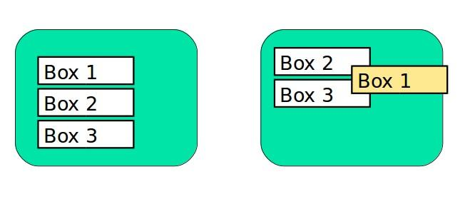
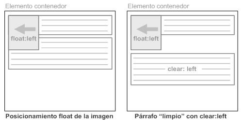

---
# Informació general del document
title: Posicionament
subtitle: Llenguatges de marques i sistemes de gestió de la informació (LMSGI)
lang: ca
page-background: img/bg.png

# Portada
titlepage: true
titlepage-rule-height: 0
# titlepage-rule-color: AA0000
# titlepage-text-color: AA0000
titlepage-background: img/portada.png
# logo: img/logotext.png

# Taula de continguts
toc: true
toc-own-page: true
toc-title: Continguts

# Capçaleres i peus
header-left: Llenguatges de Marques
header-right: Curs 2024-2025
footer-left: IES Jaume II El Just
footer-right: \thepage/\pageref{LastPage}

# Imatges
float-placement-figure: H
caption-justification: centering

# Llistats de codi
listings-no-page-break: false
listings-disable-line-numbers: false

header-includes:
     - \usepackage{lastpage}
---

# Posicionament

CSS permet modificar el posicionament amb el que es mostra cada caixa. El posicionament en CSS es basa en quatre opcions:

* Posicionament Estàtic o Normal
* Posicionament Relatiu
* Posicionament Flotant
* Posicionament Absolut

S’utilitza la propietat **position**.

```
position: static | relative | absolute | fixed
```

## Posicionament Normal (*static*)

Es tracta del funcionament per defecte.

Les caixes apareixen una darrere l’altra i de dalt a baix.

{ width=500px }

Només es té en compte si l’element és en bloc o en línia.

```css
div.static {
  position: static;
}
```

## Posicionament Relatiu (*relative*)

Consisteix en posicionar la caixa segons el posicionament normal i després desplaçar-la respecte de la seva posició original.

* Canviar la posició relativa pot fer que el contingut de dues caixes quede superposat.

  { width=500px }

* Es marca la posició original de l’element com a protegida (la resta de caixes es pensen que encara hi és).

El desplaçament de la caixa es controla amb les propietats **top**, **right**, **bottom** i **left** i es calculen respecte de la posició original de la caixa. 

```css
div.relative { 
  position: relative; 
  top: 25px; 
  right: 25px;
}
```

{ width=400px }

* **top:25px**: es desplaça 25 píxels des de dalt de la posició normal de la caixa (es desplaça cap a baix).
* **right:25px**: es desplaça 25 píxels de la dreta de la posició original (es desplaça cap a l’esquerra).

## Posicionament fixed

Ens fixa una caixa en la pantalla de manera que no es mourà encara que es moga la pàgina amunt o avall.

```css
.box1{ 
  position:fixed; 
  right:0px; 
  top:0px;
}
```

{ with=400px }

[Exemple a W3Schols](https://www.w3schools.com/css/tryit.asp?filename=trycss_position_fixed)

## Posicionament Absolut (*absolute*)

Un element amb **position:absolute** es posiciona en relació amb l’**ancestre posicionat més proper**.

Si un element posicionat absolut no té ancestres posicionats, utilitza el body del document i es mou amb el desplaçament de la pàgina.

**Nota**: els elements amb posicionament absolut s’eliminen del flux normal i es poden sol·lapar amb altres elements.


{ width=400px }

```html
<style> 
    div.relative { 
      position: relative; 
      width: 400px; 
      height: 200px; 
      border: 3px solid #73AD21;
}

div.absolute { 
  position: absolute; 
  top: 80px; 
  right: 0; 
  width: 200px; 
  height: 100px; 
  border: 3px solid #73AD21;
}
</style> 

...

<div class="relative">Aquest element té position: relative;
  <div class="absolute">Aquest element té position: absolute;</div>
</div>
```


[Exemple a W3Schools](https://www.w3schools.com/css/tryit.asp?filename=trycss_position_absolute)

## Posicionament flotant (*float*)

Podem definir una caixa flotant que deixa que les altres caixes es posin al seu voltant amb la propietat **float**. Els valors possibles són **left**, **right** o **none**.

```css
#caja1 { 
  float: right;
}
```

{ width=400px }

La caixa que hem definit amb **float:right** es posa primer, el més a la dreta o esquerra possible, i les altres es posen al seu voltant sense sobreescriure-la.

La propietat **clear** permet anul·lar el comportament introduït per la propietat float.

{width=400px}

 **clear: left** anul·la els elements flotants a l’esquerra.

La propietat **clear** pot tenir un dels valors següents:

* **left**: l’element es mou per baix dels elements flotants esquerre
* **right**: l’element es mou per baix dels elements flotants a la dreta
* **both**: l’element es mou per baix dels elements flotants esquerre i dret
* **none**: l’element no es mou per baix dels elements flotants esquerre o dret. Valor per defecte.

[Exemples de float a W3Schools](https://www.w3schools.com/css/css_float_examples.asp)

## Z-index

la propietat **z-index** controla la profunditat de les capes. Quan més alt siga el seu valor, més a prop de l’usuari es veurà l’element:

```css
img {
    position: absolute; 
    z-index: -1; 
  }
```

{ width=400px }

## Posicionament Flexbox

El model de **Caixes Flexibles** (*Flexbox*) va ser dissenyat per a superar les dificultats del model de posicionament bàsic de CSS. Fa més fàcil crear un disseny flexible amb CSS.

* [Flexbox en W3Schools](https://www.w3schools.com/css/css3_flexbox.asp)
* [Flexbox en Mozilla](https://developer.mozilla.org/es/docs/Web/CSS/CSS_Flexible_Box_Layout/Basic_Concepts_of_Flexbox)
* [Exemples de Flexbox (Mozilla)](https://developer.mozilla.org/es/docs/Web/CSS/CSS_Flexible_Box_Layout/Typical_Use_Cases_of_Flexbox)

Per exemple, flexbox simplifica el procés de creació d’un menú:

```html

<style>

nav#menu ul {
  display: flex;
  }

nav#menu li {
  flex: 1 ;
}
</style> 

...

<nav id="menu">
  <ul>
    <li><a href="#">Link 1</a></li>
    <li><a href="#">Link 2</a></li>
    <li><a href="#">Link 3</a></li>
    <li><a href="#">Link 4</a></li>
  </ul>

</nav>
```

{ width=400px }