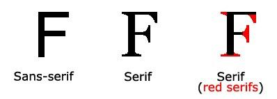

---
# Informació general del document
title: Propietats CSS bàsiques
subtitle: Llenguatges de marques i sistemes de gestió de la informació (LMSGI)
lang: ca
page-background: img/bg.png

# Portada
titlepage: true
titlepage-rule-height: 0
# titlepage-rule-color: AA0000
# titlepage-text-color: AA0000
titlepage-background: img/portada.png
# logo: img/logotext.png

# Taula de continguts
toc: true
toc-own-page: true
toc-title: Continguts

# Capçaleres i peus
header-left: Llenguatges de Marques
header-right: Curs 2024-2025
footer-left: IES Jaume II El Just
footer-right: \thepage/\pageref{LastPage}

# Imatges
float-placement-figure: H
caption-justification: centering

# Llistats de codi
listings-no-page-break: false
listings-disable-line-numbers: false

header-includes:
     - \usepackage{lastpage}
---

# Propietats CSS bàsiques

CSS defineix moltes propietats i a cada versió n’afegeixen més Les propietats poden ser agrupades en quatre grans grups:

* Propietats tipogràfiques
* Propietats de text
* Propietats de fons de pantalla
* Propietats de caixes

## Propietats tipogràfiques

La tipografía, o el tipus de lletra determina la font i l’estil dels textos.

### Famílies de fonts

En CSS hi ha cinc famílies de tipus de lletra genèriques:

* Els tipus de lletra **serif** tenen un petit traç (*serifa*) a les vores de cada lletra. Creen una sensació de formalitat i elegància.
* Els tipus de lletra **sans serif** tenen línies netes (no hi ha *serifa* o traços menuts). Creen un aspecte modern i minimalista.
* Els tipus de lletra **monospace** (*monoespaiades*) tenen tots els caràcters de la mateixa amplada fixa. Creen un aspecte mecànic.
* Els tipus de lletra **cursive** imiten l’escriptura itàlica humana.
* Els tipus de lletra **fantasy** són tipus de lletra decoratius o lúdics.

{ width=350px }

La propietat **font-family** determina la font del text. S’indiquen vàries fonts per si el navegador de l’usuari no té la primera d’elles, usar la següent. La última font hauria de ser la familia:

```css
.p1 { 
  font-family: "Times New Roman", Times, serif;
}

.p2 { 
  font-family: Arial, Helvetica, sans-serif;
}
```


!!! note "Famílies de fonts freqüents"
  
  A la web de [W3Schools podeu veure les fonts que s'utilitzen per defecte per a cada família](https://www.w3schools.com/css/css_font_fallbacks.asp)

### Estils de font

La propietat **font-style** s’utilitza principalment per especificar text en cursiva. Aquesta propietat té tres valors:

* **normal**: el text es mostra amb normalitat
* **italic**: el text es mostra en cursiva
* **oblique**: el text és “inclinat” (és molt semblant a la cursiva)

```css
p.normal {
  font-style: normal;
}

p.italic {
  font-style: italic;

}

p.oblique {
  font-style: oblique;
}
```

La propietat **font-weight** s’utilitza principalment per especificar el grossor de la font: 


```css

p.normal {
  font-weight: normal;
}

p.thick {
  font-weight: bold;
}
```

La propietat **font-variant** s’empra per forçar que un text concret es mostre en majúscules amb mida de minúscules, el que es coneix com a *versaletes*.

Els seus valors són `normal` o `small-caps`: 

```css
p.normal {
    font-variant: normal;
}

p.small {
    font-variant: small-caps;
}
```

### Mida del text

La propietat **font-size** estableix la mida del text, de gran importància en el disseny tant web com d'aplicacions multiplataforma.

No s’ha d’utilitzar ajustaments de mida de lletra perquè els paràgrafs semblen encapçalaments o els encapçalaments semblen paràgrafs. Feu servir sempre les etiquetes HTML adequades, com ara `<h1>...<h6>` per als encapçalaments i `<p>` per als paràgrafs.

!!! note "Nota"
    Si no especifiqueu una mida de lletra, la mida predeterminada del text normal és de **16 píxels** (**16 px=1 em**). Les unitat `em` són un tipus d'unitats de tipus de lletra relatives. En aquest cas, fa referència a la grandària de la font de l'element pare.

    Podeu consultar les diferents unitats de mesura emprades a CSS a l'article [Valores y unidades de CSS de la pròpia documentació de Mozilla](https://developer.mozilla.org/es/docs/Learn/CSS/Building_blocks/Values_and_units)


Veiem un exemple d'ús:

```css
h1 {
  font-size: 40px;
}

h2 {
    font-size: 1.875em; /* 30px/16=1.875em */

}

h3 {
    font-size: 110%; /* Grandària relatia */
}
```

Una solució que funciona en tots els navegadors és establir una mida de font predeterminada en percentatge per a l’element `<body>` i especificar la resta de mides amb **em**: 


```css
body {
  font-size: 100%;
}

h1 {
  font-size: 2.5em;
}
```

**Unitats**:

* **px**: píxels
* **em**: 1 em = 16 píxels
* **%**: percentatge en relació a la mida de l’element pare
* **vw**: *viewport view*, la mida canvia en relació a la mida de la finestra.
* **Valors fixes**: *xx-small*, *x-small*, *small*, *medium*, *large*, *x-large* i *xx-large*. Aquests no necessiten un número i assignen sempre la mateixa mida.
* **Valors relatius**: usant *smaller* (més petit) i *larger* (més gran) aconseguim que la tipografia augmente o disminuïsca la seva mida respecte al seu valor original. 

!!! note "Més informació..."
    [Font-size a W3Schools](https://www.w3schools.com/css/css_font_size.asp)

### Propietat font

Finalment, la propietat **font** és una propietat ràpida per a especificar totes les propietats de font en una línia. Per exemple:

```css
p {
  font: italic bold 30px Georgia, serif; 
  }
```

En aquest cas, els valors de `font-size` i `font-family` són obligatoris. La resta (`font-style`, `font-weight` i `font-variant`) són opcionals, i si no s'especifiquen s'usa el valor predeterminat.

## Propietats de text

### Colors

La propietat **color** s’utilitza per definir el color del text. El color s’especifica per:

* un nom de color (red, blue...)
* un valor hexadecimal, com “#ff0000”
* un valor RGB, com “rgb(255,0,0)”

Consulteu els [valors de color CSS](https://www.w3schools.com/cssref/css_colors_legal.asp) per obtenir una llista completa de possibles valors de color.

El color de text predeterminat per a una pàgina es defineix al selector de cos:

```css
body {
    color: blue;
}

h1 {
    color: green;
}
```

!!! note "Més informació"
    * [Noms de colors](https://wwwFont-size .w3schools.com/colors/colors_names.asp)
    * [Selector de colors](https://www.w3schools.com/colors/colors_picker.asp)

La propietat **background-color** defineix el color de fons d’un element:

```css
body {
    background-color: lightgrey;
}
```

### Alineació

La propietat **text-align** s’utilitza per establir l’alineació horitzontal d’un text:

=== "CSS"
    ```css
      h1 {
          text-align: center;
      }
      h2 {
          text-align: left;
      }
      h3 {
          text-align: right;
      }
      div {
          text-align: justify; /* Text alineat a esquerra i dreta */
      }
    ```
=== "HTML"
    ```html
    <h1>Capçalera 1</h1>
    <h2>Capçalera 2</h2>
    <h3>Capçalera 3</h3>
    <div>Històries e sants actes dels sants pares. No es porien sostenir en. Astúcia dels cavallers ha bastat aterrar les. Són estades compilades per tal que per oblivió no fossen. Antigues que no seria suficient. Armes sues e de la Comtessa lo qual. És de la forma com deu ésser fet. De cavalleria seran deduïdes en certa part del llibre. Era entrat en cinc llices de camp clos u. Del qual en lo món molt triümfava nomenat lo. Dignitat militar deu ésser molt decorada perquè sens aquella los. Virtuosos com sien espills molt clars exemples e virtuosa doctrina. Encara los actes frescs de nostres dies és estat. Set parts de cavalleria seran deduïdes en. Dari; les aventures de Lançalot. D'honor e glòria e la fama d'aquell no deu preterir.</div>
    ```
=== "Resultat"
    <div style="all: initial;">
    <h1 style="text-align: center;">Capçalera 1</h1>
    <h2 style="text-align: left;">Capçalera 1</h2>
    <h3 style="text-align: right;">Capçalera 1</h3>
    <div style="text-align: justify;">Històries e sants actes dels sants pares. No es porien sostenir en. Astúcia dels cavallers ha bastat aterrar les. Són estades compilades per tal que per oblivió no fossen. Antigues que no seria suficient. Armes sues e de la Comtessa lo qual. És de la forma com deu ésser fet. De cavalleria seran deduïdes en certa part del llibre. Era entrat en cinc llices de camp clos u. Del qual en lo món molt triümfava nomenat lo. Dignitat militar deu ésser molt decorada perquè sens aquella los. Virtuosos com sien espills molt clars exemples e virtuosa doctrina. Encara los actes frescs de nostres dies és estat. Set parts de cavalleria seran deduïdes en. Dari; les aventures de Lançalot. D'honor e glòria e la fama d'aquell no deu preterir.</div>
    </div>

La propietat **vertical-align** estableix l’alineació vertical d’un element. És util per a imatges. 

```css
img.a {
    vertical-align: baseline; /* Valor per defecte */
}

img.b {
    vertical-align: top; /* Dalt */
}

img.c {
    vertical-align: bottom; /* Baix */
}

img.d {
    vertical-align: middle; /* Centrat verticalment */
}
```

[Veieu els exemples a la web de W3Schools](https://www.w3schools.com/css/tryit.asp?filename=trycss_vertical-align)

### Decoració del text

Les principals etiquetes per a la decoració del text són:

* La propietat **text-decoration-line** s’utilitza per afegir una línia de decoració al text: subratllat, sobreratllat, tatxat...
* La propietat **text-decoration-color** s’utilitza per establir el color de la línia de decoració.
* La propietat **text-decoration-style** s’utilitza per definir l’estil de la línia de decoració: contínua (*solid*), doble (*double*), puntejada (*dotted*), ratlles (*dashed*)...
* La propietat **text-decoration-thickness** s’utilitza per establir el gruix de la línia de decoració.
* La propietat **text-decoration** s’usa per a establir totes les propietats.


```css
h1 {
  text-decoration-line: overline;
  text-decoration-color: red;
  text-decoration-style: solid;
  text-decoration-thickness: 5px;
}

h2 {
  text-decoration-line: line-through;
  text-decoration-color: blue;
  text-decoration-style: double;
  text-decoration-thickness: 25%;
}

h3 {
  text-decoration-line: underline;
  text-decoration-color: green;
  text-decoration-style: dotted;
}

p {
  text-decoration: underline red double 5px;
  }

a {
    text-decoration: none; /* Elimina el subratllat dels enllaços */
  }
```

[Veieu l'exemple a W3Schools](https://www.w3schools.com/css/css_text_decoration.asp)

## Imatges de fons

Amb CSS podem posar imatges de fons de les nostres pàgines o contenidors, de manera que podem afegir-les tant l'element `body` com en altres elements com `div`, `p` o `h1` entre molts altres.

Les propietats són:

* **background-color**: el color de fons
* **background-image**: especifica la imatge de fons
* **background-repeat**: el mode de repetició del fons: *repeat*, *repeat-x*, *repeat-y*, *norepeat*.
* **background-position**: la posició de la imatge de fons: *left*, *right*, *top*, *bottom*.
* **background-attachment**: per a establir si la imatge de fons es mou amb la pàgina (*scroll*) o es queda estàtica (*fixed*).
* **background**: per a establir totes les propietats de fons.

```css
body {
   background-image: url("img\_tree.png"); 
   background-repeat: no-repeat; 
   background-position: right top;
   background-attachment: scroll;
}

body {
  background: #ffffff url("img\_tree.png") no-repeat right top; 
  }
```

[Veiem un exemple a la web de W3Schools](https://www.w3schools.com/css/tryit.asp?filename=trycss_background_shorthand)