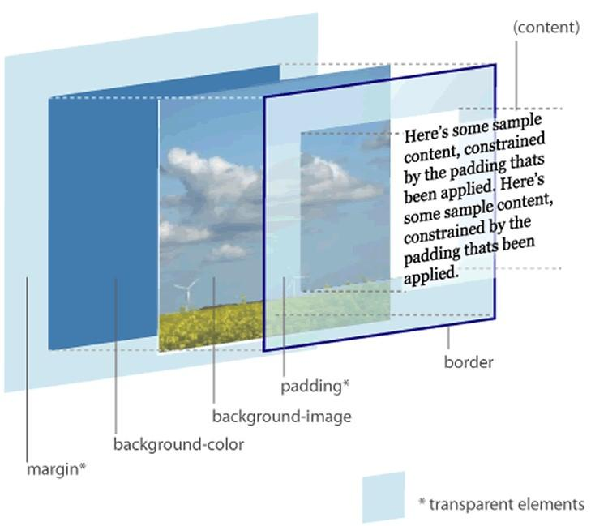

---
# Informació general del document
title: Model de caixes
subtitle: Llenguatges de marques i sistemes de gestió de la informació (LMSGI)
lang: ca
page-background: img/bg.png

# Portada
titlepage: true
titlepage-rule-height: 0
# titlepage-rule-color: AA0000
# titlepage-text-color: AA0000
titlepage-background: img/portada.png
# logo: img/logotext.png

# Taula de continguts
toc: true
toc-own-page: true
toc-title: Continguts

# Capçaleres i peus
header-left: Llenguatges de Marques
header-right: Curs 2024-2025
footer-left: IES Jaume II El Just
footer-right: \thepage/\pageref{LastPage}

# Imatges
float-placement-figure: H
caption-justification: centering

# Llistats de codi
listings-no-page-break: false
listings-disable-line-numbers: false

header-includes:
     - \usepackage{lastpage}
---

# Model de caixes (Box Model)

Quan es visualitza qualsevol element HTML és tractat com si estiguera **dins d’una caixa** rectangular.

Cada caixa té quatre components:

{ width=300px }


* **Margin (marge)**: distància des del border fins l’element en què està contingut l’objecte.
* **Border (vora)**: línia que separa el margin del padding.
* **Padding (farcit)**: distància entre el border i el contingut.
* **Contingut**: text, imatge, taula, etc.

L’**ordre de visualització** des del punt de vista de l’usuari és:

{ width=400px }

## Amplada i alçada

Els atributs **width** i **height** permeten definir la mida de la caixa.

```css
table { 
     width: 300px;
     height:100px;
}
```

!!! note "Important"

     Quan configureu les propietats width i height d’un element amb CSS, esteu establint l’amplada i l’alçada de l’àrea de contingut. Per calcular la mida completa d’un element, també heu d’afegir farcit, vores i marges.

* **Amplada total** de l’element = width + farciment esquerre + farciment dret + vora esquerra + vora dreta + marge esquerre + marge dret

* **Alçada total** de l’element = height + farciment superior + farciment inferior + vora superior + vora inferior + marge superior + marge inferior

Si usem **max-width** en lloc de width, l’element usa l’ample especificat, però si no cap en l’ample de la finestra, es redimensiona a aquesta.

Podeu veue [un exemple d'això a W3Scools](https://www.w3schools.com/css/tryit.asp?filename=trycss_max-width)

## Margin i padding

Per defecte els valors de margin, padding i border estan a zero. Podem canviar-ne els valors amb les propietats:

* *margin-left*, *margin-right*, *margin-top*, *margin-bottom*: estableixen els marges esquerre, dret, superior i inferior de l’element, respectivament.
* *margin*: estableix els 4 marges en aquest ordre: top, right, bottom, left. També es pot utilitzar amb 3 valors (top, right-left, bottom), 2 valors (top-bottom, tight-left) o un valor:

```css
/* top=25px, right=50px, bottom=75px, left=100px */ 

p {
     margin: 25px 50px 75px 100px;
}

/* top=25px, right=50px, bottom=75px, left=50px */ 

p {
     margin: 25px 50px 75px;
}

/* top=25px, right=50px, bottom=25px, left=50px */ 

p {
     margin: 25px 50px;
}

/* top=25px, right=25px, bottom=25px, left=25px */

p {
     margin: 25px;
}
```

**Padding**: funciona igual que *margin*, amb les propietats *padding-left*, *padding-right*, *padding-top*, *padding-bottom* i *padding*.

```css
div {
     padding-top: 50px;
     padding-right: 30px;
     padding-bottom: 50px;
     padding-left: 80px;
}

div {
     padding: 25px 50px 75px 100px;
}
```

Es pot establir la propietat de *margin* a **auto** per centrar horitzontalment l’element dins del seu contenidor. L’element ocuparà l’amplada especificada i l’espai restant es dividirà a parts iguals entre els marges esquerre i dret.

```css
div {
     width: 300px;
     margin: auto;
}
```

## Border

La propietat **border** serveix per a dibuixar una vora entre el padding i el margin. Amb el border hi ha moltes possibilitats:

* **border-style**: pot ser none (sense vora), solid (línia continua), dashed (línia discontinua), dotted (línia de punts), double (doble), groove , ridge, inset, outset...
* **border-width**: especifiquem l’amplada. El més corrent és fer-ho amb píxels (Per exemple: 10px)
* **border-color**: el color que tindrà.
* **border**: tot de cop especificant amplada, estil i color, en aquest ordre. p { border-color:#000000; border-style:solid; } p { border: 2px solid #000000; } 

[Teniu més exemples amb el boder a W3Schools](https://www.w3schools.com/css/css_border.asp)

## Vores arrodonides

La propietat **border-radius** serveix per a arrodonir les vores:

```css
p {
     border: 2px solid red; border-radius: 5px;
}
```

## Propietat box-sizing

Des dels inicis del CSS, el box model (model de caixa) ha funcionat així:

* **width real** visible d’un element de caixa = width + padding + border + margin
* **height real** visible d’un element de caixa = height + padding + border + margin

{ width=400px }

Això provoca que l’amplada varie molt d’uns elements als altres, de manera que s’ha creat una nova propietat CSS3 anomenada **box-sizing**.

Quan s’estableix **box-sizing: border-box** sobre un element, el padding i el border d’aquest element ja no fa augmentar la seva amplada ni alçada total.

Aquesta regla assegura que tots els elements sempre estan dimensionats d’una manera més intuïtiva. 

```css
div { 
     box-sizing: border-box;
     width: 200px;
     padding: 20px;
     border: 1px solid #DDD;
}
```

{ width=400px }

[Més exemples a W3Schools](https://www.w3schools.com/cssref/css3_pr_box-sizing.asp)