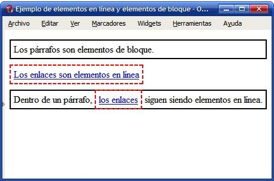

---
# Informació general del document
title: Elements de bloc i línia
subtitle: Llenguatges de marques i sistemes de gestió de la informació (LMSGI)
lang: ca
page-background: img/bg.png

# Portada
titlepage: true
titlepage-rule-height: 0
# titlepage-rule-color: AA0000
# titlepage-text-color: AA0000
titlepage-background: img/portada.png
# logo: img/logotext.png

# Taula de continguts
toc: true
toc-own-page: true
toc-title: Continguts

# Capçaleres i peus
header-left: Llenguatges de Marques
header-right: Curs 2024-2025
footer-left: IES Jaume II El Just
footer-right: \thepage/\pageref{LastPage}

# Imatges
float-placement-figure: H
caption-justification: centering

# Llistats de codi
listings-no-page-break: false
listings-disable-line-numbers: false

header-includes:
     - \usepackage{lastpage}
---

# Elements de bloc i en línia

Les caixes es poden comportar de formes diferents respecte a les altres. El més comú són dos comportaments:

* **block**: Són posicionats verticalment. Blocs de contingut que ocupen tot l’espai horitzontal. La caixa provoca un salt de línia darrere seu.
* **inline**: Són posicionats horitzontalment. Les caixes permeten que les altres es posen al seu costat.

{ width=400px }

* El primer element és un paràgraf que ocupa tota la línia perquè és un element de block.
* El segon element és un enllaç que ocupa només l’espai necessari pel seu contingut ja que és un element inline.

Podem canviar la disposició amb la propietat **display**:

* **display: inline**: mostra un element com si fora en línia.
* **display: block**: mostra un element com si fora de bloc.
* **display: inline-block**: mostra un element en línia, però permet afegir-li width i height.

```css
li {
  display: inline; /* Mostra els li uns al costat dels altres */ 
  }

a {
   display: block; /\* Mostra els a uns baix dels altres \*/
}

li {
   display: inline-block; /\* Mostra els li uns al costat dels altres \*/ width: 2px; /\* amb 2px d'ample \*/
}
```

## Visibilitat dels elements

També podem usar **display: none** per a amagar contingut:

```css
h1.hidden {
    display: none;
}
```

Amb aquesta propietat, l’element no es veu i s’allibera l’espai que ocupa.


Amb la propietat **visibility:hidden** també podem amagar un element, però es manté l’espai que ocupa.

```css
h1.hidden {
    visibility: hidden;
}
```

Per a tornar a mostrar els elements, establim les propietats a **initial**: 

```css
h1 {
    display: initial;
}

h2 {
    visibility: initial; 
}
```

## Crear un menú de navegació amb CSS

Amb el posicionament i altres propietats CSS podem fer un menú de navegació per al nostre lloc web.

Es recomana tindre els enllaços dins d’una **llista sense ordre**, la qual ha d’estar dins d’un element nav o div identificat amb un id:


```html
<nav id="menu">
  <ul>
    <li><a href="index.html">Home</a></li>
    <li><a href="news.html">News</a></li>
    <li><a href="contact.html">Contact</a></li>
  </ul>
</nav>
```

Primer, eliminem els marcadors, *margins* i *paddings* de la llista: 

```css
nav#menu ul { 
    list-style-type: none;
    margin: 0;
    padding: 0;
}
```

També eliminem el subratllat dels enllaços:

```css
nav#menu li a {
    text-decoration: none;
}
```

El següent pas serà canviar el display dels **li** a **inline-block** i els dels enllaços a block:

```css
nav#menu li {
  display: inline-block;
}

nav#menu li a {
    display: block; text-decoration: none;
}
```

Per a finalitzar, canviem els colors, alineacions i paddings dels elements. Altres millores interessants sónu tilitzar el selector **a:hover** per a canviar els colors quan passem per damunt d’un element o usar un selector de classe per a mostrar d’un color diferent l’element del menú en el qual ens trobem:

```html
<style>
    nav#menu ul {
      list-style-type: none;
      margin: 0;
      padding: 0;
      background-color: #333;
      height: 50px;
    }

    nav#menu li {
        display: inline-block;
      }

    nav#menu li a {
      display: block; 
      color: white; 
      text-align: center;
      padding: 15px;
      text-decoration: none;
    }

  nav#menu li a:hover {
      background-color: #111;
    }

.active { 
  background-color: #04AA6D;
  }

</style> 

<nav id="menu">
  <ul>
    <li><a class="active" href="#">Home</a></li>
    <li><a href="news.html">News</a></li>
    <li><a href="contact.html">Contact</a></li>
  </ul>
</nav>
```

{ width=600px }


[Més exemples de menús a W3Schools](https://www.w3schools.com/css/css_navbar.asp)
