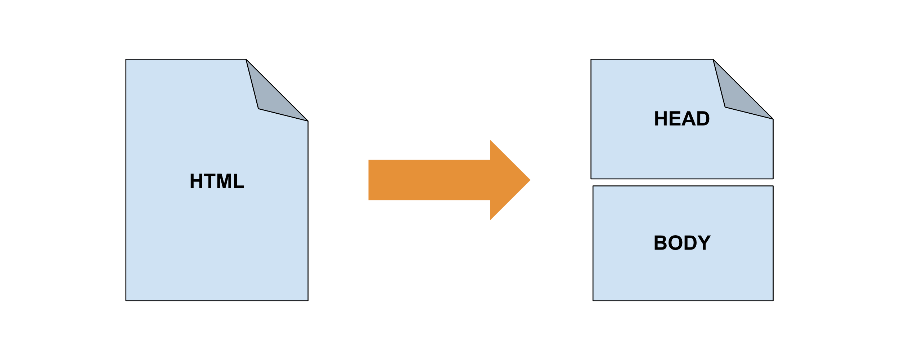
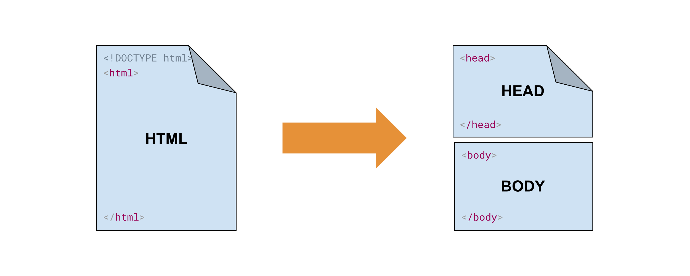

---
# Informació general del document
title: 2. HTML. Característiques bàsiques.
subtitle: Llenguatges de marques i sistemes de gestió de la informació (LMSGI)
authors: 
    - José A. Múrcia Andrés
lang: ca
page-background: img/bg.png

# Portada
titlepage: true
titlepage-rule-height: 0
# titlepage-rule-color: AA0000
# titlepage-text-color: AA0000
titlepage-background: img/portada.png
# logo: img/logotext.png

# Taula de continguts
toc: true
toc-own-page: true
toc-title: Continguts

# Capçaleres i peus
header-left: Llenguatges de Marques
header-right: Curs 2025-2026
footer-left: IES Jaume II El Just
footer-right: \thepage/\pageref{LastPage}

# Imatges
float-placement-figure: H
caption-justification: centering

# Llistats de codi
listings-no-page-break: false
listings-disable-line-numbers: false

header-includes:
     - \usepackage{lastpage}
---

# Etiquetes i atributs

Les etiquetes en HTML són els elements que s’utilitzen per **a estructurar i marcar** el contingut d’una document i són fonamentals per a la construcció de pàgines web i la definició de la seua estructura.

Per altra banda, **cada etiqueta compta amb atributs** que s’inclouen en la definició d’aquesta i **proporcionen informació addicional** sobre com s’ha de processar i mostrar l’element.

A continuació s’especifiquen les característiques bàsiques d’una etiqueta HTML:

1. **Nom de l’etiqueta**: Les etiquetes tenen un nom que defineixen l’element al que representen. El nom de l’etiqueta es posa, entre els caràcters `<` i `>`:

    ```html
    <nom_etiqueta>
    ```

2. **Obertura i tancament**: La majoria de les etiquetes d’HTML consten de dues parts, la d’obertura i la de tancament. La diferència entre les dos parts és que l’inici de la tancada comença per `</`, seguit del nom de l’etiqueta i després pel signe `>`.

    ```html
    <etiqueta>Contingut</etiqueta>
    ```

3. **Etiquetes auto-tancades**: Algunes etiquetes poden ser auto-tancades. Això significa que no tenen una etiqueta de tancament separada. Poden acabar amb un  `/` dins de l’etiqueta d’obertura. Indistintament es considera una etiqueta de tancament vàlida, tant si incloem el caràcter `/`  , com si no.

    ```html
    <br>
    <br/>
    ```

4. **Atributs**: Moltes etiquetes consten d’atributs que proporcionen informació addicional sobre l’element. Els atributs es col·loquen a l’etiqueta d’obertura i estan formats per un nom i un valor separats per un signe d’igual `=`. El valor ha d’anar entre cometes simples (`'`) o cometes dobles (`"`). Els atributs serveixen per controlar aspectes com l’aparença, el comportament i altres  característiques. En el següent exemple trobem el cas de l’etiqueta `img`, que com es pot veure consta de dos atributs: `src` i `alt`.

    ```html
    
    ```

5. **Contingut**: La majoria d’etiquetes contenen text o altres elements HTML com a contingut.

    ```html
    <p>Aquesta és una etiqueta de  paràgraf.</p>
    ```

6. **Comentaris**: El comentari és una manera de proporcionar anotacions o explicacions que **no es mostren als visitants de la pàgina**. Es tracta d’una manera de documentar el codi HTML per a què els desenvolupadors puguen comprendre millor l’estructura o per deixar notes internes. Els comentaris no són interpretats pel navegador i són ignorats a l’hora de mostrar la pàgina final. A l’hora de posar comentaris has de tindre en compte que:

    * Comencen amb `<!--` i acaben amb `-->`.
    * Poden ocupar una o varies línies de text.
    * No tenen cap efecte sobre la representació de la pàgina web, i per tant, no són visibles als usuaris.

   ```html
    `<!--Aquest és un comentari d’una línia HTML --> 
    
    <!-- Aquest és un comentari que ocupa 
         diverses línies.  
         Pots afegir tanta informació com 
         necessites -->` 
   ```

En definitiva, són d’utilitat per a aclarir el codi, indicar autors, deixar notes de desenvolupament o eliminar temporalment parts del codi sense necessitat de suprimir-les.

!!! note ""

    Si s'adoneu, no hem vist pràcticament res de nou, ja que quasi tots aquests conceptes són comuns als llenguatge de marques basats en SGML, com és XML, que ja hem vist a la unitat introductòria.

# Estructura d’un document HTML

Un document HTML té una **estructura jeràrquica** que està composada per diferents elements:

{ width=400px }

1. **L’element Doctype**: Representat per l’etiqueta `<!DOCTYPE>` en la primera línia d’un document HTML conté la declaració en la que s’especifica la versió d’HTML que s’està utilitzant. Aquesta etiqueta ajuda al navegador a interpretar correctament el document. En HTML5, a diferència d’anteriors versions només cal especificar que el tipus de document és HTML, sense fer referència a la versió.

    ```html
    <!DOCTYPE html>
    ```

2. **Element `<html>`**: és l’**element arrel** i engloba a tot el contingut de la pàgina. Conté dos subelements, el `<head>` i el `<body>`. Opcionalment podem establir l’atribut `lang` per especificar l’idioma del document.

    ```html
    <!DOCTYPE html>
    <html> 
       <head>   
       </head> 
       
       <body>         
       </body>
    </html>
    ```

3. **Secció `<head>`**: Dins d’aquesta secció es poden incloure **metadades** com ara el títol de la pàgina, la **codificació de caràcters**, les **descripcions de pàgina** (metaetiquetes), **enllaços a fulls d’estil, scripts i altres elements** relacionats amb la configuració i el comportament de la pàgina.

    ```html
    <head>
       <meta charset="UTF-8">
        <title> Títol de la pàgina </title>
      
       <link rel="stylesheet" href="estils.css">
    </head>
    ```

4. **Secció `<body>`**: Contingut de la pàgina: S’inclou dins de la secció `<body>`, es posa tot el contingut que es vol mostrar als visitants com ara, text, imatges, enllaços, taules i altres elements HTML.

   ```html
    <body>
       <h1>Títol principal</h1>
       <p>Aquest és un paràgraf de text.</p>
      
       
       <a href="https://www.exemple.com">Enllaç a l’exemple</a>
    </body> 
   ```

{ width=400px }

Una vegada introduïda l’estructura bàsica d’un document HTML, és el moment de començar a introduir la resta d’etiquetes bàsiques t’HTML que donen contingut i sentit al document.

## Elements Semàntics d'HTML5

L'estàndard HTML5 incorpora elements semàntics, que milloren l'accessibilitat i el SEO (*Search Engine Optimization* o optimització per a motors de cerca) del document HTML. Aquests elements proporcionen un significat clar sobre el contingut que encapsulen.

Veiem de quins elements es tracta:

### `header`

L'element `<header>` defineix la capçalera d'un document o secció. Pot contenir títols, subtítols i elements de navegació.

=== "HTML"
    ```html
    <header>
       <h1>Títol del Lloc</h1>
         <nav>
            <ul>
              <li><a href="#home">Inici</a></li>
              <li><a href="#about">Sobre Nosaltres</a></li>
            </ul>
         </nav>
    </header>
    ```

=== "Resultat"
    <div style="all: initial;">
       <header>
           <h1>Títol del Lloc</h1>
           <nav>
               <ul>
                   <li><a href="#home">Inici</a></li>
                   <li><a href="#about">Sobre Nosaltres</a></li>
               </ul>
           </nav>
       </header>
    </div>


!!! note "L'element nav"

    Si es fixeu, hem introduit un nou element: `nav`. Aquest element conté enllaços de navegació importants. 

    Tot i que pot ubicar-se en qualsevol lloc, sovint s'usa dins una capçalera, per afegir un menú de navegació comú a tot el lloc.

    El seu contingut, sol expressar-se en una llista, emb les etiquetes `ul`/`li`, que comentem més avant.


### `footer`
L'element `<footer>` defineix el peu de pàgina d'un document o secció. Normalment conté informació de copyright, enllaços a la política de privadesa, etc.

=== "HTML"
    ```html
    <footer>
        <p>&copy; 2024, Tots els drets reservats.</p>
    </footer>
    ```

=== "Resultat"
    <div style="all: initial;">
       <footer>
        <p>&copy; 2024, Tots els drets reservats.</p>
       </footer>
    </div>

### `article`
L'element `<article>` s'utilitza per a contingut independent i autònom, com articles de blog o notícies.

=== "HTML"
    ```html
    <article>
        <h2>Títol de l'Article</h2>
        <p>Això és un article sobre HTML5.</p>
    </article>
    ```

=== "Resultat"
    <div style="all: initial;">
       <article>
        <h2>Títol de l'Article</h2>
        <p>Això és un article sobre HTML5.</p>
    </article>
    </div>

### `section`
L'element `<section>` s'utilitza per agrupar temes o seccions relacionades dins d'un document.

=== "HTML"
    ```html
    <section>
        <h2>Títol de la Secció</h2>
        <p>Aquest és el contingut de la secció.</p>
    </section>
    ```

=== "Resultat"
    <div style="all: initial;">
    <section>
    <h2>Títol de la Secció</h2>
    <p>Aquest és el contingut de la secció.</p>
    </section>
    </div>

!!! note "Quan utilitzem article o section?"
    Com hem dit, l'article té sentit per sí mateix, mentre que una secció conté temes relacionats dins un document.

    Així, un article podria estar compost per diverses seccions, però no podriem tindre una secció composta per articles.

!!! note "Més informació sobre elements semàntics"

    * [Article *HTML5, estructura básica y elementos semánticos*](https://www.eniun.com/html5-estructura-basica-elementos-semanticos/)

# Contenidors

HTML distingeix entre **etiquetes de bloc** i **etiquetes en línia**. Les etiquetes de bloc, com `<div>`, ocupen tota l'amplada disponible i comencen en una nova línia, mentre que les etiquetes en línia, com `<span>`, només ocupen l'espai necessari i es mostren al costat d'altres elements en la mateixa línia.

Veiem aquests dos elements:

* **L'lement `div`** L'element `<div>` és un contenidor genèric que no aporta significat semàntic, però és útil per agrupar altres elements HTML. S'usa sovint per aplicar estils amb CSS o per controlar el disseny amb JavaScript.

    ```html
    <div class="container">
    <h1>Títol Principal</h1>
    <p>Això és un paràgraf dins d'un div.</p>
    </div>
    ```

* **L'element `span`**: L'element `<span>` és similar al `<div>`, però es fa servir per agrupar contingut en línia. Sol utilitzar-se pe aplicar estils a parts del text dins d'altres elements.

    ```html
    <p>Aquest és un <span class="important">text important</span> dins d'un paràgraf.</p>
    ```

!!! note "Més informació sobre div i span"

    * [W3Schools: HTML `<div>` Element](https://www.w3schools.com/tags/tag_div.asp)
    * [W3Schools: HTML `<span>` Element](https://www.w3schools.com/tags/tag_span.asp)


# Etiquetes bàsiques de text

## Capçaleres

Són etiquetes que s’utilitzen per a definir els **diferents nivells** d’una pàgina. Amb elles s’**organitza el contingut textual** d’una pàgina web, dotant-la d’una estructura jeràrquica i **ajudant a l’accessibilitat**.

Les etiquetes van des de `<h1>` fins a `<h6>`, representant `‘<h1>` el nivell més alt i `<h6>` el més baix.

És import utilitzar les etiquetes de capçalera per mantenir d’una manera correcta l’estructura jeràrquica i semàntica de la pàgina web. Per exemple la capçalera de primer nivell `<h1>` només deuria d’aparèixer una vegada en el document, mentre que la capçalera de nivell 2, `<h2>` deuria d’utilitzar-se només per a titular les seccions més importants.

!!! note "HTML i Markdown"

    Si s'adoneu, en Markdown també tenim de sis nivells de capçaleres: `#`...`######`, que són equivalents a `<h1>` fins `<h6>`.

Exemple d’ús de les etiquetes de capçalera:

=== "HTML"

    ```html
    <h1>Títol 1</h1>
    <h2>Secció 1.1</h2>
    <h3>Subsecció 1.1</h3>
    <h2> Secció 2</h2>
    <h3>Subsecció 2.1</h3> 
    ```

=== "Markdown"

    ```markdown
    # Títol 1
    ## Secció 1
    ### Subsecció 1.1
    ## Secció 2
    ### Subsecció 2.1
    ```

=== "Resultat"

    <div style="color:black; font-family:Serif">
    # Títol 1
    ## Secció 1
    ### Subsecció 1.1
    ## Secció 2
    ### Subsecció 2.1
    </div>

## Paràgrafs

Una de les eines més bàsiques per a estructurar el contingut d’una pàgina web és l’etiqueta de paràgraf. Aquesta etiqueta és representada amb `<p>` i s’utilitza per a **delimitar blocs de text** que han de ser visualitzats com a paràgrafs separats de la resta.

Un paràgraf és una **etiqueta de bloc**, que implica que quan la utilitzem crea un bloc de text i en acabar fa un salt de línia.

=== "HTML"
    ```html
     <p>Aquest és el primer paràgraf. És una manera
      senzilla d'estructurar text.</p>

     <p>Ací hi ha un segon paràgraf.
       Cada paràgraf s'ajusta automàticament a la mida
       de la finestra del navegador.</p>
    ```

=== "Resultat"

    <div style="color:black; font-family:Serif">
    Aquest és el primer paràgraf. És una manera senzilla d'estructurar text.

    Ací hi ha un segon paràgraf. Cada paràgraf s'ajusta automàticament a la mida de la finestra del navegador.
    </div>

## Etiqueta de salt de línia

L'etiqueta `<br>` en HTML és una etiqueta buida que s'utilitza per **crear un salt de línia** o una nova línia de text dins d'un element de bloc, com ara, un paràgraf `<p>`. Aquesta etiqueta **no té una part d'obertura i tancament** com moltes altres etiquetes HTML, ja que no envolta cap contingut, simplement s'afegeix a l'HTML quan es vol indicar que es requereix un salt de línia.

L'ús més comú de l'etiqueta `<br>` és per aconseguir un salt de línia manual quan es vol canviar de línia dins d'un paràgraf o un altre element en forma de bloc. Això pot ser útil per a situacions com canvis de línia en adreces o poemes, o quan es vol ajustar manualment el format del text.

En el següent exemple, l'etiqueta `<br>` es fa servir per generar un salt de línia entre les dues frases, creant dues línies de text separades dins del mateix paràgraf

=== "HTML"
    ```html
    <p> Aquesta és una línia de text.<br> Aquesta és una nova línia de text.</p>
    ```
=== "Resultat"

    <div style="color:black; font-family:Serif">
    Aquesta és una línia de text.      
    Aquesta és una nova línia de text.
    </div>

!!! note "Referència"
    * [Referència en la documentació de Mozilla](https://developer.mozilla.org/es/docs/Web/HTML/Element/br)
    * [Referència en W3Schools](https://www.w3schools.com/tags/tag_br.asp)

!!! note "Sobre Markdown, salts de línia i paràgrafs"

    Recordeu que quan treballem amb Markdown, per tal de separar paràgrafs, necessitem afegir una línia en blanc.

    Quan es tracta d'un salt de línia, però no volem separar paràgrafs (és a dir, volem afegir un `<br/>`), el que fem és acabar la línia amb dos espais i un única salt de línia.

    Si afegim només un salt de línia, sense els espais, es considerarà tot el mateix paràgraf i no s'afegirà cap salt.

!!! note "Compte amb els salts de línia"

    Cal tenir en compte que **l'ús excessiu** d'aquesta etiqueta per afegir salts de línia **pot no ser la millor pràctica**, ja que pot dificultar la gestió de la presentació i l'estil del text. En molts casos, és millor utilitzar elements de bloc com paràgrafs `<p>` per organitzar i estructurar el contingut, i com veurem més endavant, utilitzar CSS per gestionar la presentació visual, com els marges i l'espai entre línies.

## Etiquetes de format al text

HTML consta d’un conjunt d’etiquetes que permeten estilitzar, destacar i organitzar el text d’una pàgina web. Aquestes etiquetes permeten als desenvolupadors web i dissenyadors controlar com es representa el text en una pàgina web.

* **L’etiqueta `<b>`**: s’utilitza per a aplicar el format de **negreta** a un fragment de text. Aquesta etiqueta no aporta cap *valor semàntic* sobre el text, només afecta a l’aspecte visual.

=== "HTML"

    ```html
    <p>Aquest és un text en <b>negreta</b>.</p>
    ```

=== "Markdown"

    ```markdown
    Aquest és un text en **negreta**.
    ```

=== "Resultat"

    <div style="color:black; font-family:Serif">
    Aquest és un text en **negreta**.
    </div>

!!! note "Referència"
    * [Referència en la documentació de Mozilla](https://developer.mozilla.org/es/docs/Web/HTML/Element/b)
    * [Referència en W3Schools](https://www.w3schools.com/tags/tag_b.asp)

* **L’etiqueta `<strong>`‘**: s’utilitza per a donar **èmfasi** al text, mostrant-lo normalment en **negreta**. A diferència de l’etiqueta `<b>` , si que aporta un **significat semàntic** especial, ja que independentment de l’estil visual concret, **indica que el contingut d’aquesta etiqueta és important**.

=== "HTML"

    ```html
    <p>Aquest és un text <strong>important</strong>.</p>
    ```

=== "Resultat"

    <div style="color:black; font-family:Serif">
    Aquest és un text **important**.
    </div>

!!! note "Referència"
    * [Referència en la documentació de Mozilla](https://developer.mozilla.org/es/docs/Web/HTML/Element/strong)
    * [Referència en W3Schools](https://www.w3schools.com/tags/tag_strong.asp)

* **L’etiqueta `<i>`**: S’utilitza per canviar l’estil visual del text a **cursiva** (itàlica). No proporciona cap significat semàntic addicional per a les eines d’accessibilitat i per als motors de cerca.

=== "HTML"

    ```html
    <p>Aquest és un text en <i>cursiva</i>.</p>
    ```

=== "Markdown"

    ```markdown
    Aquest és un text en *cursiva*.
    ```

=== "Resultat"

    <div style="color:black; font-family:Serif">
    Aquest és un text en *cursiva*.
    </div>

!!! note "Referència"
    * [Referència en la documentació de Mozilla](https://developer.mozilla.org/es/docs/Web/HTML/Element/i)
    * [Referència en W3Schools](https://www.w3schools.com/tags/tag_i.asp)

* **L’etiqueta `<em>`**: Té com a principal objectiu **emfatitzar un text**, i a més de mostrar-lo normalment en **cursiva**, indica que el seu contingut te un significant especial o rellevant especial dins de la pàgina. Aquesta importància semàntica és interpretada per les eines d’accessibilitat i els motors de cerca.

=== "HTML"

    ```html
    <p>Aquest és un text en <em>emfatitzat</em>.</p>
    ```

=== "Resultat"

    <div style="color:black; font-family:Serif">
    <p>Aquest és un text en <em>emfatitzat</em>.</p>
    </div>

!!! note "Referència"
    * [Referència en la documentació de Mozilla](https://developer.mozilla.org/es/docs/Web/HTML/Element/em)
    * [Referència en W3Schools](https://www.w3schools.com/tags/tag_em.asp)

* **L’etiqueta `<small>`**: Indica que el contingut d’aquesta te una **importància menor** que el text que l’envolta i a més representa el text en una mida més menuda que la resta.  S’utilitza per exemple per a notes a peu de pàgina, crèdits, apartats legals, etcètera.

=== "HTML"

    ```html
    <p>Exemple d’small <small>Última actualització: 6-10-2025</small>
    ```

=== "Resultat"

    <div style="color:black; font-family:Serif">
    <p>Exemple d’small <small>Última actualització: 6-10-2025</small>
    </div>

!!! note "Referència"
    * [Referència en la documentació de Mozilla](https://developer.mozilla.org/es/docs/Web/HTML/Element/small)
    * [Referència en W3Schools](https://www.w3schools.com/tags/tag_small.asp)

* **L’etiqueta `‘<sub>`**: S’utilitza per a marcar aquell text que ha de ser representat com a un **subíndex**, mostrant-lo en una posició inferior i més menuda que la resta del text. S’utilitza especialment per a mostrar fórmules químiques, expressions matemàtiques o contingut tècnic. Més enllà de la presentació visual, no te cap importància semàntica especial.

=== "HTML"

    ```html
    <p>La formula de l'aigua és H<sub>2</sub>O</p>
    ```

=== "Resultat"

    <div style="color:black; font-family:Serif">
    <p>La formula de l'aigua és H<sub>2</sub>O</p>
    </div>

!!! note "Referència"
    * [Referència en la documentació de Mozilla](https://developer.mozilla.org/es/docs/Web/HTML/Element/sub)
    * [Referència en W3Schools](https://www.w3schools.com/tags/tag_sub.asp)

* L’etiqueta `<sup>`: S’utilitza per a marcar un text en forma de **superíndex**, és a dir, en una posició superior i lleugerament més menuda que la resta de text. S’utilitza per a mostrar potències, exponents, indicadors ordinals o altres notacions especials. Al marge de la representació visual, no aporta cap significat especial per a l’accessibilitat o els motors de cerca.

=== "HTML"

    ```html
    <p>2<sup>3</sup> representa dos elevat a la tercera potència.</p>
    ```

=== "Resultat"

    <div style="color:black; font-family:Serif">
    <p>2<sup>3</sup> representa dos elevat a la tercera potència.</p>
    </div>

!!! note "Referència"
    * [Referència en la documentació de Mozilla](https://developer.mozilla.org/es/docs/Web/HTML/Element/sup)
    * [Referència en W3Schools](https://www.w3schools.com/tags/tag_sup.asp)

* **L’etiqueta `<ins>`**: Quan un text o contingut està marcat per esta etiqueta significa que ha sigut **afegit o canviat** des de l’última versió de l’anterior document. Generalment subratlla el text marcat, però esta no és la seua finalitat. Per a subratllar text cal utilitzar altres elements que veurem més endavant. L’etiqueta `<ins>`consta de dos atributs específics: `cite` i ’`datetime`.

=== "HTML"

    ```html
    <p>Aquesta és una <ins>nova</ins> paraula afegida al text</p>
    ```

=== "Resultat"

    <div style="color:black; font-family:Serif">
    <p>Aquesta és una <ins>nova</ins> paraula afegida al text</p>
    </div>

!!! note "Referència"
    * [Referència en la documentació de Mozilla](https://developer.mozilla.org/es/docs/Web/HTML/Element/ins)
    * [Referència en W3Schools](https://www.w3schools.com/tags/tag_ins.asp)

* **L’etiqueta `<del>`**: En aquest cas, l’etiqueta indica si el text ha estat **eliminat** de l’anterior versió del document. És útil per a la comparació de revisions de text i consta dels mateixos atributs que l’etiqueta `<ins>`.

=== "HTML"

    ```html
    <p>Aquesta és una <del>paraula eliminada</del> del text.</p>
    ```

=== "Resultat"

    <div style="color:black; font-family:Serif">
    <p>Aquesta és una <del>paraula eliminada</del> del text.</p>
    </div>

!!! note "Referència"
    * [Referència en la documentació de Mozilla](https://developer.mozilla.org/es/docs/Web/HTML/Element/del)
    * [Referència en W3Schools](https://www.w3schools.com/tags/tag_del.asp)

* L’etiqueta `<mark>`:  Aquesta etiqueta s’utilitza per a **ressaltar** un text dins d’un paràgraf o altra secció, fent-lo més visible, però sense que aporte un significat especial al contingut, només afectant a les seues propietats d’estil.

=== "HTML"

    ```html
    <p>La <mark>conferència</mark> tindrà lloc a l'<mark>auditori</mark> principal</p>
    ```

=== "Resultat"

    <div style="color:black; font-family:Serif">
    <p>La <mark>conferència</mark> tindrà lloc a l'<mark>auditori</mark> principal</p>
    </div>

!!! note "Referència"
    * [Referència en la documentació de Mozilla](https://developer.mozilla.org/es/docs/Web/HTML/Element/mark)
    * [Referència en W3Schools](https://www.w3schools.com/tags/tag_mark.asp)

## Referències a entitats HTML

Una referència a entitat d'HTML, no és una etiqueta com a tal, sinò una seqüència de caràcters que es fa servir per **representar caràcters especials o reservats** que podrien ser interpretats de manera incorrecta en un document HTML. Les entitats HTML ens permeten incloure caràcters com `<`, `>`, `&`, cometes dobles (`"`), cometes simples (`'`) i altres caràcters especials sense interferir amb la sintaxi del codi HTML.

L'ús de la codificació de caràcters en HTML és fonamental per evitar errors de sintaxi i garantir que el text es mostre correctament en el navegador. També és important per a la seguretat web, ja que evita la interpretació incorrecta de caràcters i pot prevenir atacs de script entre llocs web (cross-site scripting, o XSS).

A continuació, es mostren alguns dels caràcters especials més comuns i les seues entitats HTML equivalents:

| Entitat | Símbol | Significat |
|---------|--------|------------|
|  `&lt;` |  `<`   |  menor que |
|  `&gt;` |  `>`   |major que   |
|  `&amp;`|  `&`   | ampersand  |
|  `&nbsp;` | ‘ ‘ | espai en blanc |
|  `&quot;` | `"` | cometes dobles |
|  `&apos;` o `&#39;` | `'` |cometes simples |

Per regla general, a l’hora de fer referència a les entitats o podem fer-ho pel seu nom o pel seu codi

Si necessites representar un caràcter especial en HTML, simplement substitueix el caràcter pel seu equivalent d'entitat HTML. Per exemple, si vols mostrar una cometa doble (`"`) en el teu codi HTML, utilitzaries `&quot;`:

=== "HTML"

    ```html
    <p>Els caràcters &lt;, &gt;, &quot; i &amp; poden donar problemes amb els texts en HTML</p>
    ```

=== "Resultat"

    <div style="color:black; font-family:Serif">
    <p>Els caràcters &lt;, &gt;, &quot; i &amp; poden donar problemes amb els texts en HTML</p>
    </div>
    
A més dels caràcters especials, també hi ha altres caràcters que podrien requerir codificació en HTML, com els caràcters no ASCII o els caràcters que tenen significats especials en el codi HTML, per a obtenir més informació accedeix al [Manual](https://www.w3schools.com/html/html_entities.asp) de la organització [W3Schools](https://www.w3schools.com/html).

## Enllaços

Un **enllaç** o **hiperenllaç** en HTML (hyperlink en anglès) és un element que permet als usuaris navegar i **accedir a altres pàgines web**, recursos en línia o ubicacions dins d'una mateixa pàgina. Els enllaços són la **base de la navegació web**, ja que **permeten connectar i vincular diferents pàgines i recursos**, facilitant la interconnexió d'informació a través d'Internet.

Els enllaços s'implementen mitjançant l'ús de l'etiqueta `<a>`. Aquesta etiqueta inclou, entre altres, l'atribut `href`, que especifica la URI (Uniform Resource Identifier) o la ubicació de destinació a la qual l'enllaç redirigeix l'usuari.  El text o els altres elements que es troben dins de l’etiqueta es converteixen des d’eixe moment en enllaços que l’usuari haurà de clicar per a redirigir a la pagina o ubicació especificada.

L’atribut `target` especifica com s’ha d’obrir l’enllaç, per exemple si ho fa en una finestra, en una pestanya nova, o en la pestanya actual. Els valors més comuns d’aquest atribut són:

| Valor del target | Significat |
|------------------|------------|
| `_blank` |  Obrir en una finestra nova |
| `_self`  | Obrir en la mateixa pestanya des d’on es troba l’enllaç |
| `_parent` | Obrir en la finestra *pare* |

Els enllaços poden ser utilitzats per realitzar diverses accions, com ara:

* **Navegació web**: Enllaços a altres pàgines web, llocs d'Internet o recursos externs.

=== "HTML"

    ```html
    <a href="https://portal.edu.gva.es/iesjaumeeljust/">IES Jaume II el Just</a> <a href="https://portal.edu.gva.es/iesjaumeeljust/"  target="_blank">Obrim en una nova finestra</a>
    ```

=== "Resultat"

    <div style="color:black; font-family:Serif">
    <a href="https://portal.edu.gva.es/iesjaumeeljust/">IES Jaume II el Just</a> <a href="https://portal.edu.gva.es/iesjaumeeljust/"  target="_blank">Obrim en una nova finestra</a>
    </div>

* **Descàrrega de fitxers**: Enllaços per a la descàrrega de fitxers, com documents PDF, imatges, música o altres tipus de fitxers.

=== "HTML"

    ```html
    <a href="https://portal.edu.gva.es/iesjaumeeljust/wp-content/uploads/sites/33/2024/09/SOL-LICITUD-CONVALIDACIO-.pdf" download>IES Jaume II el Just</a>
    ```

=== "Resultat"

    <div style="color:black; font-family:Serif">
    <a href="https://portal.edu.gva.es/iesjaumeeljust/wp-content/uploads/sites/33/2024/09/SOL-LICITUD-CONVALIDACIO-.pdf" download>Sol·licitud de convalidació de mòduls</a>
    </div>

* **Enllaços de correu**: Creació d'enllaços que obrin l’aplicació de correu predefinida amb la direcció de correu especificada.

=== "HTML"

    ```html
    <a href="mailto:ja.murciaandres.edu.gva.es">Professor</a>
    ```

=== "Resultat"

    <div style="color:black; font-family:Serif">
    <a href="mailto:ja.murciaandres.edu.gva.es">Professor</a>
    </div>

* **Enllaços a telèfons**: Enllaços que obrin l’aplicació de telèfon per a realitzar una telefonada.

=== "HTML"

    ```html
    <a href="tel: +34962829995">Telefona l'IES</a>
    ```

=== "Resultat"

    <div style="color:black; font-family:Serif">
    <a href="tel: +34962829995">Telefona l'IES</a>
    </div>

* **Ancoratges interns**: Creació d'enllaços dins de la mateixa pàgina per permetre als usuaris desplaçar-se a diferents seccions del contingut, posant l'`href` l'`id` de l’element on volem desplaçar-nos.

=== "HTML"
    ```html
    <!-- Identifiquem l’etiqueta amb l’atribut id seccio2  -->
    <h2 id="seccio2">`Secció 2</h2>
    <p> Altres paràgrafs o continguts </p>
    <!-- Indiquem que l’enllaç apunta a seccio2 -->
    <a href="#seccio2">`Ves a la secció `2</a>  
    ```

=== "Resultat"

    <div style="color:black; font-family:Serif">
    <!-- Identifiquem l’etiqueta amb l’atribut id seccio2  -->
    <h2 id="seccio2">`Secció `2</h2>
    <p> Altres paràgrafs o continguts </p>
    <!-- Indiquem que l’enllaç apunta a seccio2 --> 
    <a href="#seccio2">`Ves a la secció `2</a>  
    </div>

* **Navegació i interacció amb JavaScript**: L'etiqueta `<a>` també es pot utilitzar com a part de la interacció mitjançant JavaScript per realitzar accions específiques, com la mostra d'elements ocults o la connexió amb funcionalitats avançades de JavaScript.

=== "HTML"

    ```html
    <a href="javascript:alert('Hola Mon!');"> Executa JavaScript </a>
    ```

=== "Resultat"

    <div style="color:black; font-family:Serif">
    <a href="javascript:alert('Hola Mon!');"> Executa JavaScript </a>
    </div>

## Llistes

### Llistes no ordenades

Una llista no ordenada és un conjunt de línies de text, precedides generalment d’algun símbol gràfic que remarca el caràcter de llista. Aquesta tipus de llista es defineix amb les etiquetes `<ul></ul>` i cada un dels seus elements o items mitjançant `<li></li>` (*list item*).

Els pics o vinyetes de la llista poden ser substituïts per altres elements gràfics, qüestió que podrem observar més endavant amb d’aplicacions d’estils.

=== "HTML"

    ```html
    <ul>
        <li>Sota</li>
        <li>Cavall</li>
        <li>Rei</li>
    </ul>
    ```

=== "Resultat"

    <div style="color:black; font-family:Serif">
    <ul>
        <li>Sota</li>
        <li>Cavall</li>
        <li>Rei</li>
    </ul>
    </div>
    
    
!!! note "Referència"
    * [Referència en la documentació de Mozilla](https://developer.mozilla.org/es/docs/Web/HTML/Element/ul)
    * [Referència en W3Schools](https://www.w3schools.com/html/html_lists_unordered.asp)

### Llistes ordenades

Les llistes ordenades situen davant de cada element o item un número, lletra o lletra romana de manera correlativa. De manera predeterminada s’assigna l’estil de numeració.
L’inici i el final de la llista s’indica amb `<ol></ol>`. Els elements de la llista van també entre `<li></li>`. Les llistes ordenades tenen l’atribut type que defineix el tipus de llista amb les següent especificacions:

| Valor | Descripció |
| :---- | :---- |
| `type="1"` | Elements numerats amb números (valor predeterminat) |
| `type="A"` | Elements numerats amb una lletra majúscula |
| `type="a"` | Elements numerats amb una lletra minúscula |
| `type="I"` | Elements numerats amb una lletra romana majúscula |
| `type="i"` | Elements numerats amb una lletra romana en minúscula |

=== "HTML"

    ```html
    <ol>
        <li>Primer element de la llista</li>
        <li>Segon element de la llista</li>
        <li>Tercer element de la llista</li>
    </ol>
    ```

=== "Resultat"

    <div style="color:black; font-family:Serif">
    <ol>
        <li>Primer element de la llista</li>
        <li>Segon element de la llista</li>
        <li>Tercer element de la llista</li>
    </ol>
    </div>
    
!!! note "Referència"
    * [Referència en la documentació de Mozilla](https://developer.mozilla.org/es/docs/Web/HTML/Element/ol)
    * [Referència en W3Schools](https://www.w3schools.com/html/html_lists_ordered.asp)

## Llistes de definició

La llista de definició és un element que permet organitzar la informació en forma de parells de termes i descripció. Aquestes llistes són útils quan volem proporcionar explicacions o descripcions de termes. L’inici i el final de l’estructura s’indica amb les etiquetes `<dl>` i `</dl>`, els termes es defineixen amb `<dt>` i `</dt>` i les definicions amb `<dd>` i `</dd>`.

=== "HTML"

    ```html
    <dl>
        <dt>Primer Plat</dt>
        <dd>Paella, Fideuà o Arròs Negre</dd>
        <dt>Segon Plat</dt>
        <dd>Entrecot, Lluç o Llobarro</dd>
        <dt>Postre</dt>
        <dd>Flam, Natilles o Fruita</dd>
    </dl>
    ```

=== "Resultat"

    <div style="color:black; font-family:Serif">
    <dl>
        <dt>Primer Plat</dt>
        <dd>Paella, Fideuà o Arròs Negre</dd>
        <dt>Segon Plat</dt>
        <dd>Entrecot, Lluç o Llobarro</dd>
        <dt>Postre</dt>
        <dd>Flam, Natilles o Fruita</dd>
    </dl>
    
## Combinacions de llistes

És possible combinar diferents tipus de llistes donat que un element `<li>` o `<dd>` no només pot allotjar text, també pot allotjar altres elements com per exemple llistes.

=== "HTML"

    ```html
    <dl>
        <dt>Primer Plat</dt>
        <dd>
            <ul>
                <li>Paella</li>
                <li>Fideuà</li>
                <li>Arròs Negre</li>
            </ul>
        </dd>
        <dt>Segon Plat</dt>
            <dd>
                <ul>
                    <li>Entrecot</li>
                    <li>Lluç</li>
                    <li>Llobarro</li>
                </ul>
            </dd>
    </dl>
    ```

=== "Resultat"

    <div style="color:black; font-family:Serif">
    <dl>
        <dt>Primer Plat</dt>
        <dd>
            <ul>
                <li>Paella</li>
                <li>Fideuà</li>
                <li>Arròs Negre</li>
            </ul>
        </dd>
        <dt>Segon Plat</dt>
            <dd>
                <ul>
                    <li>Entrecot</li>
                    <li>Lluç</li>
                    <li>Llobarro</li>
                </ul>
            </dd>
        </dt>
    </dl>

## Taules

Una taula és bàsicament una quadricula on Els elements de la quadrícula es denominen cel·les. En sentit horitzontal, les cel·les s’agrupen en files i en sentit vertical en columnes.

Les taules es queden delimitades per les etiquetes `<table></table>`. Les files s’indiquen mitjançant les etiquetes `<tr>` i `<`/`tr>`. I les cel·les de cada fila s’indiquen amb `<td>` i `</td>`.  

A l’hora de definir una taula cal tindre en compte que totes les files han de tenir el mateix nombre de cel·les.

=== "HTML"

    ```html
        <table border="1"> 
            <tr><!-- Fila 1 --> 
                <td>Contingut 1</td>
                <td>Contingut 2</td>
            </tr>
            <tr><!-- Fila 2 -->
                <td>Contingut 3</td>
                <td>Contingut 4</td>
            </tr>
        </table>
    ```

=== "Resultat"

    <div style="color:black; font-family:Serif">
        <table border="1"> 
            <tr><!-- Fila 1 --> 
                <td>Contingut 1</td>
                <td>Contingut 2</td>
            </tr>
            <tr><!-- Fila 2 -->
                <td>Contingut 3</td>
                <td>Contingut 4</td>
            </tr>
        </table>
    </div>
    
!!! note "Referència"
    * [Referència en la documentació de Mozilla](https://developer.mozilla.org/es/docs/Web/HTML/Element/table)
    * [Referència en W3Schools](https://www.w3schools.com/html/html_tables.asp)

### Títol i capçaleres de la taula

De vegades les taules inclouen un títol, el qual s’estableix amb les etiquetes `<caption>` i `<`/`caption>`. Aquest element ocupa una fila sencera i obligatòriament  ha d’anar en la part superior de la taula.

Per altra, banda cap la possibilitat de marcar la fila superior com a capçalera, i diferenciar les cel·les superiors de cada columna amb les etiquetes `<th>` i `</th>,` que els navegadors solen presentar-les amb negreta i centrades en cada cel·la.

=== "HTML"

    ```html
        <table border="1"> 
            <tr><!-- Encapçalament -->
                <th>Capçalera columna 1</th>
                <th>Capçalera columna 2</th>
            </tr>
            <tr><!-- Fila 1 --> 
                <td>Contingut 1</td>
                <td>Contingut 2</td>
            </tr>
            <tr><!-- Fila 2 -->
                <td>Contingut 3</td>
                <td>Contingut 4</td>
            </tr>
            <caption>Títol de la taula</caption>
        </table>
    ```

=== "Resultat"
    <div style="color:black; font-family:Serif">
        <table border="1"> 
            <tr><!-- Encapçalament -->
                <th>Capçalera columna 1</th>
                <th>Capçalera columna 2</th>
            </tr>
            <tr><!-- Fila 1 --> 
                <td>Contingut 1</td>
                <td>Contingut 2</td>
            </tr>
            <tr><!-- Fila 2 -->
                <td>Contingut 3</td>
                <td>Contingut 4</td>
            </tr>
            <caption>Títol de la taula</caption>
        </table>
    </div>

### Combinació de cel·les

Es possible que alguna vegada necessitem que una cel·la vaja més enllà de la seua fila o la seua columna. Per a això farem ús de de cel·la `colspan` (per a columnes) i `rowspan` (per a files) indicant a quantes files o columnes s’expandiran.

=== "HTML"
    ```html
    <table border="1">
        <tr><!-- Encapçalament -->
            <th>Capçalera columna 1</th>
            <th>Capçalera columna 2</th>
            <th>Capçalera columna 3</th>
        </tr>
        <tr><!-- Fila 1 -->
            <td>Contingut 1</td>
             <td colspan="2">Contingut 2</td>
        </tr>
        <tr><!-- Fila 2 -->
            <td>Contingut 3</td>
            <td rowspan="2">Contingut 4</td>
            <td>Contingut 5</td>
        </tr>
        <tr><!-- Fila 3 -->
            <td>Contingut 6</td>
            <td>Contingut 7</td>
        </tr>
        <caption>Taula amb cel·les combinades</caption>
    </table>
    
    ```
=== "Resultat"
    <div style="color:black; font-family:Serif">
            <table border="1">
            <tr><!-- Encapçalament -->
                <th>Capçalera columna 1</th>
                <th>Capçalera columna 2</th>
                <th>Capçalera columna 3</th>
            </tr>
            <tr><!-- Fila 1 -->
                <td>Contingut 1</td>
                <td colspan="2">Contingut 2</td>
            </tr>
            <tr><!-- Fila 2 -->
                <td>Contingut 3</td>
                <td rowspan="2">Contingut 4</td>
                <td>Contingut 5</td>
            </tr>
            <tr><!-- Fila 3 -->
                <td>Contingut 6</td>
                <td>Contingut 7</td>
            </tr>
            <caption>Taula amb cel·les combinades</caption>
        </table>
    </div>

### Columnes

En un primer moment HTML no contempla les columnes com a element de treball: L’element bàsic dins de la taula és la cel·la i aquesta s’agrupa en files. HTML5 incorpora l’etiqueta `colgroup` que especifica un format per a una o més columnes. Aquesta etiqueta es situa després de l’etiqueta caption, si és el cas, i després de qualsevol altre element de fila o altres. El colgroup alberga en el seu interior etiquetes `col` que fan referència a l’estil de la columna. L’etiqueta col inclou l’atribut `span` que indica a quantes columnes s’ha d’expandir el seu estil.

=== "HTML"
    ```html
    <table border="1">
        <tr><!-- Encapçalament -->
            <th>Capçalera columna 1</th>
            <th>Capçalera columna 2</th>
            <th>Capçalera columna 3</th>
        </tr>
        <tr><!-- Fila 1 -->
            <td>Contingut 1</td>
             <td colspan="2">Contingut 2</td>
        </tr>
        <tr><!-- Fila 2 -->
            <td>Contingut 3</td>
            <td rowspan="2">Contingut 4</td>
            <td>Contingut 5</td>
        </tr>
        <tr><!-- Fila 3 -->
            <td>Contingut 6</td>
            <td>Contingut 7</td>
        </tr>
        <caption>Taula amb cel·les combinades</caption>
    </table>
    
    ```
=== "Resultat"
    <div style="color:black; font-family:Serif">
            <table border="1">
            <tr><!-- Encapçalament -->
                <th>Capçalera columna 1</th>
                <th>Capçalera columna 2</th>
                <th>Capçalera columna 3</th>
            </tr>
            <tr><!-- Fila 1 -->
                <td>Contingut 1</td>
                <td colspan="2">Contingut 2</td>
            </tr>
            <tr><!-- Fila 2 -->
                <td>Contingut 3</td>
                <td rowspan="2">Contingut 4</td>
                <td>Contingut 5</td>
            </tr>
            <tr><!-- Fila 3 -->
                <td>Contingut 6</td>
                <td>Contingut 7</td>
            </tr>
            <colgroup>
                <col span="2" style="background-color:cyan">
                <col style="background-color:magenta">
            </colgroup>
            <caption>Taula amb cel·les combinades</caption>
        </table>
    </div>

### Blocs de files

Existeix la possibilitat d’agrupar les files en tres blocs: `thead` per a files que representen la capçalera; `tbody` per a files que representen el cos; i `tfoot` per a files que representen el peu o resum de la taula. Cada un d’aquests elements agrupa elements `tr`.


=== "HTML"
    ```html
    <table border="1">
            <thead>
                <tr><!-- Encapçalament -->
                    <th>Capçalera columna 1</th>
                    <th>Capçalera columna 2</th>
                    <th>Capçalera columna 3</th>
                </tr>
            </thead>
            <tbody>
                <tr><!-- Fila 1 -->
                    <td>Contingut 1</td>
                    <td>Contingut 2</td>
                    <td>Contingut 3</td>
                </tr>
                <tr><!-- Fila 2 -->
                    <td>Contingut 4</td>
                    <td>Contingut 5</td>
                    <td>Contingut 6</td>
                </tr>
            </tbody>
            <tfoot>
                <tr><!-- Fila 3 -->
                    <td>Contingut 7</td>
                    <td>Contingut 8</td>
                    <td>Contingut 9</td>
                </tr>
            </tfoot>
            <caption>Taula amb thead, tbody i tfoot</caption>
        </table>

    ```
=== "Resultat"
    <div style="color:black; font-family:Serif">
            <table border="1">
            <thead>
                <tr><!-- Encapçalament -->
                    <th>Capçalera columna 1</th>
                    <th>Capçalera columna 2</th>
                    <th>Capçalera columna 3</th>
                </tr>
            </thead>
            <tbody>
                <tr><!-- Fila 1 -->
                    <td>Contingut 1</td>
                    <td>Contingut 2</td>
                    <td>Contingut 3</td>
                </tr>
                <tr><!-- Fila 2 -->
                    <td>Contingut 4</td>
                    <td>Contingut 5</td>
                    <td>Contingut 6</td>
                </tr>
            </tbody>
            <tfoot>
                <tr><!-- Fila 3 -->
                    <td>Contingut 7</td>
                    <td>Contingut 8</td>
                    <td>Contingut 9</td>
                </tr>
            </tfoot>
            <caption>Taula amb thead, tbody i tfoot</caption>
        </table>
    </div>

!!! note "Taules niuades"
    De la mateixa manera que les llistes on l’element més bàsic, el `li`, pot allotjar una altra llista, a les taules, l’element més bàsic, que és la cel·la  representada per l’etiqueta `td`, també pot allotjar altres taules donant lloc a taules niuades o taules dins d’altres taules.

## Imatges

En un document HTML podem incloure imatges en diferents formats (jpg, gif, png...) a través de l’etiqueta ``, que és una etiqueta d’autotancament. A més, l’etiqueta consta de l’atribut `src`, que fa referència a l’origen o adreça de la imatge i de l’atribut `alt`, que fa referència al text alternatiu que es mostrarà en cas que hi haja problemes per a mostrar la imatge. La seua sintaxi és la següent:

```html

```

L’element img no sol anar directament en el `body`, si no dins d’altres elements com com paràgrafs, cel·les, títols, llistes o l'element contenidor `<div>` que veurem més endavant.


=== "HTML"

    ```html
    
    ```

=== "Resultat"
    


També podem especificar l'altura i l'amplada per a la imatge, expressades bé en píxels o en percentatge respecte al contenidor on es troba.


=== "HTML"
    ```html
    
    
    
    ```

=== "Resultat"
    <div style="margin:0px; padding: 0px; float:left">
    
    
    
    </div>

### Imatges amb hipervincles

En el cas dels hipervincles podem utilitzar una imatge per a substituir el text.

=== "HTML"
    ```html
    <a href="http://portal.edu.gva.es/iesjaumeeljust/">
        
    </a>
    ```

## Marcs

L’element `iframe` ens permet emmarcar un rectangle que al mateix moment allotja un altra web. Els seus atributs són `src` per a indicar l’adreça del lloc que volem mostrar i `width` i `height` per a l’amplada i altura del marc. Si el document a mostrar és més gran que el propi marc, automàticament apareixeran les barres de desplaçament vertical i horitzontal en funció de les necessitats.

=== "HTML"
    ```html
    <iframe src="https://portal.edu.gva.es/iesjaumeeljust/" width="500" height="500"/>
    ```

=== "Resultat"
    <iframe src="https://portal.edu.gva.es/iesjaumeeljust/" width="500" height="500"/>
