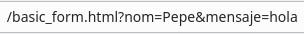

---
# Informació general del document
title: 3. Formularis HTML
subtitle: Llenguatges de marques i sistemes de gestió de la informació (LMSGI)
authors: 
    - José A. Múrcia Andrés
lang: ca
page-background: img/bg.png

# Portada
titlepage: true
titlepage-rule-height: 0
# titlepage-rule-color: AA0000
# titlepage-text-color: AA0000
titlepage-background: img/portada.png
# logo: img/logotext.png

# Taula de continguts
toc: true
toc-own-page: true
toc-title: Continguts

# Capçaleres i peus
header-left: Llenguatges de Marques
header-right: Curs 2025-2026
footer-left: IES Jaume II El Just
footer-right: \thepage/\pageref{LastPage}

# Imatges
float-placement-figure: H
caption-justification: centering

# Llistats de codi
listings-no-page-break: false
listings-disable-line-numbers: false

header-includes:
     - \usepackage{lastpage}
---

# Creació de formularis {#creació-de-formularis}

Els formularis són elements HTML que serveixen per a recollir dades per part de l'usuari, i generalment, enviar-les a un servidor per tal de ser tractades.

Pera crear un formulari usem l’element *form*, definit per les etiquetes `<form>`i `</form>`. Dins del formulari podem posar qualsevol contingut, com etiquetes de text, imatges, etc, però el més comú és posar els elements típics dels formularis, com inputs i botons.

Un formulari molt bàsic podria ser el següent:

=== "HTML"
    ```html
    <form name="formulari_basic">
        Escriu el teu nom: <input type="text" name="nom"> <br>
        Missatge: <input name="missatge" type="text" size="60"> <br>
        <input type="submit" value="Enviar" >
    </form>
    ```
=== "Resultat"
    <div style="all: initial;">
    <form name="formulari_basic">
    Escriu el teu nom: <input type="text" name="nom"> <br>
    Missatge: <input name="missatge" type="text" size="60"> <br>
    <input type="submit" value="Enviar">
    </form>
    </div>

Com es pot veure l’etiqueta `<form>` defineix el formulari, mentre que els elements `<input>` defineixen diferents tipus d’elements d’entrada de dades, com camps de text i botons. Els atributs bàsics d’un formulari són:

* **name**: el nom del formulari. Serveix per a identificar-lo o per a referenciar-lo des de Javascript.

* **action**: defineix l’acció que es realitza quan s’envia el formulari. Generalment ací s’especifica un script en PHP o en Javascript.

* **method**: indica el mètode d’enviament de les dades. Pot tindre 2 valors:

    * **get**: és el mètode per defecte. Afegeix les dades a la url a continuació de l’arxiu indicat a action, per la qual cosa són visibles en la barra d’adreces del navegador. Si no afegim res, o afegim el mètode get a l'element (`<form name="formulari_basic" method="get">`), veuriem a la barra d'adreces:

      { width=300px }

    * **post**: amb aquest mètode, les dades s’envien dins el propi cos de la petició HTTP, però no són visibles a la URL, per la qual cosa s’ha d’utilitzar quan s’envien dades sensibles, com contrasenyes. Pe fer ús de post, definirem el formulari com a `<form name="formulari_basic" method="post">`.


# Elements d’un formulari: input {#elements-d’un-formulari}

El principal element d’entrada de dades d’un formulari és `<input>`:

```html
<input type="text" id="nom" name="nom">
```

L’atribut **type** indica el tipus d'entrada. **id** és un identificador únic, usat per Javascript i per CSS. **name** és el nom que s’envia junt amb les dades de l’input.

És comú acompanyar els inputs amb etiquetes `<label>`. Aquest element és llegit pels lectors de pantalla. També ajuda els usuaris que tenen dificultats per fer clic a regions molt menudes (checkboxes o radio buttons), perquè quan l’usuari fa clic al text dins de l’element `<label>`, canvia el valor del *checkbox* o *radio button*.

```html
<label for="nom">Nom:</label>

<input type="text" id="nom" name="nom">
```

L’atribut **for** de label identifica l’id de l’input al qual està associat.

## Tipus d’inputs {#tipus-d’inputs}

Ele elements d'entrada a formuari poden contindre informació molt diversa (un nom, un telèfon, un correu...), pel que especificar el tipus d'entrada ajuda al sistema i a l'usuari a saber quin format ha d'utilitzar (alfanumèric, només numèric, etc.).

* **text**: Ja hem vist el tipus bàsic d’input, **text**, que defineix una entrada de text genèric d’una sola línia.

  ```html
  <input type="text" id="nom" name="nom">
  ```

Algunes altres entrades de text, on afegim alguna funcionalitat o formatació addicional són:


| Tipus de text | Descripció |
|----------------|------------|
| `type="number"` |Defineix una entrada de dades numèriques. Es pot acompanyar dels atributs min i max per a limitar els valors mínim i màxim de les dades introduïdes. |
| `type="date"` |  L'entrada és una data. Segons el navegador, es mostra un selector de dates al camp d’entrada. També valida que la data introduïda tinga el format correcte. |
| `type="email"` | L'entrada és una adreça de correu electrònic. Segons el navegador, l’adreça de correu electrònic es pot validar automàticament quan s’envia. Alguns smartphones reconeixen l’input i afegeixen *.com* i l'`@` al teclat a mostrar. |
| `type="tel"` | Defineix una entrada per a números de telèfon. El navegador no valida el format del número, però alguns dispositius mòbils mostren un teclat especialitzat per introduir números de telèfon. |
| `type="range"` | Mostra un control lliscant que permet seleccionar un valor dins d'un interval definit per min i max. També es pot utilitzar l'atribut step per ajustar la precisió del valor seleccionat. |
| `type="color"` | Proporciona un selector de color per triar un valor cromàtic. El valor seleccionat s'enregistra com a codi hexadecimal (#RRGGBB). Els navegadors mostren una paleta de colors o altres eines de selecció. |

=== "HTML"
    ```html
      <form action="#" method="post">

        <!-- Entrada de nombre -->
        <label for="num">Introdueix un nombre (entre 1 i 100):</label>
        <input type="number" id="num" name="num" min="1" max="100" required>
        <br><br>

        <!-- Entrada de data -->
        <label for="data">Selecciona una data:</label>
        <input type="date" id="data" name="data" required>
        <br><br>

        <!-- Entrada de correu electrònic -->
        <label for="email">Introdueix el teu correu electrònic:</label>
        <input type="email" id="email" name="email" required>
        <br><br>

        <!-- Entrada d'URL -->
        <label for="url">Introdueix una URL:</label>
        <input type="url" id="url" name="url" required>
        <br><br>

        <!-- Entrada de telèfon -->
        <label for="tel">Introdueix el teu número de telèfon:</label>
        <input type="tel" id="tel" name="tel" required>
        <br><br>

        <!-- Entrada de rang -->
        <label for="range">Selecciona un valor (entre 0 i 50):</label>
        <input type="range" id="range" name="range" min="0" max="50">
        <br><br>

        <!-- Selector de color -->
        <label for="color">Selecciona un color:</label>
        <input type="color" id="color" name="color">
        <br><br>

        <!-- Botó d'enviar -->
        <input type="submit" value="Enviar">

    </form>
    ```
=== "Resultat"
  <div style="all: initial;">
  <form action="#" method="post">

      <!-- Entrada de nombre -->
      <label for="num">Introdueix un nombre (entre 1 i 100):</label>
      <input type="number" id="num" name="num" min="1" max="100" required>
      <br><br>

      <!-- Entrada de data -->
      <label for="data">Selecciona una data:</label>
      <input type="date" id="data" name="data" required>
      <br><br>

      <!-- Entrada de correu electrònic -->
      <label for="email">Introdueix el teu correu electrònic:</label>
      <input type="email" id="email" name="email" required>
      <br><br>

      <!-- Entrada d'URL -->
      <label for="url">Introdueix una URL:</label>
      <input type="url" id="url" name="url" required>
      <br><br>

      <!-- Entrada de telèfon -->
      <label for="tel">Introdueix el teu número de telèfon:</label>
      <input type="tel" id="tel" name="tel" required>
      <br><br>

      <!-- Entrada de rang -->
      <label for="range">Selecciona un valor (entre 0 i 50):</label>
      <input type="range" id="range" name="range" min="0" max="50">
      <br><br>

      <!-- Selector de color -->
      <label for="color">Selecciona un color:</label>
      <input type="color" id="color" name="color">
      <br><br>

      <!-- Botó d'enviar -->
      <input type="submit" value="Enviar">

  </form></div>


!!! question "L'atribut `required`"

    Observeu que als diferents camps del formulari hem afegit una nou atribut `required`. Intenteu enviar el formulari, afegint valors o no a uns o altres camps i observeu-ne el seu resultat.

    L'atribut `required` és un atribut de tipus booleà, és a dir que només pot contindre dos valors (*true* o *false*). Quan l'atribut apareix en un element, la seua simple presènicia ja implica que el seu valor és cert (*true*). Podem utilitzar `required="required"`, però normalment només s'usa required.

    Com veieu, aquest atribut simplifica bastant la tasca de validació del formulari, ja que ens estalvia haver de comprovar a través de Javsacript si un camp del formulari s'ha quedat en blanc o s'ha emplenat.

* **password**: El tipus `password` defineix un camp per introduir contrasenyes. En aquest input els caràcters introduïts apareixen com a punts o asteriscs:

=== "HTML"
    ```html
    <form name="formulari_basic">
      <label for="pwd">Password:</label>
      <input type="password" id="pwd" name="pwd">
    </form>
    ```
=== "Resultat"
    <div style="all: initial;">
    <form name="formulari_basic">
      <label for="pwd">Password:</label>
      <input type="password" id="pwd" name="pwd">
    </form>
    </form>
    </div>

* **search**: L'atribut `type="search"` d'HTML5 s'utilitza per crear un camp de cerca. És molt similar a un camp d'entrada de text regular (`type="text"`), però està optimitzat per facilitar la cerca dins d'un document o pàgina web.


=== "HTML"
    ```html
    <form name="formulari_basic">
      <label for="search">Cerca en el lloc web:</label>
      <input type="search" id="search" name="search" placeholder="Introdueix el terme de cerca">
    </form>
    ```
=== "Resultat"
    <div style="all: initial;">
    <form name="formulari_basic">
      <label for="search">Cerca en el lloc web:</label>
      <input type="search" id="search" name="search" placeholder="Introdueix el terme de cerca">
    </form>
    </form>
    </div>

* **radio**: El tipus **radio** defineix una casella d’opció (***radio button***). Aquests inputs s’agrupen amb el mateix name per a definir un grup, de manera que només una de les caselles pot estar marcada en un moment determinat:

=== "HTML"
    ```html
    <form name="formulari_basic">
      <input type="radio" id="Taronja" name="fruita" value="Taronja"> <label for="Taronja">Taronja</label><br>
      <input type="radio" id="Kiwi" name="fruita" value="Kiwi"> <label for="Kiwi">Kiwi</label><br>
      <input type="radio" id="Poma" name="fruita" value="Poma"><label for="Poma">Poma</label>
    </form>
    ```
=== "Resultat"
    <div style="all: initial;">
        <form name="formulari_basic">
          <input type="radio" id="Taronja" name="fruita" value="Taronja"> <label for="Taronja">Taronja</label><br>
          <input type="radio" id="Kiwi" name="fruita" value="Kiwi"> <label for="Kiwi">Kiwi</label><br>
          <input type="radio" id="Poma" name="fruita" value="Poma"><label for="Poma">Poma</label>
      </form>
    </form>
    </div>


Quan enviem dades d’un grup de radio buttons, s’envia un únic valor amb **el nom de l’atribut `name`** i el **valor de `value`**. Si en l’exemple anterior seleccionarem “Poma”, s’enviaria `fruita=Poma`.

* **Checkbox**: El tipus **checkbox** defineix una casella de selecció múltiple. Diversos *checkboxes* d’un mateix grup poden estar seleccionats al mateix temps.


=== "HTML"
    ```html
    <form name="formulari_basic">
      <input type="checkbox" id="vehicle1" name="vehicle1" value="Bici">
      <label for="vehicle1"> Tinc una bici </label><br>
      <input type="checkbox" id="vehicle2" name="vehicle2" value="Cotxe">
      <label for="vehicle2"> Tinc un cotxe </label><br>
      <input type="checkbox" id="vehicle3" name="vehicle3" value="Moto">
      <label for="vehicle3"> Tinc una moto</label>
    </form>
    ```
=== "Resultat"
    <div style="all: initial;">
      <form name="formulari_basic">
        <input type="checkbox" id="vehicle1" name="vehicle1" value="Bici">
        <label for="vehicle1"> Tinc una bici </label><br>
        <input type="checkbox" id="vehicle2" name="vehicle2" value="Cotxe">
        <label for="vehicle2"> Tinc un cotxe </label><br>
        <input type="checkbox" id="vehicle3" name="vehicle3" value="Moto">
        <label for="vehicle3"> Tinc una moto</label>
      </form>
    </div>

* **Submit**: El tipus **submit** defineix un botó d’enviament. Al fer clic en ell, s’envia el contingut del formulari al destí especificat en l’atribut action del formulari. El valor de **value** és el text que es mostra al botó. Si no indiquem un value, el navegador mostrarà un text per defecte.

```html
<input type="submit" value="Enviar" action="processa_dades.php">`
```

* **Reset**: El tipus **reset** defineix un botó de restabliment. Al fer clic en ell, tots els camps del formulari es restableixen als seus valors inicials:

```html
<input type="reset" value="Netejar">
```

* **Button**: El tipus **button** defineix un botó genèric. Al fer clic en ell, s’executarà l’acció especificada en l’atribut **onclick**:

=== "HTML"
    ```html
    <form name="formulari_basic">
      <input type="button" 
             onclick="alert('Has fet clic al botó!')"
             value="boto_clicat">
    </form>
    ```
=== "Resultat"
    <div style="all: initial;">
      <form name="formulari_basic">
          <input type="button" onclick="alert('Has fet clic al botó!')" value="boto_clicat">
      </form>
    </div>

!!! note "Programació orientada a events"
    Quan fem clic en un botó, es dispara un event de tipus *clic*. El que fem amb `onclic` és *capturar* aquest event i indicar quina funcionalitat realitzarem quan aquest es produisca. Aquesta funcionalitat s'indicarà amb el llenguatge de programació Javascript, que és qui dona dinamisme als documents web. La funció `alert`, per tant, és una funció de Javascript, que, en aquest cas, mostra un missatge emergent amb el text *Has fet clic al botó*.

    Quan desenvolupem aplicaions gràfiques, serà habitual fer aquest tipus de programació *dirigida pe events*, on el codi no segueix un flux d'execució linial de principi a fi, sinò que segons els events que es produeixen al sistema (com puga ser la interacció de l'usuari), s'invoquen unes funcionalitats o altres.

* **File**: El tipus **file** defineix un botó de selecció de fitxers, i sol usar-se per pujar fitxers al servidor.

=== "HTML"
    ```html
    <form name="formulari_basic">
      <input type="file">
    </form>
    ```
=== "Resultat"
    <div style="all: initial;">
      <form name="formulari_basic">
      <input type="file">
    </form>
    </div>

## Altres element d’entrada {#altres-element-d’entrada}

A més dels `input`, podem tindre altre tipus d'elements en un formulari. Veiem-ne alguns:

* **textarea**: L’element `<textarea>` defineix una àrea de text, un camp de text de vàries línies.

=== "HTML"
    ```html
    <form name="formulari_basic">
      <textarea name="message" rows="10" cols="30" >
        Plou poc, però, pel poc que plou, plou prou.
      </textarea>
    </form>
    ```
=== "Resultat"
    <div style="all: initial;">
        <form name="formulari_basic">
        <textarea name="message" rows="10" cols="30">
        Plou poc, però, pel poc que plou, plou prou.
        </textarea>
       </form>
      </div>

Els atributs **rows** i **cols** especifiquen el número de línies i de columnes visibles en el text-area, respectivament.

També es pot definir les mides per mitjà de CSS:

```html
<textarea name="message" style="width:200px; height:600px;"> ...
```

El contingut entre les etiquetes` <textarea>` i `</textarea>` és el que s’envia com a value.

* **Select**:  L’element `<select>` crea una llista desplegable. Cada element `<option>` defineix un dels elements de la llista. El primer és l’element que es tria per defecte.

  Si afegim l’atribut **size**, a més limitem la quantitat d’elements visibles. Això és útil per a llistes molt llargues.

=== "HTML"
    ```html
    <form name="formulari_basic">
      <label for="menjars">Tria un menjar:</label>
      <select id="menjars" name="menjars">
      <option value="paella">Paella</option>
      <option value="fideua">Fideuà</option>
      <option value="arros_forn">Arròs al forn</option>
      <option value="putxero">Putxero</option> </select>
    </form>
    ```
=== "Resultat"
    <div style="all: initial;">
    <form name="formulari_basic">
      <label for="menjars">Tria un menjar:</label>
      <select id="menjars" name="menjars">
      <option value="paella">Paella</option>
      <option value="fideua">Fideuà</option>
      <option value="arros_forn">Arròs al forn</option>
      <option value="putxero">Putxero</option> </select>
    </form>
    </div>
=== "HTML amb diferent size"
    ```html
    <form name="formulari_basic">
      <label for="menjars">Tria un menjar:</label>
      <select id="menjars" name="menjars" size="3">
      <option value="paella">Paella</option>
      <option value="fideua">Fideuà</option>
      <option value="arros_forn">Arròs al forn</option>
      <option value="putxero">Putxero</option> </select>
    </form>
    ```

=== "Resultat amb diferent size"
    <div style="all: initial;">
    <form name="formulari_basic">
      <label for="menjars">Tria un menjar:</label>
      <select id="menjars" name="menjars" size="3">
      <option value="paella">Paella</option>
      <option value="fideua">Fideuà</option>
      <option value="arros_forn">Arròs al forn</option>
      <option value="putxero">Putxero</option> </select>
    </form>
    </div>


Quan enviem un select es fa igual que amb un radio button, s’envia el name de l’etiqueta select con a name i el value de l’etiqueta option elegida com a value. Per exemple, `menjars=paella`.

* **Fieldset i legend**: L’element `<fieldset>` s’usa per a agrupar elements d’un formulari. Sol anar acompanyat de l’element `<legend>` per a posar-li un títol o llegenda:

=== "HTML"
    ```html
    <form name="formulari_basic">
      <fieldset>
          <legend>Dades personals:</legend>
          <label for="nom">Nom:</label><br>
          <input type="text" id="nom" name="nom"><br>
          <label for="cognoms">Cognoms:</label><br>
          <input type="text" id="cognoms" name="cognoms"><br><br>
          <input type="submit" value="Enviar">
      </fieldset>
    </form>
    ```
=== "Resultat"
    <div style="all: initial;">
    <form name="formulari_basic">
      <fieldset>
          <legend>Dades personals:</legend>
          <label for="nom">Nom:</label><br>
          <input type="text" id="nom" name="nom"><br>
          <label for="cognoms">Cognoms:</label><br>
          <input type="text" id="cognoms" name="cognoms"><br><br>
          <input type="submit" value="Enviar">
      </fieldset>
    </form>
    </div>

## Atributs comuns als input {#atributs-comuns-d’input}

A banda dels atributs que ja hem vist, cal destacar els següents:

* **value**: Defineix el valor per defecte d’un input:

```html
<input type="text" name="nom" value="Maria"><br>
```

* **Placeholder**: Epecifica una pista breu que descriu el valor esperat d’un camp d’entrada.
  
  Quan l’usuari comença a escriure a l’input, aquesta pista desapareix.

  L’atribut **placeholder** funciona amb els inputs text, search, url, tel, email i password.

```html
<input type="tel" name="telefon" placeholder="555 55 55 55">
```

* **size**: Especifica l’ample visible, en caràcters, d’un input. El valor predeterminat es 20.  Funciona amb els inputs següents: text, search, url, tel, email i password.

```html
<input type="text" name="nom" size="30"><br>
```

* **Maxlenght**: L’atribut **maxlength** especifica el nombre màxim de caràcters permès en un camp d’entrada. Quan s’estableix una longitud màxima, el camp d’entrada no acceptarà més del nombre de caràcters especificat.

```html
<input type="text" id="pin" name="pin" maxlength="4" size="4">
```

5. **Min i max**:  Els atributs **min** i **max** limiten els valors minim i màxim dels inputs numèrics i de data (type='number' i type='date'). Es poden especificar ambdós valors per a especificar un rang d’entrada.

```html
<label for="datemin">Introdueix una data a partir del 1-1-1950:</label>

<input type="date" id="datemin" name="datemin" min="1950-01-01"><br><br>

<label for="quantitat">Quantitat (entre 1 i 5):</label>

<input type="number" id="quantitat" name="quantitat" min="1" max="5">
```

* **Required**: Com ja hem vist, es tracta d'un atribut booleà que obligarà a l’usuari a introduir un valor abans d’enviar el formulari.

* **Readonly**: L’atribut **readonly** indica que un input és de només lectura. Es sol indicar junt amb un valor predeterminat. Aquest valor no es pot modificar, però es pot llegir, seleccionar i copiar. El seu valor s’enviarà amb les dades del formulari.

```html
<input type="text" name="id" value="15" readonly>
```

* **Disabled**: Aquest atribut indica un input deshabilitat. Aquest input és visible, però no és pot utilitzar ni clicar. El seu valor s’envia amb les dades del formulari.

```html
<input type="submit" value="Enviar" disabled>
```

